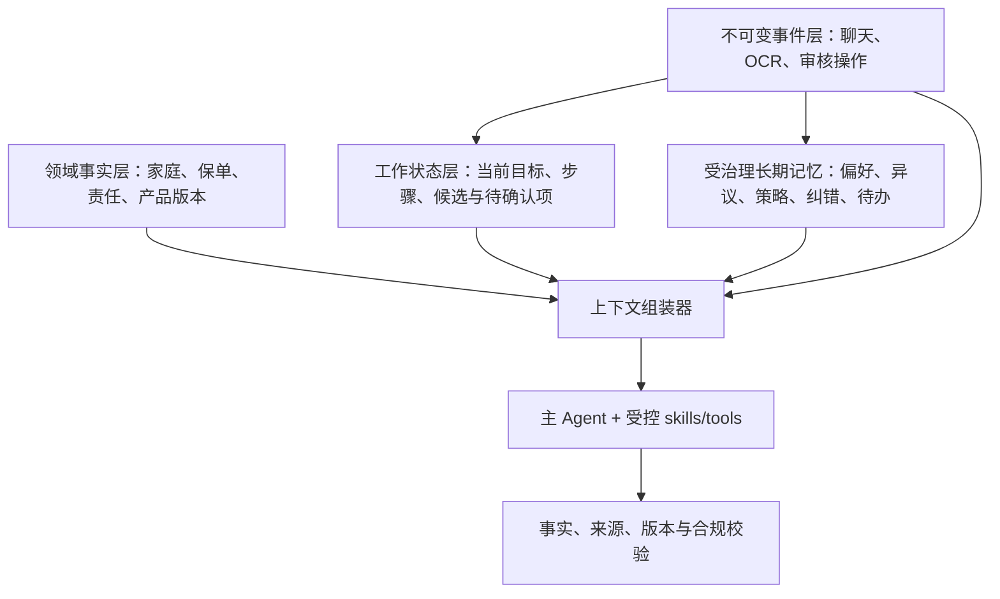
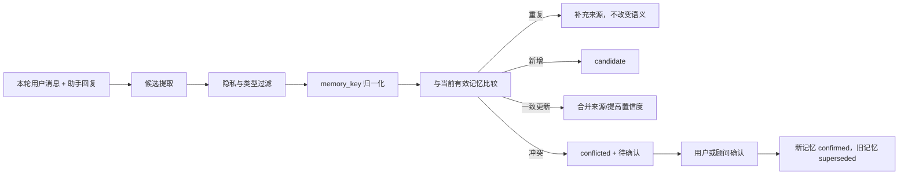

# Agent 时序记忆引擎设计

日期：2026-07-11  
状态：设计草案，待实施  
适用范围：家庭销售续聊、销售建议重算、产品推荐 Agent，以及后续统一 Agent 编排

## 1. 决策摘要

本设计在现有 `family_sales_memories` 和《产品知识库、RAG V2 与销售推荐 Agent 总体架构方案》之上增量演进，不先引入独立向量数据库或知识图谱服务。

核心决策：

1. 原始聊天、OCR 证据、保单数据和模型生成内容继续保存在各自的数据域，长期记忆只保存受治理的跨会话信息。
2. 长期记忆采用双时间模型：现实有效时间 `valid_from/valid_to` 与系统获知时间 `recorded_at/invalidated_at` 分开。
3. 旧记忆被新信息替代时不覆盖、不物理删除，而是标记失效，并通过 `supersedes_memory_id` 保留版本链。
4. 模型提取出的记忆默认是 `candidate`。只有低风险沟通偏好可以自动确认；客户事实、纠错和可能影响推荐的内容需要明确证据或人工确认。
5. Agent 默认只读取当前有效、作用域匹配、达到信任门槛且与当前任务相关的记忆；历史失效记忆仅在审计或“当时为什么这样建议”类问题中读取。
6. 保单字段、保险责任、金额、收益和产品条款不复制成长久文本记忆，Agent 始终从当前领域事实表读取。
7. 第一阶段使用 SQLite 结构化筛选和简单评分。只有真实评估证明关键词与结构化检索不足时，才为记忆增加向量召回。

一句话原则：

> 底层保留变更历史，推理时只让当前有效且可追溯的信息影响判断。

## 2. 当前实现基线

系统当前已经具备：

- `family_sales_chat_threads`：按家庭和所有者隔离的续聊会话；
- `family_sales_chat_messages`：完整用户与助手消息；
- `family_sales_memories`：从每轮续聊异步提炼的长期跟进记忆；
- `family-sales-memory.service.mjs`：提取、脱敏、置信度过滤、文本去重和最多 20 条 active 记忆控制；
- `family-sales-chat.service.mjs`：把记忆作为 `salesMemoryContext` 注入当前续聊；
- `agent-skill-router.service.mjs`：根据问题选择异议处理、保障缺口、产品比较等业务 skill；
- 家庭、成员、保单、家庭报告、销售建议和官网责任证据组成的运行时上下文。

当前实现值得保留的部分：

- 家庭与登录主体双重隔离；
- 敏感号码脱敏；
- 不允许把保单金额、条款、收益和理赔结论直接写成销售记忆；
- 完整消息与提炼记忆分开；
- 记忆提取失败不阻断主对话。

当前主要缺口：

- `status` 只有 `active/archived`，无法表达候选、确认、冲突、被替代和失效原因；
- 文本归一化只能识别近乎相同内容，无法判断“预算每年 5000 元”与“预算调整为 8000 元”属于同一事实槽位；
- 没有现实有效时间，无法回答“当时掌握的信息是什么”；
- 没有替代链，旧信息归档后无法解释被什么信息更新；
- 来源只保存消息 ID，没有来源类型、确认人、提取器版本和证据摘要；
- 所有 active 记忆最多取 20 条，没有结合 skill、任务、成员或风险等级筛选；
- 助手回复也参与记忆提取，存在模型把自己的建议再次固化为记忆的风险。

## 3. 记忆边界

### 3.1 不属于长期记忆的数据

| 数据 | 唯一事实来源 | Agent 使用方式 |
| --- | --- | --- |
| OCR 原文、页码和坐标 | OCR/来源记录 | 按字段或证据引用读取 |
| 保单字段 | `policies` 及相关领域表 | 每轮读取当前值 |
| 保险责任和可选责任 | 责任卡、指标、知识记录 | 结构化过滤 + 证据检索 |
| 家庭成员和规划数据 | family/member/profile 表 | 每轮读取当前值 |
| 家庭报告和销售建议 | 对应报告/审核记录 | 作为有版本的派生结果读取 |
| 产品事实和条款 | 产品事实与证据表 | 按产品版本读取 |
| 完整聊天 | chat messages | 审计及最近对话窗口 |

这些数据不能为了方便而复制成自然语言长期记忆，否则源数据变化后会形成第二事实源。

### 3.2 可以进入长期记忆的数据

第一阶段保留现有五类，但明确语义：

- `objection`：客户明确表达且可能跨会话持续的顾虑；
- `preference`：沟通方式、方案展示顺序等偏好；
- `strategy`：顾问确认采用的跟进策略，不是模型自行提出的普通建议；
- `correction`：对先前沟通理解的修正，不直接修改保单或条款事实；
- `todo`：需要补充资料或跟进的动作，有完成和取消生命周期。

后续若要保存“已确认客户事实”，应使用独立的 `customer_fact` 类型和更严格审核门槛，不与沟通记忆混用。

## 4. 四层 Agent 状态



四层职责：

1. **事件层**保留发生过什么，不接受摘要覆盖。
2. **领域事实层**负责业务真相和确定性计算。
3. **工作状态层**负责本次任务做到哪一步，任务完成后可关闭。
4. **长期记忆层**只负责未来仍可能有用的跨会话认知。

## 5. 双时间与版本链

每条长期记忆至少表达以下时间：

- `valid_from`：该信息从现实中的什么时候开始成立；不知道时可为空；
- `valid_to`：现实中何时不再成立；当前有效时为空；
- `recorded_at`：系统什么时候第一次记录；
- `invalidated_at`：系统什么时候确认它不应再用于当前判断；
- `created_at/updated_at`：数据库记录维护时间。

示例：

```text
M101 preference: 客户希望先看基础保障方案
valid_from: 2026-07-01
recorded_at: 2026-07-02
status: confirmed

M138 preference: 客户改为先比较标准方案与完善方案
valid_from: 2026-07-10
recorded_at: 2026-07-11
status: confirmed
supersedes_memory_id: M101

M101.valid_to: 2026-07-10
M101.invalidated_at: 2026-07-11
M101.status: superseded
```

这样既能回答当前偏好，也能在审计时还原 7 月 5 日 Agent 当时掌握的信息。

## 6. 数据模型

第一阶段保留 `family_sales_memories` 表名，逐步把关键查询字段从 `payload` 提升为列，避免立即迁移到一套平行 `agent_memories` 表。

建议新增或明确以下字段：

```text
id
family_id
owner_user_id
owner_guest_id
kind
subject_type              family | member | advisor
subject_id
memory_key                稳定事实槽位，例如 family:budget_objection
content                   展示文本
normalized_value_json     可比较的结构化值
status                    candidate | confirmed | conflicted | superseded | rejected | expired | archived
risk_level                low | medium | high
confidence
valid_from
valid_to
recorded_at
invalidated_at
supersedes_memory_id
source_thread_id
source_message_ids_json
source_type               user_statement | advisor_confirmation | system_inference | imported
confirmation_type         none | explicit_user | advisor | domain_evidence | rule
confirmed_by
confirmed_at
invalidation_reason
extractor_version
created_at
updated_at
```

补充审计表：

### `family_sales_memory_events`

```text
id
memory_id
event_type                proposed | confirmed | conflicted | superseded | rejected | expired | restored
actor_type                user | advisor | system | admin
actor_id
source_message_id
previous_status
next_status
reason
created_at
payload
```

记忆表表示当前索引状态，事件表表示不可变的变更历史。二者都通过现有 SQLite store 持久化。

## 7. 写入流程



### 7.1 提取规则

- 用户明确陈述是主要来源；助手内容只能帮助识别主题，不能单独形成已确认记忆；
- “建议客户……”是模型建议，不等于顾问已经选择策略；
- “客户可能担心预算”是推断，只能成为候选，不能写成已确认异议；
- 否定、修正、时间限定必须保留，例如“不是预算问题，是担心健康告知”；
- 每条候选必须输出 `kind`、`subject`、`memory_key`、结构化值、有效时间线索、来源消息和置信度；
- 提取器只提出候选，不拥有最终冲突处置权。

### 7.2 自动确认策略

可自动确认的低风险记忆：

- 明确的沟通格式偏好；
- 明确的联系/展示顺序偏好，但不保存敏感联系方式；
- 无业务事实影响的已确认跟进方式。

必须人工或明确对话确认：

- 会改变产品筛选、保障优先级或预算判断的内容；
- correction；
- 与已有 confirmed 记忆冲突的内容；
- 涉及健康、收入、负债、预算、家庭责任或投保意愿的内容；
- 模型根据上下文推断的内容。

### 7.3 冲突动作

冲突检测只允许输出以下动作：

- `ADD`：不存在同槽位事实；
- `REINFORCE`：语义一致，增加来源；
- `SUPERSEDE`：明确的新事实替代旧事实；
- `CONFLICT`：无法判断哪条当前有效，等待确认；
- `IGNORE`：短期、无关或不应进入长期记忆；
- `COMPLETE`：todo 已完成；
- `EXPIRE`：到期且无需替代事实。

高风险动作不能仅由自由文本 LLM 决定，需先通过确定性状态机校验。

## 8. 检索与上下文组装

### 8.1 查询过滤顺序

1. 强制匹配 owner 与 family；
2. 根据当前 `as_of` 时间过滤双时间有效区间；
3. 默认只读取 `confirmed`，必要时单独显示 `conflicted` 待确认项；
4. 根据当前 skill 选择相关 kind 和 memory_key；
5. 根据 subject 匹配家庭或成员；
6. 结合新近度、重要性、明确确认和任务相关性评分；
7. 控制条数和 token，不按更新时间简单取前 20 条。

### 8.2 Skill 与记忆映射

| Skill | 优先记忆 | 不应注入 |
| --- | --- | --- |
| 异议处理 | objection、preference、已确认 strategy | 失效异议、未确认推断 |
| 保障缺口 | todo、correction、沟通 preference | 保单数字的文本副本 |
| 产品比较 | preference、todo、已确认 strategy | 历史条款和产品事实记忆 |
| 销售话术 | objection、preference、strategy | 高风险未确认客户事实 |
| 补资料 | todo、correction | 已完成或已取消 todo |
| 销售建议重算 | 顾问本轮勾选内容优先，其次 confirmed memory | 未勾选的普通历史聊天 |

### 8.3 上下文包

推荐按以下顺序组装：

```text
SYSTEM_RULES
CURRENT_REQUEST
CURRENT_DOMAIN_FACTS
TASK_STATE
RELEVANT_CONFIRMED_MEMORIES
OPEN_CONFLICTS_AND_TODOS
RECENT_RELEVANT_MESSAGES
PRODUCT_OR_POLICY_EVIDENCE
OUTPUT_AND_SAFETY_CONTRACT
```

每条记忆注入模型时带：

- 记忆 ID；
- 类型与主体；
- 当前状态；
- 有效时间；
- 简短来源标识；
- 使用限制。

不把完整失效链注入普通回答。需要解释历史变化时，再按记忆 ID 查询版本链。

## 9. 与现有 Agent 的集成

### 9.1 `family-sales-memory.service.mjs`

逐步拆成三个明确职责，首轮不需要改目录：

- candidate extractor：只负责输出候选；
- memory resolver：确定性执行去重、状态机和版本链；
- memory retriever：根据 owner/family/skill/as-of 返回上下文。

### 9.2 `family-sales-chat.service.mjs`

- 不再接收一个无差别的 `salesMemoryContext`；
- 接收按本轮 skill 和风险过滤后的 memory package；
- prompt 明确区分领域事实、长期记忆和待确认冲突；
- 回答引用记忆时不得把记忆升级为保单或产品事实。

### 9.3 `agent-skill-router.service.mjs`

skill router 除选择 prompt 规则外，还输出：

```json
{
  "memoryKinds": ["objection", "preference"],
  "includeOpenTodos": true,
  "includeConflicts": false
}
```

本地 fallback 必须提供同样结果，不能依赖外部模型才能正确检索记忆。

### 9.4 家庭资料更新

当家庭、成员或保单变化时：

- 不直接删除销售记忆；
- 重新计算依赖这些事实的家庭报告和销售建议；
- 将可能受影响的 strategy/todo 标记为 `review_required` 或产生冲突事件；
- 当前对话提示资料已更新；
- 保单事实始终从当前表读取，因此旧销售记忆不能覆盖新保单数据。

## 10. API 与界面

第一阶段需要的最小接口：

```text
GET   /api/families/:familyId/sales-memories
POST  /api/families/:familyId/sales-memories/:memoryId/confirm
POST  /api/families/:familyId/sales-memories/:memoryId/reject
POST  /api/families/:familyId/sales-memories/:memoryId/supersede
POST  /api/families/:familyId/sales-memories/:memoryId/complete
GET   /api/families/:familyId/sales-memories/:memoryId/history
```

UI 不需要首先做复杂知识图谱。建议在销售续聊中增加一个“跟进记忆”侧栏：

- 当前有效；
- 待确认冲突；
- 待办；
- 历史变更。

每条显示“记住了什么、来自哪次对话、当前是否有效”，并允许顾问确认、修正、完成或停用。

## 11. 安全与治理

- 所有读取和写入继续执行 family + owner 隔离；
- 后续多租户化时再增加强制 `tenant_id`，不能仅靠 prompt 隔离；
- 身份证号、手机号、健康诊断原文等不得进入普通销售记忆；
- 用户删除家庭或执行隐私删除时，聊天、记忆、事件链按同一受审计策略处理；
- `system_inference` 来源不得自动升级为高风险 confirmed；
- 助手输出不能成为自身断言的唯一来源；
- 记忆内容只作为数据，不得包含可执行工具指令；
- API 必须支持回滚状态，但回滚本身也新增事件，不能抹去历史。

## 12. 分阶段实施

### 阶段 1：先补治理，不改检索技术

- 扩展现有 memory payload/列与状态机；
- 增加 `memory_key`、来源类型、确认状态、双时间和 supersedes 链；
- 修正“助手回复可自我固化”的写入风险；
- 增加 focused tests；
- 保持现有 20 条上下文接口兼容。

### 阶段 2：按任务检索与人工确认

- skill router 输出 memory retrieval policy；
- 上下文只注入相关 confirmed memories；
- 增加冲突、确认、修正和 todo 完成接口；
- 增加跟进记忆 UI。

### 阶段 3：工作状态与历史时点

- 落地 `agent_task_states`；
- 支持 `as_of` 查询和推荐运行快照；
- 家庭资料更新触发相关记忆复核；
- 支持“为什么当时这样建议”的审计回答。

### 阶段 4：评估后决定语义召回

- 建立记忆检索金标准集；
- 先比较 SQLite 结构化过滤、FTS5 和简单评分；
- 只有语义召回显著改善且不增加跨主体污染时，再加入 embedding；
- 向量索引只保存可重建索引，不成为事实来源。

## 13. 验收标准

### 13.1 正确性

- 新偏好替代旧偏好后，普通回答只使用新偏好；
- 历史查询仍能还原旧偏好及其来源；
- 两条冲突信息在未确认前不会被模型静默选一条；
- 助手自行提出的策略不会自动成为 confirmed；
- 保单或家庭资料更新后，旧文本记忆不能覆盖当前领域事实；
- 已完成 todo 不再进入普通补资料上下文。

### 13.2 隔离与隐私

- 不同家庭、登录用户和游客之间零记忆串用；
- 敏感号码不会写入 memory 或 memory event；
- 删除/归档操作具备可审计记录并遵守留存策略。

### 13.3 检索质量

- 每轮注入记忆均能说明为什么与当前 skill 相关；
- 失效记忆普通召回率为 0；
- 冲突记忆不会进入确定性结论；
- 与现有“最近 20 条”方案相比，输入 token 不增加，并减少无关记忆。

### 13.4 可恢复性

- SQLite 重启后状态、版本链与事件历史一致；
- 提取任务重复执行不会产生重复 confirmed 记忆；
- 提取模型不可用时主对话继续成功，后续可补跑候选提取。

## 14. 暂不采用的方案

- 不直接部署 Engram 作为新的外部核心依赖；先吸收其双时间、非破坏失效和混合检索思想；
- 不把所有聊天生成 embedding 后直接召回；
- 不把家庭事实复制成自然语言 memory；
- 不让 LLM 无审计地执行覆盖、删除和确认；
- 不先建设通用知识图谱；当前关系主要可由 family/member/policy/product 的结构化外键表达；
- 不为未来可能的多 Agent 场景提前拆分微服务。

## 15. 建议的第一实施切片

第一切片只解决最危险且可验证的问题：

1. 给现有记忆增加 `memoryKey`、`sourceType`、`status`、`validFrom/validTo`、`recordedAt/invalidatedAt`、`supersedesMemoryId`；
2. 将模型提取结果默认设为 `candidate`，仅允许明确低风险偏好按规则自动确认；
3. 同一 `memoryKey` 出现不同值时产生 conflict，不再并存为两条 active 文本；
4. 上下文默认只读取 confirmed 且当前有效的记忆；
5. 保留旧 payload 的兼容读取并增加迁移测试；
6. 暂不增加向量库、图数据库和复杂 UI。

这一切片完成后，系统即具备生产级记忆治理的骨架，同时保持改动范围可控。
