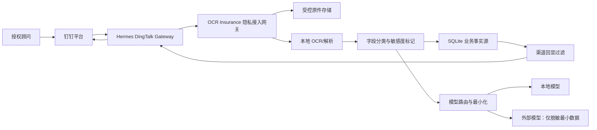
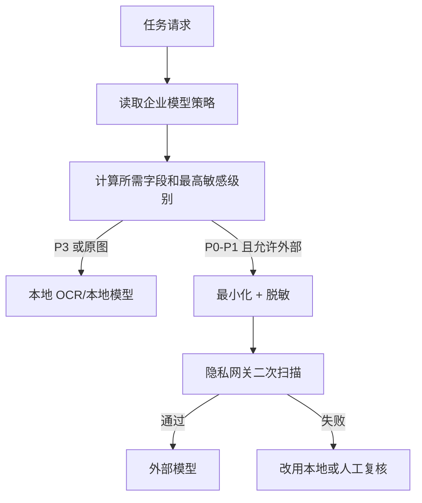

# 钉钉保单上传隐私与数据最小化设计

日期：2026-07-11  
状态：设计草案，待安全评审与 PoC 验证  
适用范围：钉钉上传客户保单、Hermes 附件转交、OCR、模型调用、聊天回显、业务记忆和审计

## 1. 决策摘要

本方案在《网页 + Hermes 钉钉双渠道保险 Agent 目标架构》基础上增加一条强制隐私边界：

> 钉钉只负责经企业授权的附件传输和交互；Hermes 只做短暂转交；OCR Insurance 是客户保单的业务处理与访问控制主体。客户原件、直接标识信息和敏感保险数据不得进入 Hermes 通用会话、Memory、Skill 或普通日志。

核心决策：

1. 网页和钉钉执行同一套后台权限、数据分类、最小化、模型路由、回显脱敏和审计规则。
2. 原始文件一旦通过钉钉发送，就已经经过钉钉平台；后台脱敏不能把这一事实变成“原件未经过第三方”。
3. 企业可以关闭钉钉原件上传。关闭时，钉钉仅处理任务通知、脱敏摘要和网页上传链接。
4. Hermes 不解析、不记忆、不长期保存客户保单，只将附件以短时凭据转交 OCR Insurance。
5. 原始 OCR 优先在本地执行；外部生成模型默认只接收最小化、脱敏后的结构化数据。
6. 身份证号、手机号、详细地址、保单号等直接标识信息在进入外部模型前删除或令牌化；健康、收入、预算、保额等业务敏感字段按任务白名单决定是否发送。
7. 钉钉回显默认掩码，完整字段只在满足用途必要、单聊、授权和显式查看条件时展示。
8. 群聊永远禁止上传、展示或处理客户保单。
9. 任何模型输出都不能反向覆盖原始证据或正式字段；正式保存仍需顾问确认。

## 2. 合规与设计依据

本设计采用以下工程基线：

- 处理目的明确且与当前功能直接相关；
- 收集范围限制在实现目的所需的最小范围；
- 敏感个人信息采用更严格的保护和单独授权流程；
- 明示处理目的、方式、信息种类、保存期限和主体权利；
- 涉及外部接收方或跨境处理时单独评估和配置，不因模型 API 可用就默认发送。

保单可能包含身份证照片、特定身份、医疗健康、保险账户以及未成年人信息，应按高敏感场景设计。依据包括：[《中华人民共和国个人信息保护法》](https://www.cac.gov.cn/2021-08/20/c_1631050028355286.htm)及[个人信息保护政策法规问答](https://www.cac.gov.cn/2026-01/09/c_1769688003183197.htm)。本设计是产品和工程方案，正式上线前仍需由企业法务、合规和安全负责人确认实际告知、同意、委托处理及留存安排。

## 3. 信任边界



边界说明：

- 钉钉平台：企业选择的第三方通信与文件传输平台；
- Hermes：渠道适配器，不是保险数据仓库；
- 隐私接入网关：附件进入业务系统后的第一道强制控制；
- OCR Insurance：权限、原件、事实、证据、任务和审计的唯一业务来源；
- 本地/外部模型：按任务白名单获得不同范围的数据。

## 4. 企业策略模式

### 4.1 模式 A：网页原件上传，钉钉只做通知

适合最高隐私要求企业：

```text
钉钉创建录入任务
→ 返回一次性网页上传链接
→ 顾问在网页上传原件
→ 钉钉仅接收进度和脱敏确认卡片
```

特点：原件不通过钉钉消息上传，但网页和网络基础设施仍需按实际部署披露处理边界。

### 4.2 模式 B：允许钉钉单聊上传原件

适合企业已经批准钉钉承载此类业务文件的场景：

```text
钉钉单聊上传
→ Hermes 短时转交
→ OCR Insurance 持久化和处理
→ Hermes 清理临时副本
```

需要额外满足：

- 企业管理员显式启用；
- 顾问已绑定并在白名单；
- 钉钉上传前展示简短敏感信息提示；
- 客户授权或其他合法处理基础已经由企业流程确认；
- 禁止群聊；
- 配置文件大小、类型、留存和删除策略。

### 4.3 模式 C：仅本地模型

可与 A/B 组合：

- 原始图片和完整 OCR 不发送外部模型；
- OCR、结构化抽取和必要分析都在受控环境内完成；
- 外部模型只允许处理不含客户数据的通用产品知识，或完全关闭。

## 5. 数据分类

| 等级 | 示例 | 默认处理 |
| --- | --- | --- |
| P0 公开产品信息 | 公司、产品名称、公开条款 | 可用于产品检索，仍需版本与来源 |
| P1 一般业务信息 | 保障期、缴费期、保额、保费 | 仅当前任务使用，外发需任务白名单 |
| P2 直接标识信息 | 姓名、手机号、保单号、详细地址、微信号 | 外部模型删除或令牌化，钉钉默认掩码 |
| P3 高敏感信息 | 身份证及照片、医疗健康、银行卡/保险账户、未成年人信息 | 严格用途控制，默认仅本地处理 |
| P4 安全凭据 | 钉钉密钥、会话 token、数据库凭据、模型密钥 | 不进入业务内容、模型或普通日志 |

数据分类在字段产生时附着，而不是到最终 Prompt 才临时猜测：

```json
{
  "field": "insuredIdNumber",
  "classification": "P3",
  "purpose": "policy_identity_verification",
  "sourceRef": "ocr_evidence_123",
  "allowedDestinations": ["local_store", "authorized_web_review"],
  "retentionPolicy": "policy_record"
}
```

## 6. 上传前控制

### 6.1 渠道与身份

- 只接受钉钉单聊；
- channel user 必须映射到 active OCR Insurance 用户；
- 服务端重新检查用户和家庭权限，不能信任 Hermes 提交的 familyId；
- 未绑定用户只能看到绑定说明，不能上传或查询；
- 群聊检测到附件时拒绝下载，并提示改用单聊或网页。

### 6.2 告知与授权记录

首次使用和策略变化后再次展示：

- 上传目的；
- 可能包含的信息类型；
- 文件将经过钉钉传输；
- OCR Insurance 的处理方式；
- 是否可能调用外部模型；
- 保存期限和删除/更正入口；
- 企业联系人或隐私入口。

系统保存授权/确认事件的版本和时间，不把“顾问发送了文件”单独视为覆盖所有用途的无限授权。

### 6.3 文件校验

- 白名单格式：PDF、JPEG、PNG，后续按需增加；
- 校验声明类型和文件签名；
- 限制单文件大小、页数和任务总量；
- 文件哈希去重；
- 恶意文件扫描和解析隔离；
- 加密或损坏文件进入人工处理，不反复发送模型。

## 7. Hermes 临时处理

Hermes 只允许执行：

1. 接收钉钉附件事件；
2. 校验发送者是否在 Gateway 白名单；
3. 获取短时下载凭据；
4. 流式或短时下载附件；
5. 调用 `start_policy_import` 或 `append_policy_import_files`；
6. 收到业务系统确认后删除临时副本；
7. 返回任务 ID 和安全进度。

Hermes 禁止：

- 把附件内容放入通用 Prompt；
- 将 OCR 全文写入 session transcript；
- 把客户信息写入 `MEMORY.md`、`USER.md` 或 Skill；
- 让 web、terminal、file search 等通用工具读取附件目录；
- 在异常日志打印下载 URL、token、正文或完整文件名中的客户信息；
- 将附件作为自主学习或轨迹训练数据。

临时目录使用每任务隔离路径、最小权限和短 TTL。正常完成立即删除；异常残留由清理作业处理并产生指标。

## 8. 隐私接入网关

附件转交 OCR Insurance 时必须经过独立入口，而不是复用任意文件上传接口。

入口职责：

- 验证 Hermes 服务身份；
- 验证 channel identity 和内部用户映射；
- 校验 requestId、taskId、文件哈希和幂等；
- 记录渠道来源和企业策略版本；
- 将原件写入受控持久化边界；
- 返回稳定 documentId，不向 Hermes 返回内部存储路径；
- 创建 privacy manifest；
- 将任务交给 OCR，不在请求线程中长期持有文件。

建议任务清单：

```json
{
  "taskId": "task_123",
  "channel": "dingtalk",
  "enterprisePolicy": "dingtalk_raw_upload_v1",
  "documentIds": ["doc_456"],
  "containsSensitiveData": true,
  "externalModelPolicy": "redacted_only",
  "retentionPolicy": "policy_import_pending",
  "consentEventId": "consent_789"
}
```

## 9. OCR 与字段处理

### 9.1 原始证据

- 原件、OCR 原文、页码、坐标和置信度保持不可变证据关系；
- 原始证据不进入 Hermes；
- OCR 结果和正式保单字段分开；
- 低置信度或冲突字段进入待确认状态；
- 模型摘要不能覆盖原始 OCR。

### 9.2 直接标识信息处理

复用并扩展现有 `deepseek-privacy-gateway.mjs`：

- 已知姓名替换为稳定会话令牌，如 `{{member_1}}`；
- 手机号、固定电话、身份证号、银行卡号、邮箱、微信号删除或固定占位；
- 保单号仅在需要精确比对的本地步骤保留，外部模型删除；
- 详细地址最多保留任务所需行政区域；
- 映射表仅在 OCR Insurance 授权范围内存在，不发送给外部模型。

### 9.3 业务敏感信息处理

保额、保费、预算、健康情况不能一概删除，因为部分保险任务确实需要。采用用途白名单：

| 任务 | 允许字段 | 禁止字段 |
| --- | --- | --- |
| Skill 路由 | 脱敏问题摘要 | 原图、证件、完整保单 |
| 产品匹配 | 公司、产品文本、版本线索 | 客户身份、健康、联系方式 |
| 责任解释 | 产品、版本、责任和必要金额 | 直接标识信息 |
| 家庭缺口 | 年龄段、家庭角色、保额、预算等必要事实 | 证件号、保单号、详细地址 |
| 话术生成 | 异议、沟通偏好、脱敏方案摘要 | 原图、身份证、完整健康记录 |
| OCR 视觉识别 | 原图，仅本地或企业批准的专用 OCR | 通用外部生成模型默认禁止 |

## 10. 模型路由策略



企业配置：

```text
DINGTALK_POLICY_UPLOAD_MODE=disabled|raw_allowed
POLICY_OCR_PROCESSING=local_only|approved_provider
EXTERNAL_LLM_CUSTOMER_DATA=disabled|redacted_only
EXTERNAL_LLM_REGION=cn|approved_region
DINGTALK_POLICY_FULL_FIELD_DISPLAY=disabled|authorized_dm_only
```

这些配置由后台安全设置管理，不允许顾问通过聊天或 Prompt 修改。

## 11. 外部模型出站闸门

所有外部模型请求必须通过统一网关，并在发送前完成：

1. 确认任务允许外部模型；
2. 选择字段白名单；
3. 删除未知或多余字段；
4. 直接标识符正则和已知值双重替换；
5. 对 message、tool arguments 和附件引用全部扫描；
6. 禁止原图、原始 OCR 和存储路径；
7. 记录模型、区域、用途、字段类别和脱敏版本；
8. 不记录完整出站正文，只保存安全摘要或摘要哈希；
9. 失败时改用本地模型或返回人工复核，不绕过网关重试。

若外部模型或服务涉及境外接收方，必须由企业另行完成适用的告知、同意、合同/安全评估和数据出境判断；技术上默认关闭，而不是根据域名自动放行。

## 12. 钉钉回显过滤

### 12.1 默认显示

```text
投保人：张**
被保险人：李**
保单号：********3821
证件号：**************2414
产品：多倍保障重大疾病保险（智享版）
保额：300,000 元
```

### 12.2 完整字段查看

只有同时满足以下条件才允许：

- 企业策略允许；
- 钉钉单聊；
- 当前用户已绑定并有该家庭权限；
- 当前任务确实需要；
- 使用短时、一次性“查看完整字段”动作；
- 记录审计事件；
- 到期后卡片恢复掩码。

身份证完整号码和原始身份证图片原则上仍只在网页受控复核界面展示，不在钉钉普通消息中发送。

### 12.3 群聊

- 不显示客户姓名、家庭、保单和任务摘要；
- 不允许将单聊卡片转为可操作的群卡片；
- 群聊只能查询公开产品知识；
- 检测到客户材料时提示转单聊或网页，不下载附件。

## 13. 业务记忆和会话

### 13.1 Hermes

允许记录顾问通用偏好，但在写入前扫描并拒绝：

- 姓名、电话、证件、保单号；
- 健康诊断原文；
- 家庭财务与客户预算；
- 附件文本和 OCR 摘要；
- 任何可关联具体客户的任务内容。

### 13.2 OCR Insurance

家庭销售记忆继续走时序记忆状态机：

```text
candidate → confirmed / conflicted / rejected / superseded
```

- 只保存业务需要的简短记忆；
- 不保存证件号、手机号和详细健康原文；
- 来源指向消息/事件 ID，不复制整段钉钉聊天；
- 顾问选择和客户事实分开；
- 删除家庭时按留存策略处理聊天、记忆和事件链。

## 14. 持久化与留存

数据类别分开配置：

| 数据 | 建议所有者 | 删除触发 |
| --- | --- | --- |
| Hermes 临时附件 | Hermes 临时区 | 转交成功立即删除，异常按短 TTL |
| 待录入原件 | OCR Insurance | 任务取消、过期或企业留存策略 |
| 正式保单原件 | OCR Insurance | 合法业务留存及用户/企业流程 |
| OCR 证据 | OCR Insurance | 与对应保单/任务一致 |
| Hermes 会话 | Hermes | 企业会话留存策略，不含原件正文 |
| 时序业务记忆 | OCR Insurance | 家庭/客户数据留存策略 |
| 审计事件 | OCR Insurance | 安全和合规留存策略 |
| 外部模型安全日志 | OCR Insurance | 短期留存，不含完整敏感正文 |

生产环境应支持按客户/家庭定位相关数据，执行访问、更正、导出、撤回或删除流程；具体删除范围和法定保留例外由企业合规政策确定。

## 15. 日志与可观测性

### 15.1 允许记录

- requestId、taskId、documentId；
- 内部 userId 和不可逆渠道主体引用；
- 文件大小、类型、页数、哈希；
- 数据分类最高等级；
- OCR/模型供应方和处理区域；
- 脱敏规则版本；
- 成功、失败、降级和清理状态；
- 展示完整字段的审计动作。

### 15.2 禁止记录

- 原始附件下载 URL 和 token；
- 完整 OCR 文本；
- 姓名、电话、身份证号和保单号；
- 完整模型 Prompt/Response；
- 本地文件真实路径；
- 钉钉 Client Secret、数据库或模型密钥。

### 15.3 指标

- Hermes 临时文件清理成功率；
- 外部模型出站拦截次数；
- 本地处理和外部处理比例；
- 群聊敏感附件拒绝次数；
- 未授权访问拒绝次数；
- 敏感字段回显拦截次数；
- 待录入任务过期清理量；
- 跨家庭数据泄漏为 0；
- 日志敏感信息扫描命中为 0。

## 16. 安全事件响应

发生以下情况立即阻断相关通道或工具：

- Hermes Memory/Skill 出现客户信息；
- 普通日志出现直接标识信息；
- 群聊收到并下载了保单附件；
- 外部模型收到原图或完整 OCR；
- 钉钉用户映射错误或跨家庭访问；
- 临时文件超过 TTL 未删除；
- 密钥或下载 token 泄露。

响应动作：

1. 禁用钉钉保险工具；
2. 吊销相关 token 和渠道身份；
3. 保全不含敏感正文的审计证据；
4. 定位受影响 task、document、用户和接收方；
5. 执行删除、隔离、通知和合规评估流程；
6. 修复后通过回归测试与人工审批再恢复。

## 17. PoC 范围

第一阶段采用最保守配置：

```text
钉钉测试企业
+ 测试顾问白名单
+ 单聊上传
+ 合成或脱敏测试保单
+ 本地 OCR
+ 外部模型客户数据关闭
+ 钉钉回显全掩码
+ 不接生产数据
```

PoC 只验证：

- 身份映射；
- 附件转交和临时清理；
- 本地 OCR；
- 字段分类；
- 掩码卡片；
- 网页与钉钉共享 task；
- 幂等和审计。

通过安全评审后，再分别评估真实数据、外部脱敏模型和有限完整字段展示，不能一次性全部打开。

## 18. 验收标准

### 18.1 数据流

- 钉钉附件只在 Hermes 短暂存在；
- 转交完成后临时副本可验证删除；
- 原件和 OCR 不进入 Hermes session、Memory、Skill 和日志；
- 网页与钉钉使用同一 task、document 和正式保单记录。

### 18.2 权限

- 未绑定用户无法上传或查询；
- 群聊无法上传或展示客户材料；
- 顾问只能访问获授权家庭；
- 旧卡片和重复点击不能越过状态机。

### 18.3 模型

- `local_only` 模式下客户数据外发次数为 0；
- `redacted_only` 模式下外部请求不含 P2/P3 直接标识信息；
- 外部闸门失败时任务降级，不绕过；
- 模型输出不能覆盖原始证据或自动确认正式保单。

### 18.4 回显和日志

- 钉钉默认只显示掩码字段；
- 群聊客户信息回显为 0；
- 普通日志直接标识信息命中为 0；
- 完整字段查看具有用户、用途、时间和字段审计记录。

## 19. 第一实施切片

只建设一个安全闭环：

```text
钉钉测试顾问单聊上传合成保单
→ Hermes 临时转交并删除
→ OCR Insurance 创建 privacy manifest
→ 本地 OCR
→ 字段分类
→ 钉钉返回掩码摘要
→ 网页打开同一任务
→ 顾问确认保存
→ 审计查询证明原件未进入 Hermes Memory/日志和外部模型
```

这一切片通过后，再实现产品候选卡片、空字段补充和真实数据安全评审。
