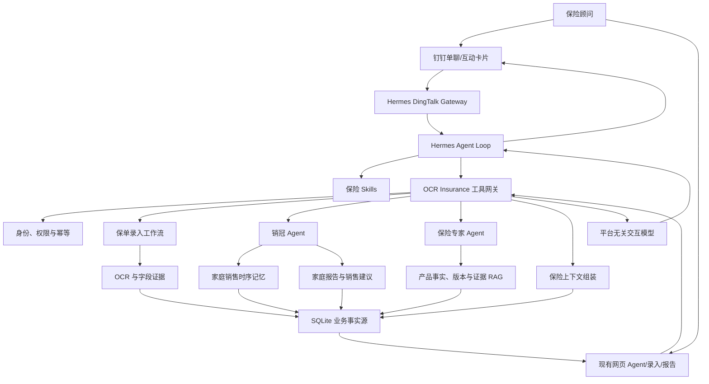
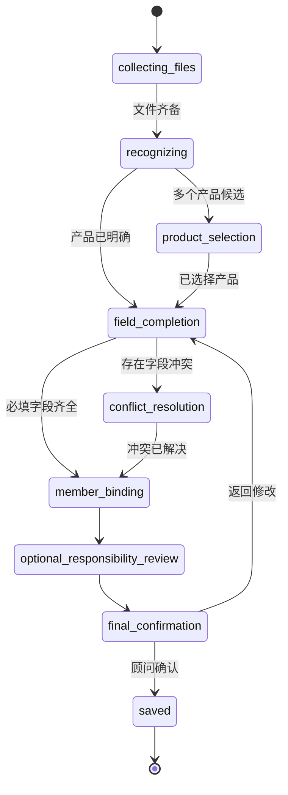

# 网页 + Hermes 钉钉双渠道保险 Agent 目标架构

日期：2026-07-11  
状态：目标架构草案，待 PoC 验证  
适用范围：钉钉保单录入、销冠 Agent、保险专家、家庭销售记忆和产品知识调用

## 1. 决策摘要

本方案保留现有网页 Agent，并新增 Hermes 钉钉渠道：

> 网页继续使用现有 Agent 路径；Hermes 负责新增钉钉渠道的 Agent Loop、Skill 加载和工具编排。两个入口共享 OCR Insurance 的保险事实、业务工作流、时序记忆、证据、权限和审计。

核心决策：

1. 网页和钉钉是长期并存的两个正式入口：网页继续支持完整录入、聊天、报告和管理；钉钉提供移动对话、附件上传和卡片式录入。
2. Hermes 不直接访问 SQLite，也不直接修改保单、产品事实或家庭销售记忆，只能调用受控业务工具。
3. 现有销冠 Agent 和保险专家继续作为两个独立领域 Agent；Hermes 通过 Agent-as-Tool 契约调用它们，不接管其角色、工具集、领域上下文或质量门。
4. Hermes 通用记忆只保存顾问使用偏好；客户、家庭、保单和销售业务记忆继续由 OCR Insurance 时序记忆系统管理。
5. 保单录入进度保存在 OCR Insurance 的持久工作状态中，不能只依赖 Hermes 会话。
6. 所有选择、补充、确认和纠错使用平台无关的交互模型；钉钉渲染为互动卡片，不支持的渠道降级为编号文本。
7. 第一阶段只新增单一 Hermes Profile、钉钉单聊、少量只读工具和保单录入 PoC，不替换或削减现有网页能力。

## 2. 与既有设计的关系

本方案是以下设计的部署和编排修订，不替代其业务模型：

- `2026-07-10-product-knowledge-rag-agent-architecture.md`：继续作为产品知识、RAG、推荐和证据治理基线；
- `2026-07-11-agent-temporal-memory-engine-design.md`：继续作为家庭销售业务记忆基线；
- `2026-07-11-dingtalk-policy-upload-privacy-design.md`：作为钉钉保单附件、模型出站、回显和留存的强制隐私边界；
- 现有 OCR、责任卡、指标、家庭报告、现金流、产品知识和 SQLite 持久化设计全部保留。

发生变化的是“新增渠道由谁运行通用 Agent”，不是替换网页 Agent：

```text
网页路径：网页 Agent → 销冠 Agent / 保险专家 Agent → 领域服务
钉钉路径：Hermes 渠道 Agent → Agent 网关 → 同一销冠 Agent / 保险专家 Agent
```

## 3. 目标与非目标

### 3.1 目标

- 顾问可在钉钉单聊中上传保单图片或 PDF；
- 顾问继续可以在网页完成原有全部录入和 Agent 操作；
- 同一业务任务可以在一个渠道创建，并在另一个渠道继续；
- 相似产品、空字段、冲突字段和家庭成员通过聊天或卡片完成确认；
- 销冠 Agent 与保险专家可被 Hermes 按需调用；
- 业务状态跨消息、跨会话和服务重启可恢复；
- 所有保险结论继续有事实、版本和证据来源；
- Hermes 故障时现有网页和服务端能力仍可使用；
- 未来增加企业微信等渠道时复用同一业务工具与交互协议。

### 3.2 非目标

- 不让 Hermes Memory 成为客户或保险事实来源；
- 不让 Hermes 直接写 SQLite；
- 不在第一阶段支持钉钉群聊上传客户保单；
- 不在第一阶段自动向客户发送销售消息；
- 不在第一阶段开放任意 SQL、文件系统或终端工具给保险顾问；
- 不在第一阶段把全部网页功能搬进钉钉；
- 不因接入 Hermes 而拆分现有模块化单体或引入微服务。

## 4. 总体架构



## 5. 组件所有权

### 5.1 交给 Hermes

- 钉钉 Stream Gateway 和消息收发；
- 通用 Agent Loop；
- 通用短期会话和上下文压缩；
- Skill 文件发现与按需加载；
- 工具调用编排；
- 通用模型提供方和失败切换；
- 定时任务和钉钉消息投递；
- 顾问级非业务偏好；
- 通用运行可观测性。

### 5.2 保留在 OCR Insurance

- 钉钉身份到系统用户的映射；
- 家庭、成员和保单权限；
- OCR、字段证据和置信度；
- 保单录入与复核状态机；
- 产品身份、版本和责任事实；
- 证据型 RAG；
- 保险专家 Agent 及其判断流程；
- 家庭保障缺口、推荐规则和销冠领域能力；
- 家庭销售时序记忆；
- 业务任务状态、审计和幂等；
- 数据脱敏和外部模型隐私网关；
- 生成后的事实、版本和合规校验。

### 5.3 双方都不应拥有的隐式状态

以下内容不能只存在于 Prompt、Hermes 会话或钉钉卡片中：

- 当前正在录入哪张保单；
- 用户已经确认了哪些字段；
- 哪个产品候选被选择；
- 哪些字段仍存在冲突；
- 是否已经执行正式保存；
- 哪条记忆已经确认或失效。

这些状态必须写入 OCR Insurance SQLite。

## 6. Agent 角色调整

### 6.1 Hermes 主 Agent

负责：

- 理解顾问本轮意图；
- 加载相应保险 Skill；
- 调用受控工具；
- 把结构化结果渲染为钉钉可读消息；
- 在多步工作流中询问下一项必要信息；
- 不自行生成或修改保险事实。

Hermes 是渠道编排 Agent，不是保险专家。它可以决定调用哪个领域 Agent，但不能绕过领域 Agent 直接给出高风险保险结论。

### 6.2 销冠 Agent

继续作为独立领域 Agent，拥有自己的角色提示、销售 Skills、工具权限、家庭上下文、时序记忆检索和输出质量门：

- 家庭保障缺口解释；
- 客户异议处理；
- 方案优先级建议；
- 顾问微信/面谈话术；
- 补资料与跟进清单；
- 销售建议重算；
- 家庭销售记忆候选提取与读取。

Hermes 负责何时委托；销冠 Agent 自己完成销售任务规划与领域工具调用；OCR Insurance 负责输入事实、业务规则和输出校验。

### 6.3 保险专家 Agent

继续作为高可信、证据优先的独立领域 Agent，拥有自己的系统规则、保险 Skills、证据检索工具、版本过滤、上下文预算和生成后质量门：

- 解释保险责任；
- 核对责任、等待期、免责和续保；
- 比较产品或保单；
- 识别换保、退保和重新核保风险；
- 返回结论、限制、缺失证据和来源。

保险专家 Agent 不读取 Hermes 通用记忆来判断保险事实。Hermes 调用它时只提交问题、授权主体和必要任务引用；保险专家 Agent 自己从 OCR Insurance 读取已授权事实和证据。

### 6.4 Agent-as-Tool 调用关系

Hermes 看到的是两个受控 Agent 入口，而不是它们内部的全部底层工具：

```text
ask_insurance_expert
ask_sales_champion
```

每个领域 Agent 可以在内部调用自己的窄工具，但不能调用另一个 Agent 的私有工具。需要协作时，由 Hermes 或服务端确定性工作流传递结构化结果，不共享隐藏推理、完整 Prompt 或未过滤记忆。

### 6.5 现有网页 Agent 与 Skill Router

完整保留，并与 Hermes 路径共用领域服务：

- 继续支撑网页端聊天、录入和报告；
- Hermes 不可用时网页仍是独立正式入口；
- 保险工具许可策略；
- 当前任务需要的业务记忆类型；
- 不可绕过的保险安全规则；
- Hermes Skill 选择结果的服务端校验。

## 7. Skill 设计

首批 Hermes Skills：

```text
insurance-policy-intake
insurance-objection-handling
family-coverage-gap
policy-evidence-review
insurance-product-comparison
advisor-sales-script
followup-materials
sales-review-regeneration
```

每个 Skill 只包含：

- 何时使用；
- 允许调用哪些 OCR Insurance 工具；
- 必须遵守的保险限制；
- 需要人工确认的动作；
- 结果呈现规则。

产品条款、客户资料和销售记忆不写进 Skill 文件。

## 8. 工具网关

### 8.1 边界

工具网关是 Hermes 唯一访问保险业务的入口，可以使用 Hermes 插件工具或 MCP 暴露；第一阶段选一种实现，不同时维护两套协议。

每次调用必须携带：

```json
{
  "requestId": "幂等请求ID",
  "channel": "dingtalk",
  "channelUserId": "钉钉用户ID",
  "conversationId": "钉钉会话ID",
  "taskId": "可选业务任务ID",
  "input": {}
}
```

服务端完成身份映射后，后续领域服务只接收内部 `userId`，不信任 Hermes 提交的 familyId 所有权。

### 8.2 第一阶段工具

#### 身份与上下文

```text
resolve_advisor_identity
list_accessible_families
get_family_context
```

#### 保单录入

```text
start_policy_import
append_policy_import_files
get_policy_import_state
answer_policy_import_step
confirm_policy_import
cancel_policy_import
create_policy_review_link
```

#### 领域 Agent 入口

```text
ask_insurance_expert
ask_sales_champion
```

#### 保险专家 Agent 内部工具

```text
explain_policy_responsibility
search_official_policy_evidence
compare_policy_coverage
review_policy_replacement_risk
```

这些工具不直接暴露给 Hermes，由保险专家 Agent 在自己的许可范围内调用。

#### 销冠 Agent 内部工具

```text
get_family_sales_context
generate_objection_response
generate_advisor_script
generate_followup_plan
regenerate_sales_review
```

这些工具不直接暴露给 Hermes，由销冠 Agent 按销售任务调用。

#### 业务记忆

```text
get_relevant_sales_memories
propose_sales_memory
list_open_memory_conflicts
```

不提供通用 `save_memory`，避免 Hermes 绕过候选、确认和冲突状态机。

### 8.3 工具响应包

统一响应：

```json
{
  "ok": true,
  "requestId": "req_123",
  "taskId": "task_456",
  "data": {},
  "interaction": null,
  "citations": [],
  "warnings": [],
  "requiresHumanConfirmation": false,
  "nextAllowedActions": []
}
```

Hermes 只能从 `nextAllowedActions` 选择下一步，不根据模型想象动作名。

## 9. 钉钉身份与权限

新增逻辑映射：

### `channel_identities`

```text
id
channel                 dingtalk
channel_tenant_id       企业 corpId
channel_user_id         钉钉 userId
user_id                 OCR Insurance 用户
status                  pending | active | revoked
bound_at
last_seen_at
payload
```

安全规则：

- 首次联系必须完成绑定或管理员批准；
- `DINGTALK_ALLOWED_USERS` 只作为 Gateway 第一层白名单；
- OCR Insurance 再执行用户、家庭和角色权限；
- 群聊第一阶段只允许通用产品知识查询，不允许上传或展示客户保单；
- 单聊返回的身份信息仍默认脱敏；
- 卡片回调必须校验 channel user、task、版本和一次性 token；
- 顾问离职或解绑后立即拒绝新调用。

## 10. 平台无关交互模型

业务服务不直接生成钉钉卡片 JSON，而是返回统一交互描述。

支持的最小类型：

```text
single_select
multi_select
text_input
number_input
date_input
confirm
file_request
progress
summary
open_url
```

示例：

```json
{
  "type": "single_select",
  "interactionId": "ix_123",
  "taskId": "task_456",
  "stateVersion": 4,
  "field": "canonicalProductId",
  "title": "请选择匹配产品",
  "options": [
    { "id": "product_a", "label": "多倍保障重大疾病保险（智享版）" },
    { "id": "product_b", "label": "多倍保障重大疾病保险（智赢版）" }
  ],
  "fallbackPrompt": "请回复 1 或 2",
  "expiresAt": "2026-07-11T16:00:00+08:00"
}
```

Hermes 钉钉适配层负责渲染；OCR Insurance 只接受 option `id`，不接受模型重新提交 option label 作为正式选择。

## 11. 保单录入工作状态

### 11.1 状态机



异常状态：

```text
ocr_failed
manual_review_required
cancelled
expired
```

### 11.2 持久化

现有 `pending_scans` 可以作为兼容数据源，但聊天录入需要稳定任务身份和版本控制，建议新增：

### `policy_import_tasks`

```text
id
owner_user_id
family_id
channel
channel_conversation_id
status
current_step
state_version
created_at
updated_at
expires_at
payload
```

### `policy_import_events`

```text
id
task_id
event_type
actor_type
actor_id
state_version
created_at
payload
```

原始上传文件、OCR 结果和正式保单继续通过现有持久化边界保存，不把钉钉临时下载目录当作事实源。

任务不归属于某个 UI。网页和钉钉都通过 `taskId` 读取和推进同一份工作状态：

```text
钉钉上传并完成 OCR
→ 用户在网页查看同一 task 的完整字段
→ 网页修正后保存
→ 钉钉收到任务已完成通知
```

反向流程同样成立：网页创建的未完成任务可以在钉钉继续补字段和确认。权限、状态版本和可执行动作始终由服务端控制。

### 11.3 幂等和并发

- 每个卡片响应包含 `taskId + stateVersion + interactionId`；
- 重复点击返回原结果，不重复保存；
- 旧版本卡片响应返回 `stale_interaction` 和最新步骤；
- 同一顾问可同时处理多张保单，但每条消息必须绑定明确 task；
- `confirm_policy_import` 使用事务完成正式保单写入和任务状态更新。

## 12. 记忆分工

### 12.1 Hermes Memory

允许保存：

- 顾问偏好简洁或详细回答；
- 默认使用中文；
- 喜欢卡片还是文本摘要；
- 通用工具使用习惯。

禁止保存：

- 客户姓名、健康和证件信息；
- 家庭收入、预算和负债；
- 保单字段和责任；
- 产品条款结论；
- 家庭销售异议、策略和待办。

### 12.2 OCR Insurance 时序业务记忆

继续保存：

- 家庭级客户异议；
- 顾问确认的销售策略；
- 家庭沟通偏好；
- 补资料待办；
- 修正、冲突和替代关系；
- 来源钉钉消息或业务事件；
- 双时间与状态历史。

Hermes 只能调用 `propose_sales_memory` 提交候选，不能确认、覆盖或删除高风险业务记忆。

## 13. 上下文与事实流

Hermes 不接收整个家庭、全部聊天或完整知识库。每次工具调用由 OCR Insurance 组装最小业务包：

```text
当前授权主体
+ 当前任务状态
+ 当前领域事实
+ 当前有效业务记忆
+ 必要产品版本
+ 少量正式证据
+ 冲突和待确认项
+ 可执行下一步
```

工具输出中的文档内容一律视为数据，不能成为 Hermes 系统指令。

## 14. 附件处理

```text
钉钉附件
→ Hermes Gateway 短期下载
→ start/append_policy_import_files
→ OCR Insurance 持久化原始输入并创建任务
→ Hermes 删除临时副本
→ OCR/解析后台任务
→ 钉钉进度消息或互动卡片
```

要求：

- 只允许已绑定顾问在单聊上传；
- 限制类型、大小、页数和单次文件数；
- 文件哈希保证重试幂等；
- Hermes 日志不得输出附件正文、证件号或完整 OCR；
- 外部模型调用继续通过现有隐私网关；
- 上传失败不能留下半完成正式保单。

## 15. 保险专家 Agent 响应契约

```json
{
  "conclusion": "当前证据支持的结论",
  "confidence": "high",
  "confirmedFacts": [],
  "limitations": [],
  "missingEvidence": [],
  "citations": [
    {
      "documentId": 123,
      "productVersionId": 456,
      "page": 18,
      "excerpt": "必要的短原文"
    }
  ],
  "requiresHumanReview": false
}
```

Hermes 可以改变展示形式，但不能改变保险专家 Agent 返回的数值、确定性等级、缺失证据或引用关系。

## 16. 故障与降级

| 故障 | 降级行为 |
| --- | --- |
| Hermes 不可用 | 网页作为并行正式入口继续工作 |
| 钉钉 Gateway 断开 | 任务保留，重连后从 `get_policy_import_state` 恢复 |
| 模型不可用 | 返回结构化字段、候选和证据，不生成自由文本 |
| 向量检索不可用 | 使用结构化查询和 FTS/BM25 |
| OCR 失败 | 请求重新上传或生成网页复核链接 |
| 卡片过期 | 返回最新任务步骤，不接受旧状态写入 |
| 工具调用超时 | 相同 requestId 安全重试 |
| 身份映射失效 | 拒绝业务调用并提示重新绑定 |

## 17. 可观测性和审计

每次调用至少记录：

- requestId、taskId 和 interactionId；
- 钉钉渠道用户到内部用户的映射结果；
- Skill 和工具名；
- 输入字段类别，不记录不必要的敏感正文；
- 业务状态版本变化；
- 调用耗时、结果和错误码；
- 是否生成候选记忆；
- 是否需要人工确认；
- 正式保存记录 ID。

关键指标：

- 钉钉保单录入完成率；
- 平均补充轮数；
- 产品候选一次选中率；
- 网页与钉钉各自的任务创建和完成比例；
- 跨渠道继续任务的成功率；
- 过期卡片和重复点击率；
- OCR 到最终确认的字段修正率；
- 跨家庭数据泄漏为 0；
- 无证据保险断言率；
- Hermes 工具调用失败和降级率。

## 18. PoC 实施范围

### 阶段 0：契约验证

- 安装独立 Hermes 开发实例和单一 Profile；
- 连接钉钉测试企业；
- 只开放测试顾问白名单；
- 验证附件、卡片、单聊会话和身份 ID；
- 不连接生产数据。

### 阶段 1：只读保险工具

- `resolve_advisor_identity`；
- `list_accessible_families`；
- `get_family_context`；
- `explain_policy_responsibility`；
- `generate_objection_response`；
- 验证权限、证据和回答一致性。

### 阶段 2：聊天保单录入

- 上传单张或多张图片/PDF；
- OCR 进度；
- 产品候选单选；
- 空字段补充；
- 家庭与成员选择；
- 最终摘要；
- 人工确认后正式保存。

暂不包括现金价值大表、复杂视觉框选和批量保单。

### 阶段 3：销冠记忆与跟进

- 读取当前有效家庭销售记忆；
- 提交候选记忆；
- 展示冲突和待办；
- 定时提醒只针对 confirmed todo；
- 所有外发动作仍需顾问确认。

### 阶段 4：评估后稳定双渠道

- 比较网页 Agent 与 Hermes 路径的正确率、Token、延迟和完成率；
- 达标后将钉钉设为正式并行渠道，不改变网页的正式入口地位；
- 两个入口共享任务、事实、记忆和审计，不复制业务状态；
- 不在同一阶段同时接入第二个通信渠道。

## 19. PoC 验收标准

### 19.1 功能

- 顾问能在钉钉单聊上传保单并恢复中断任务；
- 相似产品可用卡片或编号选择；
- 空字段可通过对话补充；
- 重复点击不会重复创建保单；
- 简单保单无需网页即可完成正式保存；
- 复杂情况可打开绑定用户的一次性复核链接；
- 网页创建或更新的任务能在钉钉读取最新状态，反向亦然；
- 网页原有保单录入、保险专家和销冠 Agent 流程保持可独立完成。

### 19.2 安全

- 未绑定用户不能读取家庭或上传保单；
- 群聊不能录入或展示客户保单；
- Hermes 无数据库凭据；
- Hermes Memory 不出现客户敏感信息；
- A 家庭信息不能进入 B 家庭任务；
- 所有正式写入都有顾问确认和审计事件。

### 19.3 质量

- 保险专家结论保留证据与版本；
- 冲突字段不会静默选择；
- 模型不能提交不在 options 中的产品 ID；
- 业务记忆候选不能绕过状态机成为高风险 confirmed；
- Hermes 不可用时网页全部既有能力不受影响。

## 20. 暂缓事项

- Hermes 通用 Memory Provider 选型；
- 多 Agent 自由协作或无边界互相调用；
- 钉钉群聊客户资料处理；
- 自动加客户或批量营销；
- 自动发送生成话术；
- 个人微信渠道；
- 全量替换现有 `family-sales-chat.service`；
- 向 Hermes 暴露终端、文件或任意 HTTP 工具；
- 在 PoC 前重构现有 SQLite 表或拆微服务。

## 21. 建议的第一实施切片

只实现以下闭环：

```text
钉钉测试顾问完成身份绑定
→ 上传一份简单保单
→ OCR Insurance 创建持久任务
→ 钉钉选择产品候选
→ 聊天补充一个空字段
→ 选择家庭成员
→ 查看最终摘要
→ 顾问确认
→ SQLite 产生一张正式保单和完整事件链
```

这个切片可以同时验证渠道、身份、工具、交互、状态、OCR 和正式写入边界，且不会提前扩张到完整销冠工作台。
