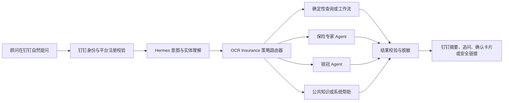

# Hermes 顾问问题路由与可配置策略设计

日期：2026-07-12  
状态：代码已实施；本地核心门通过；完整 harness 受既有工作区问题阻塞；外部联调待完成
适用范围：已注册 OCR Insurance 保险顾问通过钉钉向 Hermes 提问；后续可扩展至 C 端客户

## 1. 目标

在保留自然语言交互的同时，让 OCR Insurance 而不是 Hermes 掌握身份、权限、工具、写操作和保险事实。第一期覆盖：

- 家庭、成员、保单数量和状态查询；
- 家庭保障报告、条款解读、保障缺口分析；
- 销售建议报告、沟通策略和异议处理；
- 产品知识、投保规则和产品对比；
- 保单补充入口与系统使用帮助；
- 客户需求、偏好和销售计划更新；
- 保单转移等高风险操作的受控发起；
- 闲聊、未知问题和未配置意图的安全兜底。

网页继续作为完整数据录入和报告查看入口。钉钉负责自然语言提问、脱敏摘要、进度通知、确认卡片和安全网页链接，不接收客户保单原件。

## 2. 设计原则

1. **Hermes 理解语言，OCR Insurance 决定行为。** Hermes 输出意图、实体和置信度，不自行决定最终权限。
2. **默认只读。** 写操作必须显式配置；高风险写操作必须二次确认。
3. **后端事实优先。** 家庭、成员、保单、报告和产品结论必须来自 OCR Insurance 的授权查询或领域 Agent。
4. **最小数据包。** 每次只向处理器提供完成当前任务所需的脱敏事实。
5. **不机械列举。** 问题中已包含唯一家庭或产品时直接处理；仅在无法唯一匹配时追问。
6. **未知问法可以回答，未知写操作不能执行。**
7. **报告自动保鲜。** 报告不存在或因底层数据变化而过期时自动生成最新版。
8. **全程可追溯。** 策略版本、路由决定、工具调用、确认和写入结果均保留审计记录。

## 3. 总体架构



### 3.1 Hermes 的职责

- 理解顾问的自然表达；
- 输出候选意图、实体、上下文引用和置信度；
- 根据后端返回的 `nextAllowedActions` 发起下一步；
- 把结构化结果渲染成自然、简洁的钉钉消息；
- 在置信度不足或实体歧义时提出一个最小澄清问题。

### 3.2 OCR Insurance 的职责

- 校验钉钉身份与平台注册手机号映射；
- 按当前用户重新解析家庭和保单权限；
- 匹配已发布策略并决定处理器、工具、数据范围和确认等级；
- 调用确定性服务、保险专家 Agent 或销冠 Agent；
- 校验领域结果、脱敏回显、生成安全链接并审计；
- 对所有写操作执行事务、版本检查和失效传播。

Hermes 不得直接访问 SQLite，不得自行扩大工具集，也不得把提交的 `familyId`、`policyId` 或权限声明视为可信事实。

## 4. 统一理解契约

Hermes 只提交结构化理解结果：

```json
{
  "intent": "view_sales_advice_report",
  "entities": {
    "familyName": "余贵祥"
  },
  "contextRefs": [],
  "confidence": 0.94
}
```

服务端返回执行决定：

```json
{
  "decision": "execute",
  "handler": "sales_champion_agent",
  "policyVersion": 7,
  "confirmation": "none",
  "nextAllowedActions": ["get_report_status", "generate_report", "create_secure_link"]
}
```

`decision` 仅允许：`execute`、`clarify`、`confirm`、`deny`、`open_web`。Hermes 不得构造列表之外的动作名。

当前落地契约中，Hermes 候选还必须提交 `question`、`requestedOperation` 和 `confidence`；服务网关从已验证的钉钉身份解析 `internalUserId`，忽略请求携带的 `userId`、`familyId` 和权限声明。领域处理器内部返回 `facts`、`provenance`、`presentation`，问题路由将其转换成受限交互，HTTP 网关最终只放行对应类型的公开字段。该分层用于防止未知数值、PII 和内部来源字段透传给渠道。

## 5. 第一批问题策略

| 问题类型 | 处理器 | 默认行为 | 钉钉输出 |
| --- | --- | --- | --- |
| 家庭、成员、保单数量和状态 | 确定性查询 | 只读，自动解析家庭 | 脱敏摘要 |
| 家庭保障报告 | 保险专家 Agent | 不存在或过期时自动生成 | 摘要 + 安全网页链接 |
| 条款解读、保障缺口 | 保险专家 Agent | 只读并附证据与不确定性 | 结论摘要 + 来源 |
| 销售建议报告 | 销冠 Agent | 不存在或过期时自动生成 | 行动摘要 + 安全网页链接 |
| 沟通策略、异议处理 | 销冠 Agent | 使用已确认销售事实 | 建议话术与下一步 |
| 产品责任、投保规则、产品对比 | 保险专家 + 产品知识库 | 只读，优先官方有效知识 | 结构化对比 + 来源 |
| 上传或补充保单 | 确定性入口 | 不在钉钉接收原件 | C 端安全上传链接 |
| 修改客户需求、偏好、销售计划 | 销冠 Agent + 时序记忆 | 提议变更，确认后写入 | 变更摘要 + 确认卡片 |
| 删除、作废、覆盖、转移数据 | 确定性工作流 | 强制确认或转网页 | 影响预览 + 确认卡片 |
| 系统使用问题 | 帮助知识库 | 只读 | 操作步骤或网页链接 |
| 闲聊或无关问题 | Hermes | 不读取客户数据 | 简短回答 |
| 未知问题 | 兜底路由 | 只读可答，未知写操作禁止 | 回答、澄清或网页指引 |

## 6. 家庭上下文与歧义处理

- 当前问题明确包含家庭名称且唯一匹配时直接处理，不再次列出家庭。
- 同名、近似名或多个候选时，仅展示最小脱敏区分信息。
- “这个家庭”“刚才那家”只能引用当前会话中明确确认且未过期的家庭上下文。
- 上下文切换、超时或涉及写操作时重新确认目标。
- 无权限时不透露目标家庭是否存在，仅返回无可访问结果或要求核对信息。

## 7. 报告处理

### 7.1 家庭保障报告

由保险专家 Agent 负责。钉钉返回家庭成员数、有效保单数、主要保障缺口、报告更新时间和完整报告链接。Hermes 可以改善表达，但不得改变数值、结论等级、缺失证据或引用。

### 7.2 销售建议报告

由销冠 Agent 负责。输入仅包含必要的家庭阶段、保障摘要、已确认需求、预算、顾虑、时序销售记忆和最近保障分析。钉钉返回当前销售阶段、优先机会、建议切入点、主要顾虑和下一步行动。

未确认的预算、意愿或健康信息必须标为“待确认”，不得由模型补全。两类报告在不存在或底层数据变化后自动生成最新版；生成过程先返回进度消息，完成后推送摘要和安全链接。

## 8. 未知问题兜底

路由按以下顺序执行：

1. Hermes 开放式理解问题并提取实体；
2. 普通保险知识、产品知识和系统帮助进入只读处理器；
3. 涉及客户数据但家庭不明确时追问家庭；
4. 家庭明确时仅在授权范围读取最小摘要，再判断能否回答；
5. 未配置写操作不执行，提示网页路径或联系管理员；
6. 高风险保险结论转保险专家并标记证据和不确定性；
7. 仍无法理解时，只追问“查询、分析还是执行操作”中的必要信息。

系统将脱敏后的未知问法、理解结果、未命中原因、兜底方式和是否解决记录到“未知问题中心”。管理员可把高频项转换为策略草稿。

## 9. 高风险写操作示例：跨家庭转移保单

顾问可以在钉钉提出请求，但 Hermes 不能直接写库。

示例问法：

> 把余贵祥家庭的平安重疾险转到温萍家庭。

若来源家庭、目标家庭和保单均唯一，钉钉返回简洁确认卡片：

> 可以。我找到了余贵祥家庭中的“平安福重疾险”。  
> 准备转移到：温萍家庭  
> 被保人：余**  
> 保单号：尾号 3812  
> 转移后，两个家庭的保障报告和销售建议会自动更新。  
> [确认转移] [取消]

服务端在确认前校验双方家庭权限、保单唯一性、被保人与目标成员关系、重复保单和并发任务。执行时使用单个数据库事务，保留原始证据，写入转移审计，使两个家庭的相关报告和缓存失效并重新生成。

若存在多份相似保单，只列出匹配候选；若目标家庭缺少对应成员，引导到网页添加或关联成员；若该操作尚未启用，则自然说明钉钉暂不支持并给出网页链接。

## 10. 管理后台“Agent 策略管理”

管理员通过表单而不是直接编辑 Prompt 配置：

- 策略名称、启用状态和优先级；
- 问题类型、自然语言示例和意图描述；
- 处理器：确定性工具、保险专家、销冠 Agent 或 Hermes；
- 工具白名单与数据访问范围；
- 家庭识别及上下文复用规则；
- 执行等级：直接执行、确认后执行、禁止；
- 钉钉摘要、安全网页链接和进度通知；
- 敏感字段脱敏规则；
- 报告有效期和自动生成规则；
- 意图置信度阈值；
- 超时、失败和降级策略。

系统内置第 5 节的安全模板。策略采用“草稿 → 测试 → 发布”，保留版本、修改人和发布时间，并支持回滚。测试台输入一句问法后展示：识别类型、实体、家庭匹配、处理器、工具、确认等级和脱敏规则；测试模式不得执行真实写操作。

## 11. 数据与审计

至少记录：

- 渠道消息引用、内部用户、会话和租户；
- Hermes 候选意图、实体与置信度；
- 命中的策略及版本；
- 服务端重新解析后的授权资源；
- 工具或领域 Agent 调用、耗时和结果状态；
- 澄清、确认、取消和写操作结果；
- 脱敏规则版本和安全链接记录；
- 未知问题的兜底结果。

客户敏感原文、保单正文、完整证件号和模型隐藏推理不得进入普通日志或 Hermes Memory。客户业务记忆继续进入 OCR Insurance 时序记忆系统，并遵循候选、确认、失效和来源链规则。

## 12. 错误与降级

| 场景 | 行为 |
| --- | --- |
| Hermes 不可用 | 网页继续可用；钉钉返回稍后重试，不猜测答案 |
| 意图置信度不足 | 提出一个最小澄清问题 |
| 家庭或保单不唯一 | 展示脱敏候选，不列出无关资源 |
| 领域 Agent 超时 | 返回进度状态；允许后台任务完成后推送 |
| 报告生成失败 | 保留旧报告并标记更新时间，提供网页重试 |
| 策略配置错误 | 阻止发布或回滚上一版本 |
| 写操作版本冲突 | 不覆盖新数据，重新展示影响预览并确认 |
| 无权限 | 不透露资源是否存在 |

## 13. C 端扩展边界

第一期仅支持平台注册顾问。后续 C 端必须使用独立身份类型、策略集、工具白名单、输出模板和数据范围；不能仅靠 Prompt 区分顾问与客户。共享的仅是意图契约、策略引擎和受控领域服务。

## 14. 验收标准

1. “余贵祥家庭有几个保单”和同义自然问法均直接返回授权范围内的准确数量，不重复选择家庭。
2. “看余贵祥家庭保障报告”自动读取或生成最新版，并返回脱敏摘要和登录后安全链接。
3. “给我销售建议”和“那我该怎么跟他聊”能在明确上下文中路由到销冠 Agent。
4. 保障结论和销售建议分别由保险专家和销冠 Agent 生成，Hermes 不改变事实与数值。
5. 未配置的只读知识问题仍可回答；未配置写操作绝不执行。
6. 跨家庭转移保单必须经过权限、唯一性、成员关系和重复校验，并强制确认。
7. 管理员可以创建草稿、测试、发布和回滚策略，测试模式不产生真实写入。
8. 所有路由和写操作可以按消息、策略版本和内部用户追溯。
9. 钉钉不接收客户保单原件，仅返回 C 端安全上传链接。
10. Hermes 故障或禁用时，OCR Insurance 网页和既有领域服务不受影响。

本地自动化从 Hermes 已产出的标准 candidate 契约开始，验证意图、实体、置信度和读写类型进入路由后的行为。仓库内没有可在无企业凭据条件下运行的 Hermes 自然语言解释器，因此“同义自然问法 → 相同标准 candidate”的识别准确率不属于本地自动化结论，须使用真实 Hermes 企业环境人工联调。

## 15. 第一阶段实施边界

第一阶段只实现顾问身份、问题策略路由、内置模板、未知问题兜底、两类报告、产品知识、系统帮助、策略管理和审计。高风险写操作先建立统一确认框架，保单转移作为首个样例；不开放任意数据库修改、钉钉群聊客户数据、客户原件上传或 C 端直接使用。

## 16. 实施记录

2026-07-13 完成本地实现与自动化验收：

- 问题网关强制服务鉴权、钉钉身份映射、16 KiB 上限、严格字段白名单和类型化公开响应；原始附件被拒绝并返回 C 端安全上传入口。
- 家庭解析只使用当前内部用户可访问的持久化家庭；唯一名称直接执行，同名或近似名称返回 opaque 候选引用，下一轮再解析，不泄露真实标识。
- 家庭保单摘要按持久化记录返回总数和基于业务状态/保障期间计算的有效数；渠道响应和领域安全摘要不包含姓名、手机号、完整保单号或未批准字段。
- 保障报告和销售建议报告使用已有报告新鲜度规则；fresh 返回登录后安全链接，missing/stale 进入去重生成队列并返回进度。沟通策略复用现有家庭销售聊天上下文构造器和回复服务，只传递已授权家庭数据及受限会话历史。
- 未知只读请求进入安全网页兜底；未知写请求在处理器调用前拒绝。Hermes/问题路由上游异常统一返回可重试网关错误，不生成保险事实。
- 保单转移预览只创建有期限的确认记录，不移动保单；确认端在 SQLite 事务内重新校验状态、消费确认、转移保单并写入四项报告再生成 outbox，支持幂等派发和失败恢复。
- 管理后台支持策略草稿、校验、simulation、发布、回滚和审计。simulation 复用实际路由决策但不创建未知问题、确认、outbox 或路由审计；运行时读取唯一 published 版本，配置无效时安全回退到内置策略。
- 自动化验收覆盖 `tests/agent-question-routes.test.mjs`、`tests/agent-question-handlers.test.mjs`、`tests/agent-confirmation.test.mjs`、`tests/agent-question-router.test.mjs`、`tests/admin-agent-question-policy.test.mjs` 和 `tests/agent-question-policy.test.mjs`。

测试层级明确分为：HTTP 网关层验证服务鉴权、身份、schema、公开字段和稳定错误；`createPolicyOcrApp` 默认组合层仅注入 store、身份/服务鉴权、持久化边界和外部模型生成 stub，由 app 自行构造问题路由、领域 handlers、报告队列及生产销售聊天上下文，验证家庭精确数量、stale 报告生成进度、销售续聊和审计边界，同时验证 Hermes 禁用或故障时应用 health 仍可用；领域层验证新鲜度、PII 和 SQLite 原子/outbox；管理层验证 published 策略与 simulation 使用同一决策且 simulation 无写入。测试未注入 custom agent handler 或 reportQueue，也未虚构生产接口。

本地验证记录（2026-07-13）：`npm run check`、`npm run typecheck`、`npm test` 和 `npm run build` 通过；build 保留 Vite 对超过 500 kB chunk 的非阻塞警告。`npm run harness:audit` 已运行，exit 1：Hermes 专用映射及其 focused tests 已通过，完整审计仍被当前工作区其他未映射改动和既有 route handler 裸 `persist(state)` 检查阻塞；另有生产 SQLite 默认路径检查警告。未为通过本任务而修改这些无关项。

本记录仅表示代码和本地核心自动化已实施，不表示完整 harness 或线上环境已经验证。生产发布、真实钉钉应用回调、Hermes 同义表达解释、Hermes 企业租户接入、签名密钥及企业凭据配置仍须人工执行；凭据不写入本文档、普通日志或测试夹具。
