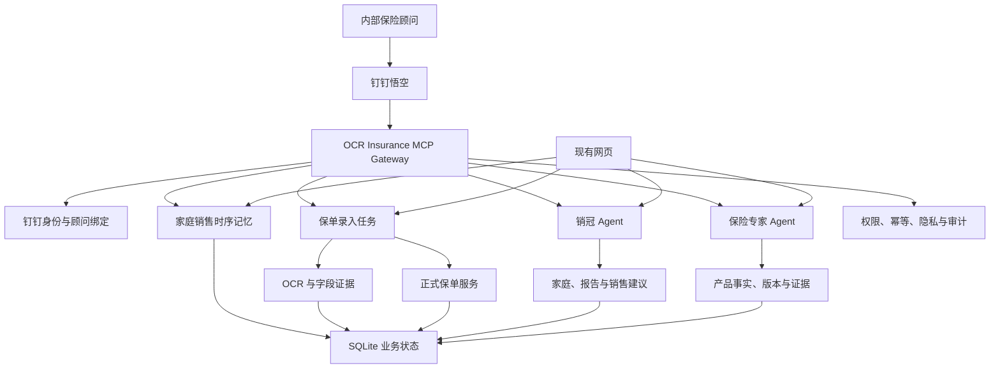

# 悟空钉钉保险 Agent 集成与既有方案补全设计

日期：2026-07-12  
状态：设计已确认，待实施计划  
适用范围：内部保险顾问通过钉钉悟空使用保单录入、销冠 Agent、保险专家 Agent 和家庭销售时序记忆

## 1. 决策摘要

本设计用钉钉悟空替代原目标架构中的 Hermes 钉钉渠道层：

```text
钉钉顾问 → 悟空 → OCR Insurance MCP 网关 → 领域 Agent 与业务服务
网页用户 → 现有网页 → 同一领域 Agent 与业务服务
```

核心决策：

1. 悟空负责钉钉入口、通用对话、默认模型和 MCP 工具编排。
2. OCR Insurance 继续拥有身份、权限、OCR、保单任务、保险事实、销冠 Agent、保险专家 Agent、时序记忆、隐私和审计。
3. 第一版不在悟空与 OCR Insurance 之间增加 Hermes。若悟空 MCP 无法满足附件或身份能力，使用窄 REST 适配器降级，而不是引入第二个通用 Agent。
4. 第一阶段只开放企业内部保险顾问，不开放外部客户。
5. 先允许 1–3 名测试顾问和合成或已脱敏保单；真实客户原件需要独立安全发布审批。
6. 悟空使用默认模型；OCR Insurance 内部继续使用现有 OCR 和模型路由。模型替换不与渠道接入绑定。
7. 简单保单可以在悟空内完成正式保存，但保存前必须有一次明确确认、权限复核和幂等校验。
8. 网页继续作为完整、独立的正式入口。悟空故障不得影响网页能力。

## 2. 与既有设计的关系

本设计修订并统合以下文档的未完成部分：

- `2026-07-11-hermes-dingtalk-agent-target-architecture.md`：以悟空替代 Hermes 的钉钉入口和通用编排职责；领域 Agent 与业务边界不变。
- `2026-07-11-agent-temporal-memory-engine-design.md`：补全状态机、事件链、人工动作、按 Skill 检索和网页界面。
- `2026-07-11-dingtalk-policy-upload-privacy-design.md`：把 Hermes 临时附件区改为悟空/渠道临时转交边界，其余最小化、模型出站和审计原则不变。

现有 `agent-policy-import.service.mjs`、家庭路由、销售聊天与记忆第一切片作为实现基线，不平行建设第二套任务或记忆系统。

## 3. 范围与非目标

### 3.1 第一版目标

- 内部顾问完成钉钉身份匹配、一次确认和持续绑定；
- 悟空通过受控 MCP 工具访问 OCR Insurance；
- 支持多张图片或一个多页 PDF，也支持向同一任务分次追加附件；
- 支持 OCR 进度、相似产品选择、缺失字段补充、家庭与成员绑定、最终确认和正式保存；
- 网页和悟空通过同一 `taskId` 读取和推进任务；
- 悟空可以调用独立的销冠 Agent 与保险专家 Agent；
- 完成时序记忆治理、操作 API 和网页侧栏；
- 建立附件临时清理、文件安全、模型出站、日志脱敏、审计和管理员策略；
- 在钉钉测试企业完成合成保单端到端 PoC。

### 3.2 非目标

- 不开放外部客户钉钉身份和客户自助上传；
- 不在群聊处理或展示客户材料；
- 不自动创建未匹配的顾问账户；
- 不让悟空直接访问 SQLite、内部文件系统或任意 REST；
- 不把客户、家庭、保单或保险业务记忆写入悟空通用记忆；
- 不在第一版引入 Hermes、向量数据库或通用知识图谱；
- 不自动开放真实客户保单；
- 不削减或替换现有网页功能。

## 4. 总体架构



悟空是渠道编排者，不是保险事实来源。MCP 是正常路径下悟空访问保险业务的唯一协议入口。若 PoC 证明附件或回调无法通过 MCP 完成，单用途 REST 适配器也必须终止于同一业务网关，不能形成第二套权限或业务入口。每次调用都执行身份解析、权限检查、参数校验、幂等、速率限制、审计和响应脱敏。

## 5. 顾问身份绑定

### 5.1 首次匹配

1. 悟空提交经验证的 `corpId`、`dingUserId`、会话类型和 `requestId`。
2. 渠道身份服务根据企业授权查询顾问手机号。
3. 手机号只用于查找唯一、启用且属于 PoC 白名单的 OCR Insurance 账户。
4. 若唯一匹配，返回姓名和手机号掩码，由顾问点击一次“确认绑定”。
5. 确认后保存 `corpId + dingUserId + internalUserId`，以后不再以手机号作为认证凭据。

### 5.2 网页兜底

没有匹配或存在重复匹配时，不自动创建账户。系统返回一个五分钟有效、单次使用且绑定原请求的一次性网页链接。顾问通过现有短信登录或注册后，网页显示待绑定的钉钉企业与用户掩码，确认绑定并恢复原任务。

### 5.3 持续授权

- 每次 MCP 调用重新解析内部用户，检查账户状态和 PoC 白名单；
- 服务端根据内部用户查询可访问家庭，不信任悟空提交的家庭所有权；
- 解绑、离职、退出企业、企业授权撤销或内部账户停用后，绑定立即失效；
- 绑定、解绑、失败和权限拒绝写入不含敏感明文的审计事件；
- 群聊不建立保险业务身份，不下载客户附件，也不返回家庭或保单信息。

## 6. 保单录入任务

### 6.1 状态与数据所有权

录入任务属于 OCR Insurance，不属于悟空会话或某个 UI。任务至少保存：

- `taskId`、`stateVersion`、所有者、家庭、渠道和目标 Agent；
- 附件 document 引用、哈希、处理状态和 privacy manifest；
- OCR 字段、证据、置信度、产品候选和冲突；
- 已确认字段、待补字段、家庭成员绑定和最终摘要；
- 操作事件、正式保单 ID、完成或失败状态。

悟空只接收脱敏后的任务视图、合法 options 和下一步 interaction，不接收原始图片、完整 OCR、内部路径或未过滤 scan 对象。

### 6.2 工作流

```text
创建任务
→ 追加一张或多张图片/一个多页 PDF
→ 文件校验与哈希去重
→ 本地 OCR 与字段证据
→ 产品候选、冲突和缺失字段确认
→ 家庭与投保人/被保险人成员选择
→ 脱敏最终摘要
→ 顾问明确确认
→ 幂等正式保存
```

### 6.3 交互规则

- 相似产品只能从服务端返回的 options 选择；模型不能生成任意产品 ID；
- 缺失字段可以逐项输入，常用枚举可以渲染为下拉或单选；
- 旧卡片携带旧 `stateVersion` 时返回 409 和最新任务，不覆盖新状态；
- 正式保存要求任务完整、顾问仍有家庭权限、最终确认有效且 `requestId` 未执行；
- 保存请求超时后先按 `requestId` 查询执行结果，不能盲目重试创建；
- 简单保单在悟空闭环，复杂冲突通过一次性授权网页复核；
- 网页和悟空读取同一任务，任何一端更新后另一端读取最新版本。

## 7. MCP 工具边界

第一批工具：

```text
resolve_advisor_identity
confirm_advisor_binding
list_accessible_families
start_policy_import
append_policy_import_files
get_policy_import
apply_policy_import_action
finalize_policy_import
ask_sales_champion
ask_insurance_expert
get_sales_memories
apply_memory_action
```

每个工具必须具有：

- 固定输入输出 schema；
- 服务端注入的内部身份上下文；
- family + owner 权限检查；
- 请求幂等、超时和速率限制；
- 参数白名单和有限状态转移；
- 结构化错误码与可安全展示的信息；
- 响应字段最小化和直接标识符扫描；
- 不含敏感正文的审计记录。

不向悟空暴露领域 Agent 私有工具、隐藏提示词、数据库凭据、任意 SQL、终端或文件系统。

## 8. 领域 Agent

### 8.1 销冠 Agent

继续由 OCR Insurance 运行，使用当前家庭事实、销售建议、报告、相关已确认记忆和销售 Skills。悟空只提交授权任务引用和问题，不能自行构造家庭事实。

### 8.2 保险专家 Agent

继续使用产品事实、版本和证据 RAG，返回结论、限制、缺失证据和来源。保单原图和完整 OCR 不进入悟空通用上下文。

### 8.3 输出校验

- 保险事实必须来自当前领域表或可追溯证据；
- 冲突或缺失证据必须显式呈现；
- 高风险换保、退保、核保和理赔内容保留限制说明；
- 渠道输出经过掩码和敏感信息扫描；
- Agent 输出不能直接修改正式保单或记忆状态。

## 9. 时序记忆补全

在现有第一切片基础上补齐：

- 状态：`candidate`、`confirmed`、`conflicted`、`superseded`、`rejected`、`expired`、`completed`、`archived`；
- 双时间：现实有效时间与系统记录/失效时间分离；
- `supersedesMemoryId` 替代链；
- 不可变 `family_sales_memory_events`；
- 确认、拒绝、替代、完成、过期和历史查询 API；
- Skill Router 输出记忆检索策略；
- 普通上下文只注入当前有效、已确认且与 Skill 相关的记忆；
- 冲突进入待确认列表，不进入确定性结论；
- 网页增加跟进记忆侧栏，悟空使用同一记忆动作接口。

助手回复不能成为记忆唯一事实来源；保单字段、金额、责任和产品条款仍从领域事实读取，不复制成销售记忆。

## 10. 附件与隐私

### 10.1 临时处理

- 只接受测试企业、白名单顾问和单聊；
- 使用短时下载凭据，不记录下载 URL 或 token；
- 每任务隔离临时目录，转交确认后立即删除，异常残留按短 TTL 清理；
- 允许 PDF、JPEG、PNG，同时校验声明类型和文件签名；
- 限制单文件大小、页数和任务总量；
- 使用哈希去重；损坏、加密或可疑文件进入人工处理；
- 普通日志不得包含文件正文、完整文件名中的客户信息或内部存储路径。

### 10.2 模型出站

- 原图和完整 OCR 默认只进入本地 OCR；
- P2/P3 直接标识字段删除或稳定令牌化；
- 每种模型任务使用显式字段白名单；
- 发送前扫描 message、tool arguments 和附件引用；
- 扫描失败改用本地模型或人工复核，不能绕过网关重试；
- 记录模型、区域、用途、字段分类和脱敏策略版本，不记录完整出站正文。

### 10.3 渠道回显

悟空默认显示姓名、手机号、保单号和证件号掩码。完整字段只允许在授权网页复核页按用途查看，并记录用户、时间、字段和任务。群聊客户信息回显为零。

## 11. 错误处理与恢复

- 身份未绑定：返回一次性绑定链接，不执行保险工具；
- 权限变化：停止任务推进并要求重新选择有权限家庭；
- 附件下载失败：在凭据有效期内安全重试，过期后请求重新上传；
- OCR 失败：保存证据和错误状态，进入人工复核，不反复发送模型；
- 旧卡片：返回最新版本和重新渲染指令；
- Agent 超时：返回可重试状态，不改变保单或记忆；
- 保存超时：按幂等键查询已执行结果；
- 悟空不可用：网页继续读取和推进同一任务；
- 临时清理失败：产生安全告警、隔离残留并禁止任务继续外发。

## 12. 实施拆分

### 实施包 1：身份与网关基础

钉钉身份表、手机号候选匹配、一次确认、网页登录兜底、白名单、解绑和失效、MCP 服务鉴权、结构化错误与审计。

### 实施包 2：保单任务闭环

多附件追加、哈希去重、OCR 进度、产品候选、补字段、家庭成员选择、版本交互、正式保存和跨渠道恢复。

### 实施包 3：领域 Agent 工具化

销冠与保险专家 MCP 入口、最小上下文、证据输出、工具许可、超时降级和生成后校验。

### 实施包 4：时序记忆补全

完整状态机、事件链、替代历史、按 Skill 检索、记忆 API、网页侧栏和悟空动作。

### 实施包 5：隐私与真实 PoC

临时文件清理、文件安全、模型出站、日志扫描、管理策略、指标告警和合成保单端到端验收。

实施包按顺序推进。每一包必须能独立验证和安全回滚，不能把身份、保单写入和隐私风险留到最后一次联调。

## 13. 测试矩阵

### 13.1 自动化测试

- 身份：唯一匹配、无匹配、重复匹配、伪造用户、解绑、离职和账户停用；
- 权限：跨用户、跨家庭、游客和群聊零泄漏；
- 任务：多附件、重复附件、损坏附件、旧卡片、断点恢复和重复保存；
- Agent：最小上下文、证据保留、超时和敏感输出拦截；
- 记忆：候选、冲突、确认、替代、历史、过期和 todo 完成；
- 隐私：原图、OCR、号码、URL 和 token 不进入悟空记忆、外部模型或普通日志；
- 兼容：网页原录入、销冠、保险专家、家庭报告和 SQLite 重启无回归。

### 13.2 人工 PoC

- 1–3 名白名单顾问完成一键绑定和网页登录兜底；
- 合成多页保单从上传到正式保存闭环；
- 网页继续同一任务，悟空读取最新状态；
- 两个领域 Agent 输出保留证据、限制和缺失项；
- 临时文件删除、模型路由和审计事件可以现场验证；
- 悟空不可用时网页全部既有能力正常。

## 14. 完成与发布标准

第一版只有同时满足以下条件才标记完成：

1. 五个实施包全部通过相应自动化测试；
2. 钉钉测试企业完成合成或脱敏保单端到端 PoC；
3. 身份、群聊、跨家庭、临时文件、日志和模型出站安全测试通过；
4. 网页既有能力无回归；
5. 三份 2026-07-11 设计文档更新为实际实施状态；
6. 没有未记录或未批准的安全降级。

真实客户原件不因第一版代码完成而自动开放。管理员只有在安全负责人批准后，才能将企业策略从 `test_redacted_only` 切换为 `raw_allowed`。

## 15. 技术降级与后续选项

PoC 首先验证悟空 MCP 对身份上下文、附件、交互和回调的实际支持：

- 若 MCP 完整满足需求，保持悟空直连 MCP 网关；
- 若仅附件或回调能力不足，增加单用途 REST 渠道适配器，其他工具仍走 MCP；
- 不因单点能力缺口默认引入 Hermes；
- Hermes 可在未来作为独立渠道或高级自动化运行时重新评估，但不得拥有保险业务事实或绕过 OCR Insurance 网关。
