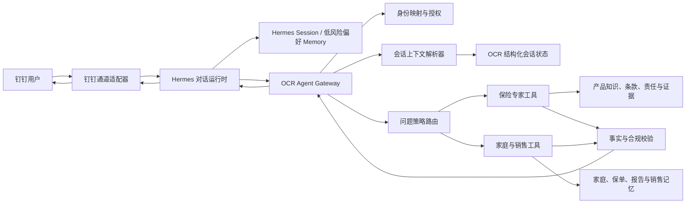

# Hermes 对话运行时接入 OCR Insurance 设计

日期：2026-07-13  
状态：建议方案，待确认 Hermes API/部署契约后实施  
适用范围：钉钉保险专家、产品查询与比较、家庭保障查询、销售辅助续聊

## 1. 决策摘要

本设计选择 **Hermes 作为唯一对话运行时和对话编排器**，OCR Insurance 继续作为保险业务事实、权限、工具执行、业务记忆和审计的唯一权威系统。

核心决策：

1. 钉钉消息进入 Hermes；Hermes 负责理解自然语言、维护当前对话、规划工具调用和组织用户可读回复。
2. OCR Insurance 负责身份映射、权限、家庭与保单隔离、产品事实、条款证据、保险计算、业务动作和审计。
3. “它、他、这个产品、和康健长佑对比”等指代不能只依赖大模型猜测。Hermes 提出语义解析，OCR Insurance 根据持久化的结构化会话实体做确定性解析和校验。
4. 产品、保单、责任、金额、销售状态等业务事实不写入 Hermes 长期记忆；每次均从 OCR Insurance 当前领域数据读取。
5. Hermes Memory 只保存低风险的顾问交互偏好和对话习惯。家庭销售记忆继续由 `family_sales_memories` 治理，不能迁移成一份无边界的通用模型记忆。
6. 不采用“悟空和 Hermes 同时做主 Agent”的双编排架构。若后续使用悟空，只能作为钉钉传输、卡片或附件适配层，不能再次决定意图和上下文。
7. 迁移先落地 OCR 侧持久会话状态，再接 Hermes 影子流量，最后切主；不一次性重写现有保险工具链。

一句话边界：

> Hermes 负责像人一样理解和交流；OCR Insurance 负责保险结论是否真实、可查、可做和可审计。

## 2. 与既有方案的关系

本设计：

- 延续《Hermes 钉钉 Agent 目标架构》中“Channel Agent + Agent-as-Tool”的总体方向；
- 延续《Hermes 可配置问题路由设计》的候选意图、策略路由和证据边界；
- 延续《Agent 时序记忆引擎设计》的领域事实、工作状态、受治理长期记忆分层；
- **取代**《悟空钉钉保险 Agent 接入设计》中“首版不接 Hermes”的对话编排决策；
- 不否定悟空可能提供的通道、附件或卡片能力，但它不再是对话大脑。

若现有文档与本设计在“谁拥有对话编排权”上冲突，以本设计为准。

## 3. 当前实现与问题定位

当前真实链路为：

```text
钉钉 Stream
  -> dingtalk-agent-gateway.mjs
  -> DeepSeek 问题解释器 / 本地正则 fallback
  -> POST /api/agent/questions/route
  -> OCR Insurance 路由与领域处理器
  -> 钉钉文本或 Markdown
```

当前钉钉网关使用四个进程内 `Map` 保存：

- 最近 6 条对话；
- 最近一次产品；
- 最近一次产品候选列表；
- 最近一次非闲聊问题。

产品上下文有效期为 30 分钟。这能处理部分连续追问，但存在根本限制：

- 进程重启后全部丢失；
- 多实例之间不能共享；
- 只能记住一个产品名称，无法稳定表达比较双方及角色；
- “他和康健长佑对比”依赖正则补丁，而不是统一实体状态；
- 模型对话历史与业务实体状态混在网关代码里；
- 用户只得到“无可核验来源”，系统没有利用对话状态主动说明缺什么资料；
- 当前仓库没有 Hermes 客户端、运行配置或真实会话调用，已有的是设计契约，不是已接通的运行链路。

因此问题不是“大模型本身知不知道”，而是当前大模型没有被赋予一个可恢复、可校验、与保险事实系统相连的会话状态。

## 4. 目标架构



### 4.1 Hermes 拥有

- 当前用户话语的语义理解；
- 最近对话的语言连续性；
- 工具选择建议和多步对话计划；
- 澄清问题的自然表达；
- 钉钉可读的答案组织；
- 顾问低风险偏好，例如“回答简短”“先给结论再给依据”。

### 4.2 OCR Insurance 拥有

- 钉钉用户到平台用户的身份映射；
- family、policy、product 等资源的访问权；
- 产品规范名、别名、版本和销售状态；
- 条款、说明书、责任、金额、免责、等待期等保险事实；
- 确定性计算、来源、置信等级和缺失证据；
- 家庭销售记忆、客户事实和业务工作状态；
- 写操作确认、幂等、审计及隐私治理；
- 对 Hermes 解析结果的最终校验权。

### 4.3 明确禁止

- Hermes 直接读取 SQLite 或绕过 OCR API；
- Hermes 传入 `userId/familyId/policyId` 后被系统直接信任；
- Hermes 根据常识自行补齐产品责任、金额或在售状态；
- 将 OCR 原文、身份证号、手机号、健康诊断或完整家庭资料写入 Hermes 长期记忆；
- 同一条消息先由悟空规划、再由 Hermes 重新规划、最后 OCR 再路由三次；
- 用自然语言对话历史替代业务事实表。

## 5. 会话状态模型

Hermes Session 与 OCR 会话状态是配对关系，但职责不同：

- Hermes Session 保存语言层连续性；
- OCR 会话保存工具需要的结构化引用和审计状态。

### 5.1 `agent_conversations`

```text
id                         UUID
channel                    dingtalk
tenant_id                  当前也必须有稳定值；单租户可使用固定 default
channel_user_id            钉钉 staffId
internal_user_id           OCR Insurance 登录用户
channel_conversation_id    钉钉 conversationId
hermes_session_id          Hermes 会话标识
status                     active | expired | closed
context_version            乐观并发版本
last_message_ref           最近已处理消息，辅助幂等
created_at
updated_at
active_context_expires_at  隐式指代有效期
retention_expires_at       会话审计保留期
payload                    非查询关键的扩展字段
```

唯一约束：

```text
(tenant_id, channel, channel_user_id, channel_conversation_id)
```

不能只用 `conversationId`，也不能只用手机号，防止跨用户或跨会话串用。

### 5.2 `agent_conversation_entities`

```text
id
conversation_id
entity_type                product | family | policy | task
role                       current | comparison_a | comparison_b | candidate | referent
canonical_ref              领域对象 ID；不存在时为空
display_name
normalized_name
insurer_name
confidence
confirmed                  0 | 1
source_message_ref
valid_from
valid_to
payload
```

产品比较至少需要表达：

```json
{
  "current": "国寿惠享保（免健告）百万医疗险",
  "comparisonA": "国寿惠享保（免健告）百万医疗险",
  "comparisonB": "新华人寿康健长佑长期医疗保险（费率可调）",
  "requestedDimensions": ["保险责任"],
  "contextVersion": 12
}
```

### 5.3 `agent_conversation_events`

```text
id
conversation_id
message_ref                同一通道内唯一
event_type                 received | interpreted | resolved | tool_called | replied | failed
actor                      user | hermes | ocr | system
context_version
created_at
payload                    脱敏后的结构化摘要
```

事件表用于幂等、调试和审计。默认不复制完整 OCR 或敏感原文。

### 5.4 生命周期建议

- Hermes Session：按 `(channel, channel_user_id, channel_conversation_id)` 自动创建或恢复，由 Hermes 自身负责短期历史、上下文窗口和压缩；OCR 不用“最近 6 条”替代 Hermes 的会话机制；
- Hermes Session 的保留、归档和删除遵循实际 Hermes Provider 能力与隐私策略，不与某个产品指代的过期时间强行绑定；
- 隐式产品指代：属于 OCR 业务工作状态，默认 30 分钟无新消息后失效，并允许在 Agent 后台配置；
- DeepSeek/本地降级历史：仅在 Hermes 不可用或 direct 模式使用，默认最近 6 条消息，并允许在 Agent 后台配置；
- 会话元数据和脱敏事件：默认 30 天，最终以隐私留存策略为准；
- 顾问交互偏好：可跨会话，但只能进入 Hermes 的低风险偏好空间；
- 家庭销售记忆：继续使用 OCR 的双时间和确认机制，不跟随 Hermes Session 过期。

### 5.5 Hermes 用户与记忆隔离

隔离键由 OCR 服务端根据已验证身份生成，不能接受模型、前端或钉钉消息体自行指定：

```text
Hermes Session namespace
  = tenant_id + channel + internal_user_id + channel_conversation_id

Hermes preference Memory namespace
  = tenant_id + internal_user_id + hermes_profile_id
```

规则：

- 每个钉钉用户、每个 conversationId 创建或恢复独立 Hermes Session；
- 同一顾问可以在自己的不同会话间读取已允许的低风险偏好，但不能读取另一顾问的偏好；
- 手机号只用于首次身份核验，不作为 Hermes Memory 主键；
- 用户解绑、换绑、停用或租户迁移后，旧 namespace 立即停止读取，并记录审计事件；
- 客户、家庭、保单、产品和销售事实不进入 Hermes preference Memory，因此不会因为通用记忆召回发生跨客户串用；
- Hermes 返回的 `sessionId/userId/memoryKey` 只作为外部引用，OCR 必须与本地映射核对后才能继续调用工具；
- 所有缓存键、指标标签和 fallback 历史使用同一隔离维度，不能出现只按 `conversationId` 缓存的旁路。

任何无法证明 namespace 完整匹配的请求，都按“无历史的新会话”处理，不能尝试相似用户或相似问题召回。

## 6. 指代解析规则

模型可以理解“他”大概率指产品，但最终解析必须是确定性的：

1. Hermes 输出实体提及和待解析引用，例如 `referent: previous_product`；
2. OCR 根据用户、会话、有效期和 `context_version` 查询结构化实体；
3. 只有一个有效候选时，解析成规范产品；
4. 有多个候选时返回可选项，不静默猜测；
5. 没有候选或已过期时，说明当前还缺哪个产品名称、保险公司或资料；
6. 产品有别名时由 OCR 产品目录归一化，Hermes 不自造规范名；
7. 解析结果随工具调用写入事件，便于回答“为什么理解成这个产品”。

示例：

```text
用户：国寿惠享保（免健告）百万医疗险保险责任
系统：写入 current/comparison_a

用户：他和康健长佑对比呢
Hermes：识别为产品比较，A=previous_product，B=康健长佑
OCR：A 解析为国寿惠享保；B 经目录归一化为新华康健长佑
工具：读取双方当前可核验责任与来源
系统：写入 comparison_a/comparison_b
```

如果“康健长佑”匹配多个版本，回复应为：

```text
我已经知道你要拿“国寿惠享保（免健告）百万医疗险”做对比。
但“康健长佑”目前匹配到多个版本，请选择具体条款版本或发保险公司/条款首页。
```

这比“当前没有可核验来源”更像人，也没有越过证据边界。

## 7. Hermes 与 OCR 的契约

### 7.1 Hermes 到 OCR：工具请求

Hermes 不直接提交最终业务结论，只提交候选理解：

```json
{
  "protocolVersion": "1",
  "channel": "dingtalk",
  "channelUserId": "ding-user-id",
  "conversationId": "ding-conversation-id",
  "hermesSessionId": "hermes-session-id",
  "messageRef": "ding-message-id",
  "candidate": {
    "intent": "insurance_product_knowledge",
    "question": "他和康健长佑对比呢",
    "requestedOperation": "read",
    "confidence": 0.94,
    "entities": {
      "productBText": "康健长佑"
    },
    "contextRefs": [
      { "role": "comparison_a", "ref": "previous_product" }
    ],
    "requestedDimensions": ["保险责任"]
  }
}
```

现有 `/api/agent/questions/route` 可作为兼容入口，但应扩展版本化 envelope；身份仍由服务签名和通道映射在 OCR 侧解析。

### 7.2 OCR 到 Hermes：领域结果

返回值要区分不可改写的事实与可调整的展示：

```json
{
  "ok": true,
  "requestId": "request-id",
  "decision": "execute",
  "domainResult": {
    "facts": [],
    "certainty": "verified | partial | unavailable",
    "missingEvidence": [],
    "citations": [],
    "resolvedEntities": [],
    "warnings": []
  },
  "interaction": {
    "type": "answer | clarification | secure_link | denied",
    "text": "可直接展示的安全文本",
    "candidates": [],
    "renderHints": {
      "template": "product_comparison",
      "compact": true
    }
  }
}
```

Hermes 可以调整语气和段落，但不得：

- 修改 `facts` 的数值和限定条件；
- 把 `partial/unavailable` 改写成确定结论；
- 删除影响结论的 `warnings`；
- 生成返回结果中不存在的来源链接。

### 7.3 工具划分

第一阶段只暴露两个粗粒度工具：

- `ask_insurance_expert`：产品知识、责任、条款、销售状态、产品比较；
- `ask_sales_champion`：家庭概览、保障报告、销售建议和销售辅导。

Hermes 不需要了解内部几十个表和服务。OCR 的问题策略路由继续选择实际处理器，这能保留现有权限和审核边界。

## 8. 响应与 UI 协议

Hermes 负责对话表达，但钉钉适配器根据 `renderHints` 选择稳定模板：

- 简短结论：普通文本；
- 产品责任：分组 Markdown 列表；
- 产品比较：移动端纵向比较卡，不直接渲染宽表；
- 多候选：可编号选择；
- 证据：短标题链接，不显示超长原始 URL；
- 缺资料：显示“已找到什么、还缺什么、怎么补”；
- 免责声明或销售状态不确定性：独立提示块。

保险产品比较的展示顺序建议固定为：

1. 一句话结论；
2. 产品身份与销售状态；
3. 核心责任差异；
4. 免赔额、等待期、续保/保证续保和免责；
5. 适合与不适合的人群；
6. 缺失资料与核验来源。

模板只改变展示，不拥有保险事实。

## 9. 可靠性与降级

### 9.1 超时和熔断

- Hermes 单次理解/编排超时建议 6–8 秒；
- 连续错误触发短时熔断；
- OCR 工具调用使用独立超时和 `requestId`；
- 钉钉同一 `messageRef` 重放不得重复执行业务动作或重复写审计。

### 9.2 降级链

```text
Hermes 正常
  -> Hermes 理解 + OCR 工具

Hermes 不可用
  -> 现有 DeepSeek 解释器
  -> 本地 candidateFromText
  -> 同一个 OCR 持久会话解析器和领域工具
```

降级时仍能记住当前产品，因为状态位于 OCR，而不是只在 Hermes。降级模型只能帮助识别意图，不能自行回答保险事实。

### 9.3 一致性

- 会话状态更新使用 `context_version` 乐观锁；
- 并发消息按会话串行提交或检测版本冲突后重读；
- 工具结果先完成审计再发给通道；
- 回钉钉失败时允许按 `messageRef` 重试发送，不重复执行领域查询或写操作。

## 10. 安全与隐私

- Hermes 调用 OCR 使用独立服务身份、短期凭证或 HMAC 签名；
- OCR 根据通道身份重新解析内部用户，不信任 Hermes 传来的内部资源 ID；
- 所有 family/policy 查询继续执行 owner 隔离；
- 发往 Hermes 前进行字段白名单和敏感信息扫描；
- Hermes Memory 默认关闭业务事实写入，仅允许经过分类器的低风险顾问偏好；
- 日志不记录手机号、身份证号、健康原文、完整保单或 OCR 页面；
- 链接只允许 HTTPS 和配置的安全域名；
- 写操作继续采用确认令牌、过期时间、一次性消费和审计。

## 11. 可观测性

必须能回答“消息在哪一层被理解错了”：

- `messageRef/requestId/hermesSessionId/conversationId` 全链路关联；
- Hermes 意图、OCR 最终意图及影子模式一致率；
- 指代解析成功率、澄清率和过期率；
- 产品别名归一化成功率；
- Hermes 延迟、错误率、熔断率和 fallback 率；
- OCR 工具延迟、无证据率和候选歧义率；
- 回钉钉成功率；
- 任何 `partial/unavailable` 被改写成确定结论的合规告警；
- Hermes Memory 隐私抽检和违规写入数，目标必须为 0。

### 11.1 容量与扩展边界

第一阶段按单项目、SQLite、千级活跃会话设计：

- 会话查询必须命中 `(channel, channel_user_id, channel_conversation_id)` 索引；
- event 按留存期清理，不能无限增长；
- Hermes 调用和 OCR 工具调用均设置并发上限，避免钉钉突发消息拖垮 OCR；
- SQLite 写入保持短事务，不在事务内等待 Hermes 或外部网络；
- 多个钉钉网关实例可以共享同一状态存储，但同一会话要通过版本控制避免覆盖。

出现以下任一条件时，再评估将 conversation/event 状态迁移到 PostgreSQL，而不是提前拆微服务：

- SQLite 写锁持续成为可观测瓶颈；
- 需要多主机并发写同一状态库；
- 活跃会话和事件留存显著超过当前单机容量；
- 需要数据库级行锁、分区或更复杂的租户隔离。

## 12. 方案比较

| 方案 | 连续对话 | 保险事实治理 | 复杂度 | 结论 |
| --- | --- | --- | --- | --- |
| 保持当前进程内 Map | 弱，重启即失效 | 可保留 | 低 | 不满足目标 |
| 只接悟空 | 取决于悟空实现 | 需重新做边界 | 中 | 与当前 Hermes 决策不符 |
| Hermes 直接访问数据库 | 强 | 权限和事实边界失控 | 表面低、实际高 | 禁止 |
| 悟空 + Hermes 双主 Agent | 上下文可能重复 | 决策归属不清 | 高 | 拒绝 |
| Hermes + OCR 工具网关 | 强且可恢复 | 最清晰 | 中 | **采用** |

## 13. 分阶段实施

### 阶段 0：确认 Hermes 运行契约

- 确认 Hermes 的部署地址、鉴权方式、Session API、Tool API、Memory API、超时和可用性；
- 用一条无敏感数据的测试消息验证创建会话、工具调用和返回；
- 固化 `protocolVersion` 和错误码。

完成条件：不改用户流量，也能证明 Hermes 是真实可调用服务，而不是文档假设。

### 阶段 1：先持久化现有对话上下文

- 增加 conversation、entity、event 三组 SQLite 状态；
- 把四个进程内 Map 替换为会话上下文服务；
- 现有 DeepSeek 解释器继续工作；
- 增加重启恢复、跨用户隔离、指代过期和比较双方测试。

完成条件：即使 Hermes 尚未切入，“他和康健长佑对比”在网关重启后仍能正确解析或明确澄清。

### 阶段 2：Hermes 影子模式

- 同一份脱敏输入同时交给当前解释器和 Hermes；
- 用户仍使用当前结果；
- 记录意图、实体、工具选择和澄清需求的差异；
- 建立保险场景金标准集。

完成条件：核心意图、产品实体和指代解析达到约定准确率，且隐私检查通过。

### 阶段 3：Hermes 主运行时

- Hermes 成为主解释器和编排器；
- DeepSeek/本地规则作为降级；
- OCR 继续执行路由、权限、事实和工具；
- 灰度开关按用户或比例放量。

完成条件：Hermes 故障时自动降级，事实结果和引用不发生变化。

### 阶段 4：展示与偏好记忆

- 接入移动端比较模板、候选选择和短链接；
- 仅开放低风险顾问偏好到 Hermes Memory；
- 删除已无用途的进程内上下文兼容代码。

完成条件：对话体验提升，但业务记忆和领域事实没有出现第二事实源。

### 阶段 5：可选通道增强

- 若悟空提供更好的钉钉卡片/附件能力，只接入 transport/render adapter；
- 保持 Hermes 是唯一对话编排器；
- 不让悟空重复解释意图或持有独立业务记忆。

## 14. 配置建议

只定义配置契约，本设计阶段不修改 `.env.local`：

```text
AGENT_CONVERSATION_RUNTIME=direct | hermes | shadow
AGENT_FALLBACK_HISTORY_MESSAGE_LIMIT=6
AGENT_REFERENT_TTL_MINUTES=30
HERMES_BASE_URL=
HERMES_API_KEY=
HERMES_PROFILE_ID=
HERMES_TIMEOUT_MS=8000
HERMES_SHADOW_SAMPLE_RATE=0.1
HERMES_MEMORY_ENABLED=false
```

其中前两个运行参数应由已发布的 Agent 后台配置覆盖；环境变量只作为首次启动或读取配置失败时的安全默认值。Hermes 自身 Session 的窗口、压缩和保留由 Hermes Provider 配置，不在 OCR 后台伪造一个通用 TTL。

生产密钥不得进入仓库、日志或 Hermes Memory。

## 15. 工作量评估

前提：Hermes 已有稳定的 Session/Tool API 和可用测试环境。

| 工作包 | 估算 | 主要产物 |
| --- | ---: | --- |
| Hermes 契约验证 | 0.5–1 天 | API 契约、健康检查、最小 PoC |
| OCR 持久会话状态 | 1.5–2.5 天 | SQLite schema、context service、迁移测试 |
| Hermes adapter + 影子模式 | 1.5–2.5 天 | client、feature flag、差异指标 |
| 主链切换与降级 | 1–2 天 | runtime switch、熔断、fallback |
| 钉钉渲染与验收 | 1–2 天 | 比较模板、端到端测试、运行手册 |

可演示 MVP 约 **4–6 个工作日**；达到可灰度上线水平约 **7–10 个工作日**。若 Hermes API 尚未部署、鉴权未定或需要自建 Hermes 服务，需另计基础设施工作，不能把该部分算作简单接线。

## 16. 验收标准

### 16.1 对话连续性

- 先问产品 A，再问“它的责任”，能解析为产品 A；
- 先问产品 A，再问“他和康健长佑对比”，能形成明确 A/B；
- 钉钉网关重启后，上述有效会话仍能恢复；
- 不同用户、不同 conversationId 之间零串话；
- 指代过期或多义时主动澄清，不静默猜测。

### 16.2 专业与证据

- 所有产品事实来自 OCR 产品知识与证据链；
- 没有核验来源时，回答同时说明“已识别对象、缺失资料、补充方式”；
- Hermes 不得把未核验搜索摘要当成确定保险责任；
- 产品比较显示双方版本、关键差异、限制和来源；
- `certainty=partial/unavailable` 在最终回复中保持可见。

### 16.3 可靠性

- Hermes 超时或不可用时自动降级；
- 同一 `messageRef` 重放不产生重复业务动作；
- 并发消息不会覆盖较新的上下文；
- 回钉钉失败可重试且有审计记录。

### 16.4 隐私与安全

- Hermes Memory 中没有保单事实、健康原文、证件号或手机号；
- Hermes 不能绕过 OCR 身份和资源授权；
- 所有工具调用可按 `messageRef` 还原身份、解析实体、证据和最终输出；
- 两个用户使用相同 `conversationId` 时仍创建不同 Session；
- 同一用户的两个 conversationId 不共享短期会话历史；
- 用户解绑/换绑后旧 Session 与偏好 namespace 不再可读；
- 跨用户、跨租户会话和记忆污染测试全部为 0。

## 17. 第一实施切片

最小且最有价值的第一切片不是先改模型，而是：

1. 落地 `agent_conversations`、`agent_conversation_entities`、`agent_conversation_events`；
2. 抽出 `agent-conversation-context.service.mjs`，替换钉钉网关内四个 Map；
3. 让现有 DeepSeek 和本地 fallback 都使用同一上下文解析器；
4. 为产品 A/B、代词、候选选择、可配置过期时间、可配置降级历史上限、进程重启和用户隔离补 focused tests；
5. 在此稳定边界上新增 Hermes adapter 和 shadow 模式。

这样做既能立刻修复用户已经遇到的断上下文问题，又把 Hermes 接入控制为一个清晰的运行时替换，而不是重写保险业务系统。

## 18. 实施前待确认项

这些问题只影响 adapter 细节，不改变本设计的系统边界：

1. Hermes 是由 OCR Insurance 主动调用，还是通过 Hermes 注册 Tool/MCP 后由 Hermes 回调；
2. Session 的创建、续期、关闭和历史读取接口；
3. Tool 调用是否支持 `messageRef`、超时、取消和结构化错误；
4. Memory 是否能按 profile、user、tenant 分区并配置保留/删除；
5. Hermes 部署位置、数据是否出境、日志留存和服务可用性；
6. 影子模式是否允许在开发环境使用一套不含真实客户数据的测试 profile；
7. 钉钉卡片最终由当前 gateway 渲染，还是复用悟空的通道渲染能力。

如果前四项没有可验证接口，当前不能声称“已接入 Hermes”；只能称为已完成架构和契约准备。
