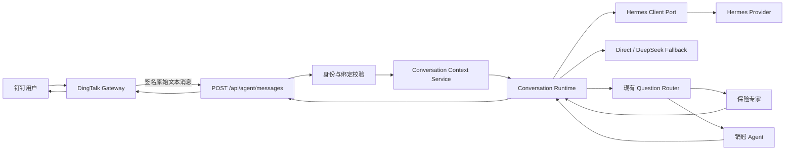
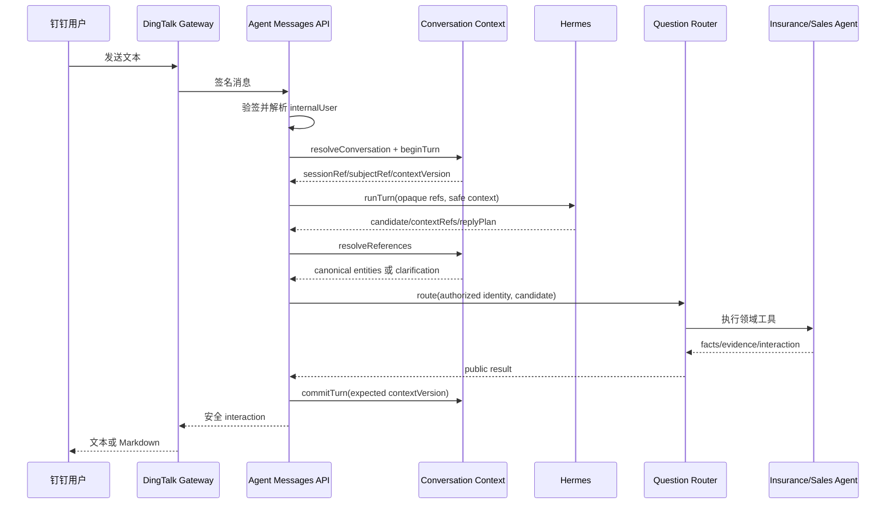

# Hermes 接入 OCR Insurance 开发设计

日期：2026-07-13  
状态：开发设计，Hermes Provider API 契约确认后可进入实施  
上游方案：[Hermes 对话运行时接入 OCR Insurance 设计](./2026-07-13-hermes-conversation-runtime-integration-design.md)  
适用代码：`server/`、钉钉 Agent、SQLite state store、Agent 策略后台

## 1. 目标与非目标

### 1.1 开发目标

1. 将 Hermes 接为唯一主对话运行时，负责自然语言理解、短期会话历史、上下文压缩、对话规划和表达。
2. 在调用 Hermes 前完成 OCR Insurance 身份验证，并由服务端生成隔离的 Session/Memory 引用。
3. 将当前钉钉进程内产品和问题上下文持久化，支持重启恢复、并发版本控制和跨实例共享。
4. 保留现有问题策略路由、保险专家、销冠 Agent、产品证据、家庭权限和写操作确认。
5. Hermes 不可用时降级到现有 DeepSeek 解释器和本地规则，保险事实仍由 OCR 领域服务返回。
6. 支持 direct、shadow、hermes 三种运行模式以及可观测的灰度和回滚。

### 1.2 非目标

- 不让 Hermes 直接访问 SQLite；
- 不把 OCR Insurance 拆成微服务；
- 不把客户、保单、产品事实或家庭销售记忆迁入 Hermes Memory；
- 不在本阶段改造保单上传、OCR 或家庭报告领域模型；
- 不同时保留 Hermes 和悟空两个对话编排器；
- 不在未取得 Hermes API 契约前猜测具体 HTTP 路径或 SDK 方法。

## 2. 当前基线

### 2.1 已完成

| 能力 | 当前状态 |
| --- | --- |
| 钉钉 Stream 收发 | 已运行 |
| DeepSeek 意图解释 + 本地 fallback | 已运行 |
| `/api/agent/questions/route` 服务鉴权、身份映射、路由 | 已运行 |
| 保险专家、销冠 Agent、产品证据和家庭权限 | 已运行 |
| 产品比较 Markdown 移动端适配 | 已运行 |
| 降级历史消息上限后台配置 | 已完成，默认 6 条 |
| OCR 产品指代有效期后台配置 | 已完成，默认 30 分钟 |
| 参数随策略草稿、发布和回滚 | 已完成 |
| 当前 fallback 用户隔离 | 已按 `channelUserId + conversationId` 实现并测试 |

### 2.2 尚未完成

| 能力 | 当前缺口 |
| --- | --- |
| Hermes 客户端 | 无真实客户端、凭证和调用 |
| Hermes Session | 无创建、恢复、关闭接口 |
| Hermes Memory | 无 Provider 契约和 namespace 验证 |
| 持久对话上下文 | 仍为钉钉进程内 4 个 `Map` |
| 重启恢复 | 进程重启后短期上下文丢失 |
| 影子模式 | 无 Hermes/当前解释器对照 |
| Hermes 指标和熔断 | 未实现 |

开发过程中必须保持以上状态描述准确。完成 shadow 之前不能在产品或运维文档中声称“已经接入 Hermes”。

## 3. 实现级架构决策

### 3.1 Hermes 调用放在 OCR API 服务内

目标链路：



不采用“钉钉网关先调用 Hermes，再把 candidate 交给 OCR”的实现。原因：

- 内部用户身份只有 OCR Insurance 能权威解析；
- Hermes Session namespace 必须在身份校验后生成；
- 工具调用必须经过 OCR 的权限、事实和审计边界；
- API 服务更适合持久化、熔断、指标和灰度；
- 钉钉网关可以继续保持无业务状态的通道适配器。

### 3.2 单体内增加端口，不增加服务

新增模块都是现有 Node 应用内的 ESM `.mjs`：

```text
server/
  agent-conversation-context.service.mjs
  agent-conversation-runtime.service.mjs
  hermes-conversation-client.service.mjs
  hermes-memory-policy.service.mjs       # 第五阶段再增加
```

继续复用：

```text
server/agent-question-interpreter.service.mjs
server/agent-question-router.service.mjs
server/agent-question-handlers.service.mjs
server/dingtalk-agent-gateway.service.mjs
server/routes/agent.routes.mjs
server/sqlite-state-store.mjs
```

## 4. 用户、Session 与 Memory 隔离

### 4.1 身份顺序

每条消息严格按以下顺序执行：

1. 验证 Agent 服务签名和时间窗；
2. 校验 `channel/channelUserId/conversationId/messageRef`；
3. 通过钉钉手机号和绑定关系解析 `internalUserId`；
4. 生成或读取本地 conversation；
5. 从 conversation 读取 Hermes 外部引用；
6. 调用 Hermes；
7. 工具执行时再次按 `internalUserId` 做资源授权。

Hermes 返回的 `userId/sessionId/familyId/policyId` 均不能替代上述身份解析。

### 4.2 本地隔离键

```text
Conversation natural key
  tenantId + channel + channelUserId + internalUserId + channelConversationId

Hermes preference subject natural key
  tenantId + internalUserId + hermesProfileId
```

当前为单租户时 `tenantId = "default"`，但数据库列和所有查询都必须显式携带，不使用 `NULL`。

### 4.3 给 Hermes 的外部引用

Hermes 不接收原始内部用户 ID。OCR 在本地创建随机 UUID：

```text
hermesSessionRef = 随机 UUID，按 conversation 唯一
hermesSubjectRef = 随机 UUID，按 tenant + internalUser + profile 唯一
```

本地保存映射。Hermes 只能看到这两个不含 PII 的引用。

### 4.4 记忆允许范围

Hermes preference Memory 允许：

- 回答简洁或详细；
- 中文表达偏好；
- 先结论还是先证据；
- 文本或卡片展示偏好。

禁止：

- 客户姓名、手机号、证件号、诊断和健康原文；
- family、policy、product 的事实或标识；
- 保险责任、金额、收益、免责和销售状态；
- 客户异议、预算、家庭责任和销售待办；
- 助手生成的保险结论。

Hermes Memory 第一阶段默认关闭。只有 Session 隔离、删除和隐私测试通过后才能打开偏好记忆。

### 4.5 解绑和换绑

钉钉绑定发生变化时：

1. 增加绑定版本；
2. 将旧 Hermes subject 标记 `revoked`；
3. 关闭或停止恢复旧用户的 Session；
4. 新身份生成新的 subject/session 引用；
5. 写入脱敏审计事件。

不得把旧偏好迁移给新绑定用户，除非由管理员执行受审计的显式迁移。

## 5. 数据模型

所有迁移为增量建表，不修改现有保单、产品或家庭事实表。

### 5.1 `agent_hermes_subjects`

```sql
CREATE TABLE agent_hermes_subjects (
  id TEXT PRIMARY KEY,
  tenant_id TEXT NOT NULL,
  internal_user_id INTEGER NOT NULL,
  hermes_profile_id TEXT NOT NULL,
  hermes_subject_ref TEXT NOT NULL UNIQUE,
  identity_version INTEGER NOT NULL DEFAULT 1,
  status TEXT NOT NULL CHECK (status IN ('active', 'revoked')),
  created_at TEXT NOT NULL,
  updated_at TEXT NOT NULL,
  revoked_at TEXT NOT NULL DEFAULT '',
  payload TEXT NOT NULL DEFAULT '{}',
  UNIQUE (tenant_id, internal_user_id, hermes_profile_id, identity_version)
);
```

第一阶段可以建表但不向 Hermes Memory 写入；subject 先用于验证隔离契约。

### 5.2 `agent_conversations`

```sql
CREATE TABLE agent_conversations (
  id TEXT PRIMARY KEY,
  tenant_id TEXT NOT NULL,
  channel TEXT NOT NULL,
  internal_user_id INTEGER NOT NULL,
  channel_user_id TEXT NOT NULL,
  channel_conversation_id TEXT NOT NULL,
  hermes_subject_id TEXT,
  hermes_session_ref TEXT NOT NULL UNIQUE,
  status TEXT NOT NULL CHECK (status IN ('active', 'expired', 'closed', 'revoked')),
  context_version INTEGER NOT NULL DEFAULT 1,
  active_context_expires_at TEXT NOT NULL,
  retention_expires_at TEXT NOT NULL,
  created_at TEXT NOT NULL,
  updated_at TEXT NOT NULL,
  payload TEXT NOT NULL DEFAULT '{}',
  UNIQUE (tenant_id, channel, channel_user_id, internal_user_id, channel_conversation_id)
);
```

`channel_user_id` 用于审计和检测绑定漂移，不作为唯一授权来源。

### 5.3 `agent_conversation_turns`

```sql
CREATE TABLE agent_conversation_turns (
  id TEXT PRIMARY KEY,
  conversation_id TEXT NOT NULL,
  message_ref TEXT NOT NULL,
  runtime_mode TEXT NOT NULL CHECK (runtime_mode IN ('direct', 'shadow', 'hermes')),
  status TEXT NOT NULL CHECK (status IN ('received', 'processing', 'replied', 'failed')),
  context_version_before INTEGER NOT NULL,
  context_version_after INTEGER,
  request_payload TEXT NOT NULL,
  result_payload TEXT NOT NULL DEFAULT '{}',
  error_code TEXT NOT NULL DEFAULT '',
  created_at TEXT NOT NULL,
  updated_at TEXT NOT NULL,
  UNIQUE (conversation_id, message_ref)
);
```

`request_payload` 只保存脱敏、受限的结构化数据。唯一约束提供消息幂等。

### 5.4 `agent_conversation_entities`

```sql
CREATE TABLE agent_conversation_entities (
  id TEXT PRIMARY KEY,
  conversation_id TEXT NOT NULL,
  entity_type TEXT NOT NULL CHECK (entity_type IN ('product', 'family', 'policy', 'task')),
  role TEXT NOT NULL CHECK (role IN ('current', 'comparison_a', 'comparison_b', 'candidate', 'referent')),
  canonical_ref TEXT NOT NULL DEFAULT '',
  display_name TEXT NOT NULL,
  normalized_name TEXT NOT NULL,
  insurer_name TEXT NOT NULL DEFAULT '',
  confidence REAL NOT NULL,
  confirmed INTEGER NOT NULL CHECK (confirmed IN (0, 1)),
  source_message_ref TEXT NOT NULL,
  valid_from TEXT NOT NULL,
  valid_to TEXT NOT NULL DEFAULT '',
  payload TEXT NOT NULL DEFAULT '{}'
);
```

查询当前实体时必须同时匹配 conversation、role、`valid_to = ''` 和业务有效期。

### 5.5 `agent_conversation_events`

```sql
CREATE TABLE agent_conversation_events (
  id INTEGER PRIMARY KEY AUTOINCREMENT,
  conversation_id TEXT NOT NULL,
  turn_id TEXT,
  event_key TEXT NOT NULL UNIQUE,
  event_type TEXT NOT NULL,
  actor TEXT NOT NULL CHECK (actor IN ('user', 'hermes', 'ocr', 'system')),
  context_version INTEGER NOT NULL,
  created_at TEXT NOT NULL,
  payload TEXT NOT NULL DEFAULT '{}'
);
```

事件只追加不覆盖，用于定位解析、工具、回复和降级发生在哪一层。

### 5.6 索引

至少增加：

```text
agent_conversations(tenant_id, channel, channel_user_id, internal_user_id, channel_conversation_id)
agent_conversations(status, updated_at)
agent_conversation_turns(conversation_id, created_at DESC)
agent_conversation_entities(conversation_id, entity_type, role, valid_to)
agent_conversation_events(conversation_id, created_at DESC)
agent_hermes_subjects(tenant_id, internal_user_id, hermes_profile_id, status)
```

外键按项目现有 SQLite 策略决定是否启用；即使没有数据库外键，store 方法也必须保证归属关系。

## 6. 模块与接口

### 6.1 `agent-conversation-context.service.mjs`

职责：业务会话和指代状态，不调用 Hermes，不访问钉钉。

建议端口：

```js
createAgentConversationContextService({ store, clock, createId })

resolveConversation({ tenantId, channel, channelUserId, channelConversationId, internalUserId, hermesProfileId })
loadContext({ conversationId, asOf })
beginTurn({ conversationId, messageRef, runtimeMode, safeRequest })
resolveReferences({ conversationId, candidate, asOf })
commitTurn({ turnId, expectedContextVersion, resolvedEntities, safeResult })
failTurn({ turnId, errorCode })
revokeUserContext({ tenantId, internalUserId, identityVersion })
```

确定性规则：

- `messageRef` 重复时返回已完成结果或当前 processing 状态；
- `expectedContextVersion` 不匹配时重读并重新解析，不覆盖新状态；
- 产品指代使用已发布的 `productContextTtlMinutes`；
- 模型只提供候选，canonical product 由产品目录和证据服务解析；
- 多候选必须澄清；
- 过期实体不参与普通指代。

### 6.2 `hermes-conversation-client.service.mjs`

这是 Provider Anti-Corruption Layer。业务代码只依赖本地端口：

```js
createHermesConversationClient({ transport, profileId, timeoutMs, clock })

health()
runTurn({
  sessionRef,
  subjectRef,
  question,
  safeRecentContext,
  toolDefinitions,
  requestId,
})
closeSession({ sessionRef, reason })
```

统一输出：

```json
{
  "candidate": {
    "intent": "insurance_product_knowledge",
    "question": "他和康健长佑对比呢",
    "confidence": 0.94,
    "requestedOperation": "read",
    "entities": { "productBText": "康健长佑" },
    "contextRefs": ["previous_product"]
  },
  "toolCalls": [],
  "replyPlan": {
    "tone": "professional",
    "format": "product_comparison"
  },
  "providerTraceRef": "opaque-reference"
}
```

Provider 原始响应不能越过该模块进入 router 或 UI。

### 6.3 `agent-conversation-runtime.service.mjs`

职责：选择 direct/shadow/hermes 并统一降级。

```js
createAgentConversationRuntime({
  conversationContext,
  hermesClient,
  directInterpreter,
  questionRouter,
  runtimeSettingsProvider,
  metrics,
})

processMessage({ verifiedIdentity, channelEnvelope })
```

模式：

| 模式 | 用户结果 | Hermes 调用 | 适用阶段 |
| --- | --- | --- | --- |
| direct | DeepSeek/本地 + OCR 工具 | 不调用 | 当前和紧急回滚 |
| shadow | direct 结果 | 异步或受限同步对照 | 准确率评估 |
| hermes | Hermes + OCR 工具 | 主调用，失败降级 direct | 灰度和正式运行 |

shadow 模式不得把 Hermes 的结果发给用户，也不得让 Hermes 触发写操作。

### 6.4 `hermes-memory-policy.service.mjs`

第五阶段才实现：

```js
classifyPreferenceCandidate({ text, source, subjectRef })
allowPreferenceWrite({ kind, content, containsSensitiveData })
sanitizePreference({ kind, content })
```

只允许枚举化偏好，不允许自由文本直接写入 Memory。示例：

```json
{ "kind": "response_length", "value": "concise" }
```

## 7. HTTP API

### 7.1 新增 `POST /api/agent/messages`

钉钉网关发送原始文本，不再自行决定业务 candidate。

请求：

```json
{
  "protocolVersion": "1",
  "channel": "dingtalk",
  "channelUserId": "staff-id",
  "channelMobile": "仅供身份解析",
  "conversationId": "ding-conversation-id",
  "messageRef": "ding-message-id",
  "message": {
    "type": "text",
    "text": "他和康健长佑对比呢"
  }
}
```

约束：

- 继续使用 `x-agent-timestamp` 和 `x-agent-signature`；
- body 最大 16 KiB；文本最大 1000 字符；
- `protocolVersion/channel/type` 使用 allowlist；
- 拒绝附件和任意 `userId/familyId/policyId/permissions`；
- 响应不返回手机号和内部用户 ID。

响应沿用公开 interaction：

```json
{
  "ok": true,
  "decision": "execute",
  "requestRef": "opaque-request-id",
  "interaction": {
    "type": "answer",
    "text": "..."
  }
}
```

### 7.2 保留 `POST /api/agent/questions/route`

迁移期间保留给 direct 兼容和测试，不对 Hermes 暴露为绕过身份的公开业务入口。新钉钉链路稳定后评估降为内部函数，不急于删除。

### 7.3 已有 `POST /api/agent/runtime-config`

继续返回：

```json
{
  "fallbackHistoryMessageLimit": 6,
  "productContextTtlMinutes": 30
}
```

Hermes 模式上线前扩展设置时，必须保持旧字段兼容。建议后续增加：

```json
{
  "conversationRuntime": "direct | shadow | hermes",
  "hermesShadowSampleRate": 0.1,
  "hermesMemoryEnabled": false
}
```

密钥、URL 和 profile 凭证不通过此接口返回，仍属于服务端秘密配置。

### 7.4 可选 Hermes Tool 回调

优先采用 OCR 主动调用 Hermes、在本进程执行 tool loop。只有实际 Provider 强制要求回调时，才新增：

```text
POST /api/agent/hermes/tools/execute
```

该路由必须使用与钉钉网关不同的服务凭证，并重新核对 `sessionRef + subjectRef + toolCallId` 的本地映射。

## 8. 正常消息时序



Hermes 不持有工具结果的最终事实权。若需要 Hermes 对结果做自然表达，必须再传递受限的 `facts/certainty/warnings/citations`，随后经过输出校验，不能把自由改写直接作为保险结论。

## 9. 降级、并发和幂等

### 9.1 降级

Hermes 发生以下任一情况时降级：

- 连接错误或超时；
- 返回 schema 非法；
- session/subject 引用不匹配；
- tool call 超出 allowlist；
- 熔断器已打开。

降级结果：

```text
DeepSeek interpreter
  -> candidateFromText
  -> 同一 Conversation Context
  -> 同一 Question Router
```

### 9.2 熔断

第一版不增加依赖，使用小型内存状态即可：

- 连续 5 次 Provider 失败打开熔断；
- 30 秒后允许一次 half-open 探测；
- 成功后关闭；
- 进程重启后恢复关闭状态；
- 熔断只影响 Hermes，不影响 OCR API 健康。

阈值最终根据影子流量数据调整，不进入业务数据库。

### 9.3 幂等

- `(conversation_id, message_ref)` 唯一；
- 已 replied 的重复消息返回已保存的公开结果；
- processing 超过租约时间才允许安全重试；
- 写工具继续使用现有 confirmation，不因消息重试直接执行；
- Hermes tool call 使用 `toolCallId` 去重。

### 9.4 并发

- `context_version` 使用 compare-and-swap；
- 不在 SQLite 事务内等待 Hermes、DeepSeek 或网络；
- 并发 turn 完成时版本冲突则重读实体并重新校验；
- 不允许旧 turn 覆盖更新的 `current/comparison_a/comparison_b`。

## 10. 隐私和输出治理

### 10.1 发给 Hermes 前

- 只传本轮问题和必要的脱敏近期上下文；
- 不传手机号、身份证、账户、健康原文和完整 OCR；
- 文档正文作为工具数据，不作为 system 指令；
- 使用现有隐私网关同等级别的字段扫描；
- 记录字段类型和大小，不记录敏感值。

### 10.2 Hermes 输出后

- candidate 按 allowlist schema 校验；
- 丢弃 Hermes 提供的内部 ID、权限和工具名越权字段；
- 工具调用仅允许策略中发布的工具；
- `certainty=partial/unavailable` 不能被改写成确定结论；
- URL 继续执行 HTTPS 和来源域名校验；
- Markdown 继续经过移动端表格转换和安全链接清洗。

## 11. 配置

### 11.1 后台发布配置

当前已经支持：

```text
fallbackHistoryMessageLimit: 1–40，默认 6
productContextTtlMinutes: 1–1440，默认 30
```

后续按同一策略版本增加：

```text
conversationRuntime: direct | shadow | hermes
hermesShadowSampleRate: 0–1
hermesMemoryEnabled: boolean，默认 false
```

### 11.2 服务端秘密配置

```text
HERMES_BASE_URL
HERMES_API_KEY
HERMES_PROFILE_ID
HERMES_TIMEOUT_MS
HERMES_NAMESPACE_SECRET          # 仅当 Provider 要求确定性外部键时
```

不在设计阶段修改 `.env.local`。Provider 契约验证后通过现有秘密管理方式配置。

## 12. 可观测性

### 12.1 关联字段

```text
messageRef
requestRef
conversationId（本地 UUID）
hermesSessionRef（仅 opaque ref）
turnId
runtimeMode
policyVersion
```

日志禁止出现手机号、原始内部用户 ID、客户名称和消息全文。

### 12.2 指标

- `agent_message_total{runtime,result}`；
- `agent_message_duration_ms{runtime}`；
- `hermes_request_total{result}`；
- `hermes_request_duration_ms`；
- `hermes_fallback_total{reason}`；
- `hermes_circuit_state`；
- `hermes_shadow_agreement{field}`；
- `conversation_reference_resolution{result}`；
- `conversation_cross_identity_rejection_total`；
- `agent_no_evidence_reply_total`；
- `hermes_memory_write_total{kind,result}`。

### 12.3 影子差异记录

只保存结构化差异：

```json
{
  "intentEqual": true,
  "productEntityEqual": false,
  "directIntent": "insurance_product_knowledge",
  "hermesIntent": "insurance_product_knowledge",
  "directClarify": true,
  "hermesClarify": false
}
```

不保存两份完整 Prompt 或客户原文。

## 13. 测试设计

### 13.1 单元测试

`agent-conversation-context`：

- 同一用户同一会话恢复同一 conversation；
- 两个用户使用相同 `conversationId` 得到不同 conversation/session；
- 同一用户不同 `conversationId` 不共享短期历史；
- product context 在后台 TTL 内有效、过期后澄清；
- A/B 比较角色不会被旧 turn 覆盖；
- `context_version` 冲突不会丢更新；
- 重复 `messageRef` 返回同一结果。

`hermes client`：

- timeout、非 2xx、非法 JSON、非法 schema；
- 原始 Provider 字段不会泄漏；
- subject/session ref 缺失直接拒绝；
- tool allowlist；
- close session 调用。

`runtime`：

- direct 不调用 Hermes；
- shadow 不影响用户结果且不执行 Hermes 写工具；
- hermes 成功使用 Hermes candidate；
- Hermes 失败使用 direct；
- 熔断打开、half-open 和恢复。

### 13.2 HTTP 测试

- 服务签名、过期、篡改和 replay；
- 未注册用户安全提示；
- body 字段、大小和附件限制；
- 身份字段注入被丢弃或拒绝；
- 公开响应字段白名单；
- 同一消息重放；
- runtime config 只返回公开设置。

### 13.3 SQLite 测试

- 旧数据库增量建表且数据不丢；
- subject/conversation 唯一约束；
- 发布参数和 rollback；
- turn 幂等；
- 事件只追加；
- 重启后恢复实体和版本；
- revoke 后旧 subject/session 不可读；
- retention 清理不删除领域事实。

### 13.4 保险场景金标准

至少覆盖：

1. “国寿惠享保保险责任” → “它的免赔额呢”；
2. 产品 A → “他和康健长佑对比”；
3. “康健长佑”匹配多个版本时澄清；
4. 找到产品但缺责任来源时说明缺什么；
5. 同名产品跨保险公司；
6. 在售、停售与历史产品边界；
7. 家庭保障追问；
8. 销售建议追问；
9. Hermes 输出未核验保险常识时被事实门拦截；
10. 两用户交错发送同样问题时零串话。

### 13.5 项目验证命令

每个跨边界阶段必须运行：

```bash
npm run check
npm run typecheck
npm test
npm run build
```

另运行最接近的 focused tests。禁止依靠真实客户数据做自动化测试。

## 14. 分阶段开发计划

### D0：Provider 契约验证

产物：

- Hermes Session/Tool/Memory API 样例；
- 鉴权、超时、错误和删除契约；
- 无敏感数据 PoC；
- 决定主动 tool loop 还是 Provider 回调。

阻断条件：没有可调用 endpoint 或不能证明 user/session namespace 隔离。

### D1：持久会话上下文

改动：

- SQLite 新表和 store 方法；
- `agent-conversation-context.service.mjs`；
- 当前钉钉 4 个 Map 迁移到 service；
- direct 模式保持用户行为不变。

完成标准：重启后产品指代恢复，跨用户/会话隔离测试为 0 污染。

### D2：消息入口和运行时抽象

改动：

- 新增 `/api/agent/messages`；
- 新增 `agent-conversation-runtime.service.mjs`；
- DeepSeek 解释从钉钉进程移到 API 服务；
- 钉钉 gateway 退化为通道适配器；
- `/questions/route` 保持兼容。

完成标准：direct 模式端到端输出与当前一致。

### D3：Hermes Client 与 shadow

改动：

- Hermes Provider adapter；
- schema、超时、熔断；
- subject/session opaque 引用；
- shadow 采样和差异指标；
- 管理后台 runtime mode。

完成标准：shadow 不改变用户结果，隐私审计通过，金标准差异可查看。

### D4：Hermes 灰度主链

改动：

- `hermes` 模式；
- 失败自动 fallback；
- 按内部用户稳定采样灰度；
- 运行手册、告警和 direct 一键回滚。

建议灰度：

```text
内部测试用户 -> 5% -> 20% -> 50% -> 100%
```

每阶段至少观察一个完整业务周期；出现跨用户污染、事实越权或写操作异常立即回滚 direct。

### D5：低风险偏好 Memory

改动：

- `hermes-memory-policy.service.mjs`；
- 枚举化偏好；
- 后台开关；
- revoke/delete；
- 隐私抽检。

完成标准：只存在 allowlist 偏好，跨用户和解绑测试全部通过，违规业务事实写入为 0。

## 15. 部署和回滚

### 15.1 部署顺序

1. 部署 additive SQLite schema，运行仍为 direct；
2. 启用持久 context，观察错误和锁等待；
3. 部署 `/messages`，钉钉切 direct 新入口；
4. 配置 Hermes 秘密并启用 shadow；
5. 评估后灰度 hermes；
6. 最后考虑打开偏好 Memory。

### 15.2 回滚

- 后台将 `conversationRuntime` 发布为 `direct`；
- 不回滚、不删除 conversation 表；
- 已生成的 Hermes session 标记 inactive，避免继续调用；
- 保留事件供排查，但遵循留存清理；
- 数据库迁移不做破坏性 down migration；
- 写工具仍由 OCR confirmation 保护，因此回滚不需要恢复业务事实。

## 16. 风险与控制

| 风险 | 控制 |
| --- | --- |
| Hermes 串用户记忆 | 身份先行、随机 subject/session ref、本地映射、四维 namespace、隔离测试 |
| Hermes 编造保险事实 | 领域工具唯一事实源、certainty 门、来源校验 |
| 两个对话大脑冲突 | Hermes 唯一主编排；DeepSeek 只作为 fallback |
| SQLite 并发覆盖 | 短事务、turn 幂等、context version CAS |
| shadow 泄露更多数据 | 同一脱敏输入、采样、只存结构化差异 |
| Provider 故障拖垮钉钉 | 6–8 秒超时、熔断、direct fallback |
| 解绑后读到旧偏好 | identity version、subject revoke、新 UUID |
| 配置误操作 | 草稿、显式发布、版本回滚、范围校验 |
| 外部 API 契约变化 | Provider adapter 隔离，不让原始 schema 扩散 |

## 17. 验收门

### 进入 shadow 前

- 持久 conversation 重启测试通过；
- 相同 conversationId 的不同用户隔离通过；
- Provider API 和删除契约已验证；
- 发往 Hermes 的 payload 隐私审计通过；
- direct 一键回滚可用。

### 进入 hermes 灰度前

- shadow 金标准达到约定准确率；
- 保险事实和引用与 direct 领域结果一致；
- Hermes 超时和熔断演练通过；
- 不存在业务事实 Memory 写入；
- 全量项目验证通过。

### 打开 Hermes Memory 前

- 只允许枚举化低风险偏好；
- subject revoke/delete 已实测；
- 两用户、两租户、解绑换绑矩阵全部通过；
- Memory 抽检违规数为 0；
- 管理后台默认仍为关闭。

## 18. 待确认输入

开始 D0 前需要取得：

1. Hermes 部署地址和版本；
2. 官方 Session、Tool、Memory API 或 SDK 文档；
3. API 鉴权和测试凭证；
4. Session 创建、恢复、关闭和删除样例；
5. Memory namespace、查询、删除和 retention 能力；
6. Tool 是同步返回、流式事件还是回调；
7. Provider 数据存放区域和日志保留策略；
8. 开发环境可使用的无真实客户数据 profile。

以上信息未确认时，可以先实施 D1 和 D2；D3 只能建立本地 port 和 fake adapter，不能宣称真实 Hermes 已接通。
