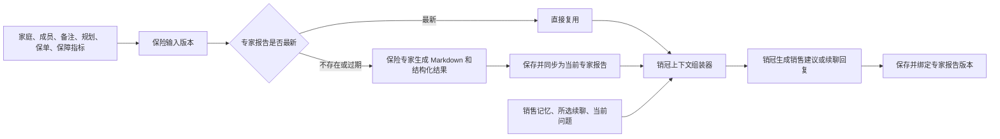

# 家庭销冠基于保险专家报告的分层上下文设计

日期：2026-07-15  
范围：C 端家庭销售建议首次生成、重算与续聊

## 1. 背景

当前 C 端销冠续聊每轮都会重新构造完整 `familyInput`，包含家庭成员、全部保单摘要、责任指标、现金流、家庭报告、官网证据、上一版销售建议、家庭保单分析报告和最近聊天。虽然输入不是原始 OCR 全文，但仍是“压缩后的全量灌入”。同一事实还可能在保单摘要、官网证据和家庭报告中重复出现，导致当前问题被大量无关信息稀释。

系统已经拥有两个不同层次的保险分析产物：

- **保障分析**：由确定性业务逻辑生成，包括家庭成员、保单清单、分类保障指标、金额、待关注项和数据质量，不依赖大模型。
- **家庭保单分析报告**：由保险专家模型基于家庭、保单和保障指标生成，用于解释保障结构、重要问题和待核实事项。

销冠的职责应是把保险专家结论转化为销售策略，而不是再次读取全部底层保险信息并重复进行保险分析。

## 2. 目标

1. 让保险专家报告成为销冠生成销售建议的前置事实层。
2. 专家报告最新时直接复用；不存在或过期时自动生成并同步。
3. 销冠默认读取结构化专家结论，不读取全部底层保单责任和长篇 Markdown。
4. 保留所有有业务意义的已确认、未识别、冲突和无来源指标状态。
5. 首次生成、重算和续聊使用不同的上下文包，避免每轮重复加载全家数据。
6. 保持现有家庭隔离、隐私脱敏、金额校验、销售记忆和勾选续聊重算能力。

## 3. 非目标

- 不修改确定性保障指标的计算口径。
- 不在家庭责任数据不足时输出伪精确的保障缺口金额。
- 不要求用户先手动打开或生成家庭保单分析报告。
- 不把完整 OCR、保单原图或完整官网知识库交给销冠。
- 不在本期实现完全自主的多轮工具调用 Agent。
- 不改造钉钉或 Hermes 链路；只保留可复用的领域服务边界。

## 4. 核心原则

### 4.1 职责分离

- 确定性保障分析负责可计算事实。
- 保险专家负责解释保险事实、保障结构、重要问题和核实事项。
- 上下文组装器负责版本判断、裁剪、分组和预算控制，不生成保险结论。
- 销冠负责销售重点、沟通策略、异议处理、面谈目标和下一步动作。

### 4.2 未识别不等于没有

指标状态至少区分：

- `confirmed`：已识别且达到当前证据要求。
- `not_found_in_recorded_policies`：当前已录入保单中没有发现该项保障，可作为未配置关注点，但不代表客户在系统外绝对没有其他保单。
- `not_identified`：存在相关保单或产品，但现有责任资料未识别到该项；暂按未配置关注，并要求核对合同。
- `conflicted`：不同来源结果冲突。
- `missing_source`：缺少可用于判断的保单或条款来源。
- `not_applicable`：该指标在当前场景不适用。

数值 `0`、字段缺失和 `not_identified` 必须分别表达。

家庭收入、支出、负债、资产和预算等未提供时必须使用 `null + unknown`，不能为了方便计算转换为 `0`。客户不需要为了获得报告先补齐全部家庭财务信息。

### 4.3 定性缺口优先

保险专家可以结合成员角色、已有保单和已确认指标判断：保障缺失、责任不完整、保额偏低、成员配置失衡或保费结构不合理。家庭责任信息不足时，不输出精确缺口金额，但仍可给出有依据的定性判断，并同时说明缺失信息和判断置信度。

定性状态包括：

- `confirmed_gap`：从现有事实可以确认责任未配置或明显不完整。
- `likely_insufficient`：结合成员角色和已有保障，判断保额或责任可能不足。
- `needs_verification`：存在相关保单但指标未识别或来源不足，暂按未配置关注并核对合同。
- `currently_reasonable`：当前数据未发现明显问题，不代表承诺保障充足。

### 4.4 长文用于展示，结构化结果用于协作

家庭保单分析报告生成后同时保存：

- `markdownContent`：供 C 端页面展示和导出。
- `structuredResult`：供销冠及其他受控领域服务读取。

销冠不得以长篇 Markdown 作为默认输入。

## 5. 总体架构



## 6. 保险输入版本与新鲜度

### 6.1 `expertInputVersion`

系统根据会影响保险专家结论的规范化输入计算稳定版本标识。版本输入包括：

- 家庭成员的新增、删除和基本信息变化。
- 家庭备注和成员个人备注。
- 家庭收入、支出、负债、可用资产、保费预算、教育及赡养目标。
- 保单新增、删除、修改和效力状态变化。
- OCR 重跑后关键保单字段变化。
- 确定性保障指标、未识别状态、冲突状态和来源引用变化。
- 官网责任证据或客户保单条款的核实状态变化。

计算版本前应稳定排序并排除更新时间、UI 状态等非业务字段，避免同一业务输入产生不同版本。

以下变化不影响 `expertInputVersion`：

- 销售聊天和销冠回复。
- 销售记忆和顾问表达偏好。
- 页面打开、下载、复制和其他 UI 操作。

### 6.2 新鲜度判断

专家报告可复用必须同时满足：

```text
status = complete
且 report.expertInputVersion = currentExpertInputVersion
```

销售建议记录其使用的 `expertReportId` 和 `expertInputVersion`。上游版本变化时，专家报告和销售建议均标记为过期；历史记录可以查看，但不能作为新销售建议的输入。

## 7. 保险专家结构化结果

建议的稳定输出契约：

```json
{
  "summary": "家庭保障结构的简要结论",
  "priorityFindings": [
    {
      "memberRef": "{{member_1}}",
      "category": "medical",
      "finding": "当前资料未识别到医疗报销责任",
      "assessment": "needs_verification",
      "confidence": "medium",
      "confirmedFactRefs": [],
      "indicatorRefs": ["indicator:medical_general"],
      "policyRefs": [],
      "missingInformation": ["医疗险合同或责任页未提供"],
      "nextVerification": "核实是否存在尚未录入的医疗险或责任页"
    }
  ],
  "confirmedFacts": [],
  "verificationItems": [],
  "memberFindings": [],
  "evidenceRefs": [],
  "dataQualityWarnings": []
}
```

约束：

- 只引用输入中的家庭、保单、指标和证据。
- 可以输出有事实依据的定性缺口判断；家庭责任数据不足时不得输出精确缺口金额。
- `likely_insufficient` 必须说明成员角色、已有保障和缺失信息，不能只给结论。
- `currently_reasonable` 只能表示当前数据未发现明显问题，不能写成保障充足承诺。
- 每个关键结论必须携带成员、指标、保单或证据引用。
- 没有关联保单或指标时，可写“当前已录入保单中未发现该项保障”；存在相关保单但指标未识别时，只能写“暂按未配置关注，需核对合同”。
- 结构化结果解析或校验失败时，该次专家报告生成失败；不得只保存 Markdown 后继续销冠流程。

### 7.1 专家提示词调整

现有提示词中“缺口分析不少于全文 40%”“五类缺口必须套用固定倍数或金额口径”“必须输出基础版、标准版、完善版三档量化建议”等强制要求，调整为定性分析优先：

- 已有信息足以支持时，可以解释保障是否偏低及其风险影响，但无需计算精确差额。
- 家庭财务信息不完整时，不套用固定倍数生成金额，不把未知值当成零。
- 可以提出保障配置的先后顺序，不强制输出三档金额方案。
- 每个“缺失、偏低、不完整、失衡”判断必须同时输出事实依据、缺失信息和置信度。
- 客户不愿补充家庭财务信息时，报告仍应基于现有保单和指标正常完成。

## 8. 指标输入压缩

### 8.1 已确认指标

传入业务必要字段：指标名称、金额或比例、次数或方式、状态、来源保单和证据状态。删除空的技术字段和重复说明。

家庭财务字段采用显式状态：

```json
{
  "annualIncome": { "status": "unknown", "value": null },
  "debt": { "status": "confirmed", "value": 1000000 }
}
```

禁止把未填写的收入、支出、负债、资产或预算转换为数值 `0`。

### 8.2 未识别指标

按“成员 + 保障大类”分组，保留全部指标名称：

```json
{
  "memberRef": "{{member_2}}",
  "category": "accident",
  "status": "incomplete",
  "confirmedItems": [],
  "notIdentifiedItems": [
    "一般意外身故/全残",
    "意外伤残",
    "意外医疗",
    "交通意外",
    "自驾/驾乘",
    "公共交通",
    "航空意外",
    "轨道/轮船",
    "猝死",
    "住院津贴"
  ],
  "interpretation": "存在相关保单但当前责任资料未识别到，暂按未配置关注，需核对合同"
}
```

不逐项重复“金额未识别”“来源为空”“未识别到该责任”等相同文字。

## 9. 生成流程

### 9.1 用户直接生成保险专家报告

1. 刷新确定性保障分析。
2. 计算当前 `expertInputVersion`。
3. 普通读取和销售建议前置检查直接复用相同版本的完成报告。
4. 用户明确点击专家报告页的“重新生成”时，即使输入版本未变，也创建一次新的刷新任务；同一次刷新期间的重复点击复用该任务。
5. 保存 Markdown、结构化结果和版本信息。
6. 将完成报告同步为当前家庭的最新专家报告。

### 9.2 用户生成销售建议

1. 刷新确定性保障分析并计算 `expertInputVersion`。
2. 查询相同家庭和版本的专家报告或进行中任务。
3. 最新报告存在时直接复用，不重复同步或覆盖。
4. 报告不存在或过期时，先生成并同步新专家报告。
5. 专家报告完成后，构建销冠上下文并生成销售建议。
6. 保存销售建议正文、结构化摘要、`expertReportId` 和 `expertInputVersion`。

### 9.3 连续点击去重

客户先点击专家报告生成、再点击销售建议时：

- 专家报告已完成且版本一致：销售建议直接复用。
- 同版本报告仍在生成：销售建议等待同一个任务，完成后自动继续。
- 不得并发创建第二个相同版本的专家报告任务。
- 专家报告失败：停止销售建议生成并显示明确错误。

### 9.4 数据修改后的生成

保单、成员、备注、规划信息或保障指标变化后：

1. 当前专家报告和销售建议显示为过期。
2. 不因保存动作立即调用模型。
3. 用户下一次生成销售建议时，自动补齐新的专家报告。
4. 新报告先保存并同步，再用于生成新的销售建议。

## 10. 销冠上下文

### 10.1 首次生成和重算

销冠接收：

- 家庭和成员最小基本信息。
- 保险专家 `structuredResult`。
- 有助于解释专家结论的少量保单索引。
- 当前有效的销售记忆。
- 顾问明确勾选的最多六条续聊内容。
- 本次任务和输出格式。

销冠默认不接收：

- 全部 `familyInput.policies` 责任明细。
- 完整 `officialEvidence`。
- 完整家庭报告 JSON。
- 专家报告 Markdown 正文。
- 上一版销售建议 Markdown 正文。
- 无关成员的现金流和责任指标。

### 10.2 销售建议结构化摘要

销售建议同时保存供续聊使用的结构化摘要：

- 本次销售结论。
- 最多三个需核实项。
- 最多三个保障关注点。
- 最多三个销售机会。
- 唯一面谈目标。
- 下一步动作。
- 引用的专家结论、成员和保单。

### 10.3 续聊轻量包与专题包

续聊固定读取：销售建议结构化摘要、当前有效销售记忆、最近相关对话、当前问题、资料更新状态，以及成员/保单最小索引。

根据当前问题最多追加一个主要专题包：

- `member_coverage`：指定成员的相关专家结论和指标。
- `policy_indicators`：指定保单的关键指标与状态。
- `responsibility_evidence`：指定责任的来源与核实状态。
- `family_finance`：家庭收入、支出、负债、资产和预算。
- `wealth_cashflow`：指定保单的已核实现金价值或年度给付。
- `expert_findings`：与当前问题直接相关的专家结论。

不得提供无范围限制的 `get_all_family_data` 全量包。

范围优先级：当前问题明确对象、最近一轮明确对象、当前销售建议主机会。仍无法定位时，只基于轻量包回答或请顾问明确对象，不加载全家详细数据。

## 11. 状态与错误处理

建议状态：

- 专家报告：`generating`、`complete`、`failed`、`stale`。
- 销售建议：`waiting_for_expert`、`generating`、`complete`、`failed`、`stale`。

页面状态按实际阶段展示：

```text
正在更新保障分析
→ 正在生成或更新保单专家报告
→ 正在生成销售建议
→ 已完成
```

异常规则：

- 确定性保障分析失败：停止流程，不使用旧数据冒充最新数据。
- 专家结构化结果校验失败：专家任务失败，停止销售建议生成。
- 专家任务失败：保留旧报告供历史查看，但不得用于新销售建议。
- 指标部分未识别：允许继续，但必须携带状态和核实提示。
- 输入在生成过程中发生变化：结果不得成为当前版本；新请求基于新版本重新生成。
- 模型把“存在相关保单但责任未识别”改写成“客户确认没有”：输出质量门拦截；能确定性改写为“暂按未配置关注，需核对合同”时改写，否则任务失败。
- 模型在家庭责任信息不足时输出精确缺口金额：输出质量门拦截并要求改为定性判断。

## 12. 并发与幂等

- 专家任务幂等键：`familyOwner + familyId + expertInputVersion`。
- 销售建议任务幂等键应包含 `familyOwner + familyId + expertReportId + salesInputVersion`。
- 相同幂等键的并发请求共享任务结果。
- 新版本不得覆盖更新版本的当前指针。
- 家庭所有者校验必须在查询、等待、复用和保存每个阶段执行。

## 13. 隐私与证据

- 延续现有成员变量替换和身份证号脱敏。
- 不在模型请求、日志或错误中输出证件号、手机号、原始保单号或原图内容。
- 销冠中的保险事实只能来自专家结构化结果及其引用的确定性事实。
- 第三方或待审核资料不能升级为已确认保障。
- 年度给付和现金流仍使用现有已核实金额事实表与生成后金额校验。

## 14. 可观测性

每次调用记录脱敏统计：

```json
{
  "stage": "insurance_expert | sales_review | sales_chat",
  "expertInputVersion": "hash",
  "expertReportReused": true,
  "expertReportId": 456,
  "contextProfile": "expert_input | sales_summary | sales_chat_lightweight",
  "selectedMemberCount": 1,
  "selectedPolicyCount": 2,
  "confirmedIndicatorCount": 8,
  "notIdentifiedIndicatorCount": 10,
  "topicPacks": ["member_coverage"],
  "estimatedInputTokens": 6200,
  "truncatedSections": []
}
```

日志不得记录家庭敏感全文或模型思维过程。

## 15. 测试与验收

### 15.1 版本与任务

- 相同业务输入生成相同 `expertInputVersion`。
- 保单、成员、家庭/成员备注、规划信息、指标和核实证据变化会改变版本。
- 销售聊天和销售记忆变化不改变专家输入版本。
- 同版本并发专家请求只调用模型一次。
- 销售建议等待进行中的同版本专家任务并自动继续。
- 旧版本任务晚完成时不能覆盖新版本当前报告。

### 15.2 指标语义

- `0`、`null`、`not_found_in_recorded_policies`、`not_identified`、`conflicted` 和 `missing_source` 正确区分。
- 未填写的家庭财务字段保持 `unknown + null`，不得转换为 `0`。
- 未识别项目不丢失，并按成员和保障大类分组。
- 重复空字段和说明不会进入专家输入。
- 没有关联保单或指标时，专家与销冠可以表述“当前已录入保单中未发现”；存在相关保单但责任未识别时，只能表述“暂按未配置关注，需核对合同”。
- 专家可以输出 `confirmed_gap`、`likely_insufficient`、`needs_verification` 和 `currently_reasonable` 定性判断，并携带事实依据、缺失信息和置信度。
- 家庭责任数据不足时，报告不输出精确缺口金额；仍能输出保障缺失、责任不完整、保额偏低和配置失衡等定性结论。

### 15.3 销冠上下文

- 销售建议只使用最新版本的专家结构化结果。
- 最新专家报告直接复用，不产生额外专家调用。
- 过期或缺失时先同步新专家报告，再生成销售建议。
- 续聊不再同时注入完整销售建议、完整专家 Markdown 和全量保单责任。
- 微信话术类问题不加载责任专题。
- 指定成员或保单的问题只加载相关专题。
- 无法定位范围时不加载全家详细数据。

### 15.4 安全与回归

- 家庭 A 的上下文不能进入家庭 B。
- 现有隐私替换、金额校验、销售记忆和勾选重算继续生效。
- 专家失败时不得回退到旧报告或全量上下文。
- C 端无需增加手动生成专家报告的必经步骤。

### 15.5 效果指标

- 普通销售续聊输入体积相比当前实现下降至少 60%。
- 与当前问题无关的成员详细指标数量为零。
- 销冠每项保险事实可追溯到专家结论及其事实引用。
- 保单数量增加时，轻量续聊基础包大小基本稳定，只有命中的专题包增长。

## 16. 实施边界建议

实施应按以下顺序进行：

1. 定义专家结构化结果与稳定版本契约。
2. 为专家报告增加新鲜度、任务去重和结构化结果保存。
3. 把销售建议生成改为“确保最新专家报告后再生成”。
4. 保存销售建议结构化摘要及专家版本引用。
5. 将续聊切换为轻量包和限定专题包。
6. 增加输出质量门、可观测性与回归测试。

每一步保持现有路由和 C 端入口兼容，避免同时重写报告、续聊、记忆和渠道架构。
