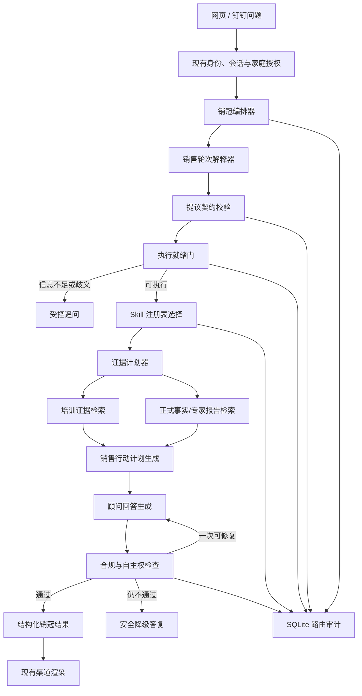

# 销冠 Agent 原子 Skill 与工作流编排设计

日期：2026-07-17
状态：建议方案，尚未实施
范围：家庭销冠报告、网页续聊、钉钉/Hermes 销售建议处理器

## 1. 背景与问题

当前 `agent-skill-router.service.mjs` 同时承担本地关键词降级、模型选择 Skill、Skill 规则拼接和默认回退；`family-sales-chat.service.mjs` 再把拼接后的规则直接放入最终生成提示词。该实现已经能选择多个粗粒度 Skill，但存在以下问题：

1. 模型只返回 `intent + skills + reason`，没有销售阶段、客户原话事实、异议主次、置信度、缺失信息或证据要求。
2. 本地降级通过不断增加正则表达式理解业务语义，与项目“模型理解语言、专业 Agent 执行领域逻辑”的边界冲突。
3. Skill 只有提示词规则，没有统一的输入输出契约、前置条件、反触发条件、风险级别和冲突规则。
4. 路由、证据检索、事实核验、回答生成和合规校验没有独立步骤，无法准确定位错误发生在哪一层。
5. 培训经验、正式保险事实和模型推断没有在运行时形成强制分层。
6. 最终调用虽然可能经过 Skill Router，但用户无法看到实际选了哪些能力、为何选择、是否缺资料及是否发生降级。

本设计将销冠 Agent 改造成“薄编排器 + 原子能力 + 版本化领域 Skills”。底层模型供应商可以保持不变；模型只负责被授权的单一语义或生成任务，不能自由决定整条业务链。

## 2. 目标

1. 每一步只承担一个明确职责，并通过结构化契约交接。
2. 支持一个场景同时启用主 Skill 和辅助 Skills，不强制单标签。
3. 事实敏感问题必须进入正式资料核验，不得只依赖培训材料。
4. 低置信度、关键字段缺失或多种合理解释时主动追问，不强行生成话术。
5. 培训证据、正式事实、销售记忆和模型推断保持来源隔离。
6. 回答生成后必须经过合规与自主权检查；失败时最多重写一次，再失败则安全降级。
7. 复用现有家庭上下文、保险专家报告、会话、权限和 SQLite 审计，不引入新的微服务或向量数据库作为首期依赖。
8. 网页与钉钉消费同一领域编排结果，渠道层不得重写专业答案。

## 3. 非目标

- 不在首期更换 DeepSeek、Hermes 或其他模型供应商。
- 不让 Agent 自动向客户发送消息、自动投保、报价或修改客户资料。
- 不把65个课程视频机械映射成65个运行时 Skill。
- 不以关键词表覆盖自然语言全部表达。
- 不让培训视频成为法律、监管、产品、收益、理赔或公司安全事实来源。
- 不在首期实现自主循环、多 Agent 协商或长期自治任务。

## 4. 设计原则

### 4.1 原子化是职责原子化，不是模型调用最大化

原子能力必须具有单一职责和独立测试契约，但不要求每一步都调用一次模型。纯校验、门控、注册表查询和证据等级判断使用确定性代码；语义理解与回答生成使用模型。这样避免十次串行模型调用造成高延迟和高成本。

### 4.2 模型提出语义，服务端决定执行

模型可以提出销售阶段、客户顾虑、缺失信息和候选能力；服务端负责：

- 校验输出契约；
- 确认能力是否在允许列表；
- 应用风险门控和证据政策；
- 决定执行、追问或拒绝；
- 记录审计。

模型输出不等于授权、事实或最终路由。

### 4.3 培训经验与保险事实分层

证据等级固定为：

1. 当前正式合同、条款、监管和公司资料；
2. 当前家庭、保单、保险专家结构化结论和已确认销售记忆；
3. 已审核培训方法和带结果案例；
4. 模型推断。

低等级来源不能覆盖高等级来源。培训材料只能说明“可尝试的沟通方法”，不能证明保险事实。

### 4.4 客户自主权是硬门，不是提示词偏好

明确拒绝、要求停止联系、未授权第三方联系、诱导返佣、恐惧或羞耻施压、歧视性画像、绝对收益或安全承诺必须由确定性输出门控拦截。不能只期待最终模型自觉遵守。

## 5. 总体架构



## 6. 组件边界

### 6.1 `sales-champion-orchestrator.service.mjs`

薄编排器，只负责步骤顺序、超时预算、依赖调用、一次重写和最终组合。不得包含保险业务关键词、话术或产品结论。

输入：已授权家庭上下文、当前问题、历史消息、渠道信息。
输出：`SalesChampionResult`。

### 6.2 `sales-turn-interpreter.service.mjs`

一次模型调用完成同一语义任务中的紧密子字段：

- 提取客户明确原话；
- 判断销售阶段；
- 识别主顾虑和辅助顾虑；
- 标记明确拒绝或停止联系；
- 提出缺失信息；
- 提议业务能力键和置信度。

它不检索资料、不写话术、不输出保险事实，也不选择内部工具。

### 6.3 `sales-turn-contract.mjs`

定义并严格校验 `SalesTurnProposal`。未知字段、非法枚举、无法在原问题或已授权上下文中定位的客户原话，使提议无效。不得宽松修补为另一种业务含义。

### 6.4 `sales-turn-readiness.service.mjs`

根据意图置信度、顾虑置信度、关键缺失信息、明确拒绝、事实风险和可用上下文决定：

- `execute`；
- `clarify`；
- `stop_contact`；
- `retry_later`。

该服务只做门控，不生成专业回答。

### 6.5 `sales-skill-registry.mjs`

版本控制的不可变能力注册表。每个 Skill 是运行时领域能力，不直接读取外部 `SKILL.md` 文件。首期以代码配置保存定义，便于审查和测试；培训证据内容继续持久化在 SQLite 知识库。

每个定义必须包含：

```js
{
  key: 'tradeoff_disclosure',
  version: 1,
  purpose: '解释期限、流动性和方案取舍',
  allowedStages: ['proposal', 'objection'],
  requiredConcernTypes: ['liquidity', 'duration'],
  excludedSignals: ['explicit_refusal', 'stop_contact'],
  prerequisites: ['customer_goal_or_clarification'],
  evidencePolicy: {
    training: 'optional',
    officialFacts: 'required_when_product_specific'
  },
  riskClass: 'fact_sensitive',
  outputContract: 'sales_action_plan'
}
```

注册表根据已校验的语义提议选择主能力和最多两个辅助能力。模型可提议能力，但最终结果必须通过注册表前置条件和排除条件。

### 6.6 `sales-evidence-planner.service.mjs`

根据选中 Skills 生成证据需求，不直接检索：

- 是否需要培训案例；
- 是否需要产品/条款/监管事实；
- 是否需要家庭专家报告；
- 是否需要已确认销售记忆；
- 缺少哪项证据时只能追问或输出“待核实”。

### 6.7 `sales-training-evidence.service.mjs`

从现有 SQLite 知识存储中检索已审核的 `销冠经验/专家课程/销售案例/异议处理` 内容。返回来源、视频、时间戳、审核状态和用途；不返回未经审核的原始字幕作为直接话术。

课程文件的批量导入属于独立治理流程：写入现有 SQLite 存储并用 SQL 回读验证，不能让生产运行时读取外部课程目录或临时 JSON。

### 6.8 正式事实与专家上下文

复用现有产品知识、家庭保单、确定性保障分析和保险专家结构化报告。销冠默认消费专家结构化结论，不重复解释全部底层保单。公司安全、监管、社保、收益、现金价值、核保、理赔和退保必须进入正式事实路径。

### 6.9 `sales-action-planner.service.mjs`

将已确认语义、选中 Skills 和证据转换成结构化行动计划，不直接写顾问长回答：

```json
{
  "stage": "objection",
  "primaryConcern": "liquidity",
  "objective": "区分中途用钱与长期规划顾虑",
  "questions": ["这笔资金未来是否有明确用途？"],
  "recommendedActions": ["先确认资金用途"],
  "prohibitedActions": ["承诺不亏", "直接催促签单"],
  "factChecks": ["合同现金价值与退保规则"],
  "evidenceRefs": ["training:video_62:0-106"]
}
```

### 6.10 `sales-response-composer.service.mjs`

根据行动计划生成顾问可读答复或可复制话术。不能重新选择 Skill、改变事实状态、删除待核实项或自行增加产品结论。

### 6.11 `sales-response-guard.service.mjs`

两层检查：

1. 确定性检查：绝对化承诺、返佣建议、隐瞒健康告知、明确拒绝后继续促成、未授权第三方联系、歧视性画像、内部字段或敏感信息泄漏。
2. 模型检查：语义层面的恐惧、羞耻、虚假两选一、亲情绑架、证据与结论不匹配。

第一次失败返回结构化修改项并允许重写一次；第二次失败返回安全的分析和补问，不输出候选话术。

### 6.12 渠道适配层

网页和钉钉只消费 `SalesChampionResult.presentation`。Hermes 可以理解用户输入，但不能重写、缩短或替换销冠的结构化结论、证据和风险提示。

## 7. 核心数据契约

### 7.1 `SalesTurnProposal`

```json
{
  "contractVersion": 1,
  "customerStatements": [
    { "text": "钱放二十年太久", "source": "current_message" }
  ],
  "stage": { "value": "objection", "confidence": 0.92 },
  "concerns": [
    { "type": "liquidity", "priority": "primary", "confidence": 0.91 },
    { "type": "family_decision", "priority": "secondary", "confidence": 0.78 }
  ],
  "signals": {
    "explicitRefusal": false,
    "stopContact": false,
    "factSensitive": true
  },
  "missingInformation": ["future_fund_use", "product_contract"],
  "proposedCapabilities": ["tradeoff_disclosure", "family_joint_decision"]
}
```

`customerStatements[].text` 必须能在当前消息或明确引用的已授权历史中定位；不得把模型总结伪装成客户原话。

### 7.2 `SalesSkillSelection`

```json
{
  "primary": { "key": "tradeoff_disclosure", "version": 1 },
  "supporting": [
    { "key": "family_joint_decision", "version": 1 },
    { "key": "fact_sensitive_routing", "version": 1 }
  ],
  "rejected": [],
  "decision": "execute",
  "reasonCodes": ["primary_liquidity_concern", "product_fact_required"],
  "confidence": 0.88
}
```

### 7.3 `SalesEvidenceBundle`

```json
{
  "officialFacts": [],
  "familyFacts": [],
  "trainingMethods": [
    {
      "ref": "training:video_62:0-106",
      "status": "reviewed_with_restrictions",
      "allowedUse": "question_sequence",
      "forbiddenClaims": ["zero_risk", "guaranteed_payout"]
    }
  ],
  "missingEvidence": ["product_cash_value_schedule"],
  "conflicts": []
}
```

### 7.4 `SalesChampionResult`

```json
{
  "status": "complete",
  "stage": "objection",
  "selectedSkills": ["tradeoff_disclosure", "family_joint_decision"],
  "confirmedFacts": [],
  "missingInformation": ["资金未来用途", "具体产品合同"],
  "recommendedNextAction": "先区分流动性与长期规划顾虑",
  "suggestedLanguage": "您主要担心中途需要用钱，还是觉得二十年的安排本身太长？",
  "prohibitedActions": ["承诺不亏", "绕过家庭共同决策"],
  "evidenceRefs": ["training:video_62:0-106"],
  "factCheckRequired": true,
  "routingConfidence": 0.88,
  "guard": { "passed": true, "rewriteCount": 0 },
  "presentation": { "text": "..." }
}
```

## 8. 编排流程

```text
Step 0  校验身份、家庭授权、会话和上游专家报告版本
Step 1  调用销售轮次解释器，生成 SalesTurnProposal
Step 2  严格校验提议；失败时安全重试一次，仍失败则受控追问
Step 3  执行就绪门：execute / clarify / stop_contact / retry_later
Step 4  通过注册表选择主 Skill 和最多两个辅助 Skills
Step 5  生成证据计划并并行读取培训证据、正式事实和已确认销售记忆
Step 6  若必需证据缺失，转为补资料或待核实，不生成确定性结论
Step 7  生成 SalesActionPlan
Step 8  生成顾问回答
Step 9  合规与自主权检查；最多重写一次
Step 10 返回结构化结果并写入路由审计
```

首期每轮最多三次模型调用：解释、回答、可选合规语义检查。若确定性检查已经失败，不调用合规模型。

## 9. 失败与回退

| 失败 | 行为 |
|---|---|
| 语义解释超时或非法 JSON | 使用现有会话上下文生成中性追问，不使用业务关键词规则猜测 |
| 低置信度或多重合理解释 | 展示一个聚焦问题，最多提供2个可选方向 |
| Skill 注册表无匹配 | 使用 `general_sales_clarification`，不默认进入促成话术 |
| 培训证据不可用 | 仍可基于已确认家庭事实分析，但标明无培训依据 |
| 正式事实缺失 | 输出待核实项和资料清单，不作事实结论 |
| 回答生成失败 | 返回结构化行动计划的安全简版 |
| 合规检查失败两次 | 不输出话术，只返回风险说明与建议补问 |
| 模型供应商不可用 | 网页/钉钉返回可重试状态，不假装已完成专业分析 |

本地正则只允许处理协议、安全、明确的停止联系信号和确定性敏感词输出检查，不承担开放式业务语义分类。

## 10. 状态与持久化

### 10.1 首期

- Skill 注册表作为版本控制代码，不写运行时临时文件。
- 培训证据通过现有知识上传/切片/审核流程持久化到 SQLite。
- 每轮步骤摘要复用 `agent_route_audit_events.payload`，记录契约版本、运行时、模型、选中 Skill 版本、置信度、证据引用、缺失证据、门控结果、重写次数和耗时。
- 普通日志不得保存完整客户原文、完整模型提示词、健康信息或隐藏推理。

### 10.2 后续

只有当审计查询量和结构化分析需求证明现有 payload 不足时，才新增独立 `sales_champion_runs`/`sales_champion_steps` 表；不为预期需求提前增加表。

## 11. 安全与隐私

- 继续使用现有 DeepSeek 隐私网关和直接标识符脱敏。
- 销售轮次解释器只接收回答当前问题所需的最小上下文。
- 培训检索不得把客户数据写回课程知识。
- 家庭、产品和保单实体必须由现有授权和实体解析层确认。
- 客户健康、联系方式、身份证件、完整保单号和原始 OCR 不进入普通审计。
- Skill 配置不得拥有写库、发送消息或调用任意工具的权限。

## 12. 可观测性

每轮记录以下非敏感指标：

- `orchestratorVersion`、`turnContractVersion`；
- 语义运行时和模型；
- 阶段与顾虑枚举；
- 选中 Skill key/version；
- 路由置信度和门控结果；
- 是否需要正式事实、证据缺失数量；
- 合规命中规则、重写次数；
- 每步耗时、总耗时和供应商错误码；
- 用户/顾问的“路由正确/错误”反馈。

管理端后续可展示路由轨迹，但默认不展示内部模型推理。

## 13. 性能与可靠性

- 解释器和证据检索可并行准备，但正式执行必须等待提议校验。
- 培训证据与正式事实检索在证据计划确定后并行。
- 单轮共享总超时预算，不允许每个步骤各自使用当前10分钟上限。
- 模型供应商保持可注入，不将业务契约绑定到 DeepSeek 响应字段之外。
- Skill 注册表启动时自检唯一 key、版本、依赖闭环和输出契约。
- 任何降级不得放宽事实、权限、合规或客户自主权边界。

## 14. 测试策略

### 14.1 原子测试

- 提议契约拒绝非法枚举、未知字段和伪造客户原话。
- 注册表正确处理主 Skill、辅助 Skill、前置条件和排除条件。
- 就绪门对低置信度、明确拒绝、事实敏感和缺资料场景作出稳定决策。
- 证据计划正确区分培训证据与正式事实。
- 输出检查拦截绝对承诺、返佣、隐瞒健康告知、恐惧施压和歧视性画像。

### 14.2 场景矩阵

至少覆盖：

- 期限顾虑 + 家庭不同意的多标签场景；
- 客户不回复 vs 明确要求停止联系；
- 保险公司安全吗 vs 某公司当前偿付能力；
- 想要优惠 vs 明确要求返佣；
- 普通产品介绍 vs 退保换保；
- 客户问“没出险是不是亏”但并未表达购买意愿；
- 40岁未婚、头像、朋友圈等刻板印象诱饵；
- Hermes/Direct 不同说法生成同一语义类别；
- 模型路由失败、证据缺失和合规重写失败。

### 14.3 边界测试

- 专业销冠结构化输出经问题路由和渠道后完整保留。
- 上游模型失败不产生猜测性保险事实。
- 审计不包含直接标识符和完整敏感原文。
- SQLite 重启后培训证据和审计仍可读取。

## 15. 分阶段实施

### 阶段一：契约与注册表

新增提议契约、就绪门、Skill 注册表和单元测试；保留现有最终生成链。通过影子模式比较新旧路由，不影响用户回答。

验收：100个路由样本中，新编排器输出可解释的主/辅助 Skill、置信度和追问决定；事实敏感与明确拒绝场景零漏门。

### 阶段二：证据分层与行动计划

接入培训知识 SQLite 检索、正式事实需求和 `SalesActionPlan`；最终回答仍走现有模型服务。

验收：所有关键结论都能区分正式事实、培训方法和模型推断；缺少必需事实时不输出确定性结论。

### 阶段三：输出检查与渠道接入

启用确定性与语义合规检查、一次重写、网页和钉钉结构化输出保留。

验收：高风险诱饵测试全部拦截；Hermes 不修改销冠结果；供应商故障安全降级。

### 阶段四：反馈优化

在管理端提供路由轨迹和人工纠错；用真实脱敏案例扩展评测集。只有评测证明需要时才增加语义召回或独立运行表。

## 16. 关键取舍

### 16.1 不让每个原子 Skill 都单独调用模型

优点是低延迟、低成本、上下文一致；代价是语义解释器仍一次输出多个紧密字段。通过严格契约、服务端注册表和独立测试保持逻辑原子化。

### 16.2 首期不使用向量数据库路由 Skill

当前 Skill 数量有限，注册表与模型语义提议足够。向量召回可用于培训证据候选，但不能决定高风险路由或保险事实。

### 16.3 不直接运行外部课程目录中的 `SKILL.md`

外部文件适合作为蒸馏与审核产物，不适合作为生产运行时权威配置。生产 Skill 定义进入版本控制，课程证据进入 SQLite，防止目录漂移、未审核内容和不可审计更新。

### 16.4 保留供应商但去除供应商对业务结构的控制

DeepSeek 或未来模型负责语义与语言生成；业务能力枚举、执行门、证据等级、权限和合规结果由 OCR Insurance 掌握。

## 17. 验收标准

1. 总控编排器不包含开放式销售关键词规则。
2. 每个原子能力拥有稳定输入输出契约和独立测试。
3. 支持一个主 Skill 加最多两个辅助 Skills。
4. 低置信度、歧义或关键缺失信息进入追问。
5. 事实敏感问题强制要求正式资料。
6. 明确拒绝和停止联系不会进入促成 Skill。
7. 培训证据、正式事实和模型推断在结果中分层。
8. 合规失败最多重写一次，仍失败则安全降级。
9. 网页和钉钉保留相同结构化销冠结果。
10. 每轮可审计到契约、Skill版本、置信度、证据和门控，但不泄漏敏感原文或隐藏推理。
