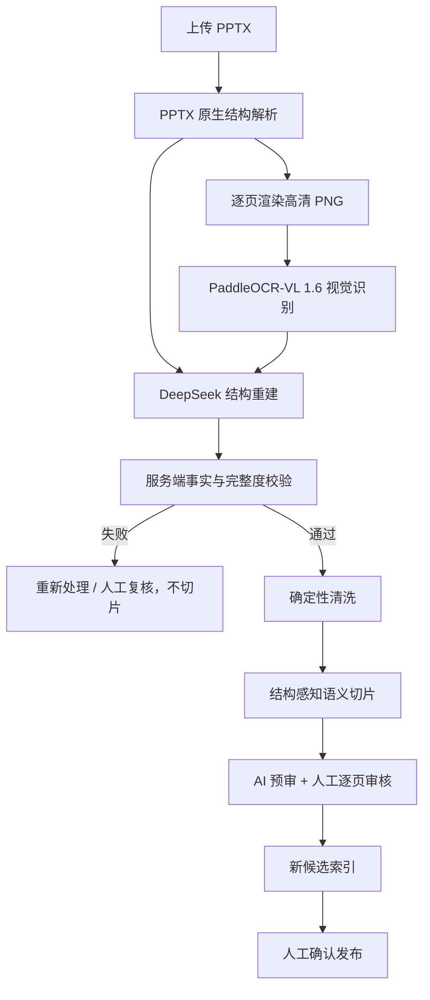

# PPT 上传后 PaddleOCR-VL 1.6 + DeepSeek 自动处理设计

日期：2026-07-18  
状态：需求已确认，实施中  
适用范围：产品知识库所有 `.pptx` 上传和重新处理任务

## 1. 核心决策

PPT 上传后必须自动执行双证据解析和语义重建：

1. `officeparser/PPTX XML` 提取原生文字、备注和可读取结构。
2. 每页渲染为高清 PNG，强制调用现有线上 `PaddleOCR-VL 1.6（AutoDL）`。
3. PaddleOCR-VL 返回文字、Markdown、坐标和表格。
4. DeepSeek V4 接收“PPT 原生结果 + PaddleOCR-VL 结果”，负责去重、断行修复、分组、表格语义整理和冲突说明。
5. 服务端校验 DeepSeek 没有补造金额、比例、日期、期限等关键事实。
6. 任一页面缺少 PaddleOCR-VL 或 DeepSeek 结果，整份 PPT 不生成可发布候选切片。
7. PaddleOCR-VL 识别和 DeepSeek 重建都成功后，才进入清洗、语义切片和人工审核。
8. 重处理只生成新候选版本，不覆盖当前索引。

DeepSeek 当前按文本模型使用，不直接看图片，也不会天然读取 PPT 对象。系统必须显式把原生结构和 PaddleOCR-VL 结构化结果交给它。

## 2. 处理链路



## 3. 模块职责

### PPT 原生解析

`server/product-document-parser.service.mjs`

- 提取原生文字和备注。
- 保留原始解析结果，不能被后续模型覆盖。
- 只提供第一路证据，不再把“抽到部分文字”判定为完整。

### 页面渲染

`server/product-document-preview.service.mjs`

- 将全部幻灯片渲染为 PNG。
- PaddleOCR-VL 输入使用高清版本。
- 渲染页数必须与 PPT 页数一致。

### PaddleOCR-VL 1.6 页面解析

`POST /internal/ocr/product-pages/parse`

输入：页面 PNG、文档 ID、页码。  
输出：`ocrText`、`markdown`、`boxes`、`tables`、模型和解析版本。

必须固定调用 `paddleocr_vl16_autodl`，不调用 DeepSeek-OCR。

### DeepSeek 语义重建

`server/product-slide-reconstruction-model.service.mjs`

输入：

```json
{
  "pageNo": 17,
  "nativeText": "PPTX 原生文字",
  "paddleOcrText": "PaddleOCR-VL 文字",
  "paddleMarkdown": "PaddleOCR-VL Markdown",
  "paddleTables": [],
  "paddleBoxes": []
}
```

输出：

```json
{
  "canonicalMarkdown": "规范页面内容",
  "tables": [{ "headers": [], "rows": [] }],
  "issues": []
}
```

DeepSeek 只能整理两路证据，不得补充模型常识。原生与 OCR 冲突时写入 `issues`，不能擅自选择。

### 视觉处理编排

`server/product-slide-visual-ingestion.service.mjs`

- 默认并发处理 2 页。
- 每页先 PaddleOCR-VL，后 DeepSeek。
- 任一阶段失败都阻断切片。
- 页面结果写入 SQLite 后支持恢复处理。

## 4. 质量门

- PaddleOCR-VL 成功页数必须等于总页数。
- DeepSeek 重建成功页数必须等于总页数。
- PPT 原生文字必须保留为来源证据。
- DeepSeek 输出新增了来源中不存在的金额、比例、日期或期限时直接失败。
- PaddleOCR-VL 识别到表格时，最终结果必须保留非空行列。
- 关键事实存在原生/OCR冲突时必须人工复核。
- 封面和目录仍完成解析，之后由人工决定“不入库”。
- 不允许仅因页面非空就判定解析完整。

## 5. 持久化与审计

页面 `layout_json` 保存：

```js
{
  nativeExtraction: { text: '...', parser: 'pptx_native' },
  visualExtraction: {
    provider: 'paddleocr_vl16_autodl',
    model: 'PaddleOCR-VL-1.6',
    markdown: '...',
    boxes: [],
    tables: []
  },
  semanticReconstruction: {
    model: 'deepseek-v4-flash',
    version: 'product-ppt-reconstruction-v1',
    canonicalMarkdown: '...',
    issues: []
  }
}
```

原始 PPT、PPTX 原生结果、PaddleOCR-VL 结果和 DeepSeek 输出都要可追溯。人工修正只能生成派生候选版本。

## 6. 现有 47 页课件重新处理

目标：`Copy of 司庆系列健康险产品培训课件(1).pptx`

1. 保留当前索引和所有历史候选。
2. 全部 47 页重新渲染。
3. 47 页全部调用 PaddleOCR-VL 1.6。
4. 47 页全部调用 DeepSeek 进行结构重建。
5. 运行完整度和关键事实校验。
6. 生成新的页面、表格与切片候选版本。
7. 新候选不继承旧候选的人工通过状态。
8. 人工重新核对后发布。

重点验收：

- 第 11 页完整保留左右蓝色卡片、标题、正文和分组。
- 第 17 页还原“保障项目 × 计划一/二/三”矩阵，并正确关联“对应年度免赔额后 50% 赔付”。

## 7. 自动化验收

- 47/47 页有 PaddleOCR-VL 解析记录。
- 47/47 页有 DeepSeek 重建记录。
- 任一阶段失败时没有新候选切片。
- 表格页输出结构化行列。
- 每个切片可追溯到页码、原生证据和 PaddleOCR-VL 证据。
- 重跑不覆盖旧索引，发布后仍支持回滚。
- 默认链路不调用 DeepSeek-OCR。

