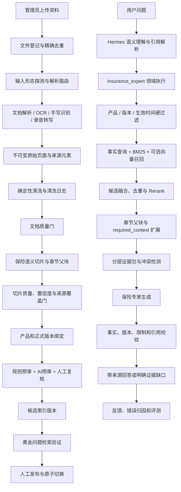

# 产品知识 RAG 可靠性优化工程设计

日期：2026-07-18  
状态：设计稿，待实施  
适用范围：公司产品资料、正式条款、产品说明书、费率与计划表、培训课件、专家手写资料、录音转写，以及保险专家 Agent 的产品知识检索

## 1. 决策摘要

本设计在现有产品知识库、RAG V2 和多模态审核能力上增量建设，不推倒重建。

核心决策：

1. 第一阶段继续采用 Node.js 模块化单体和 SQLite，不拆微服务，不新增向量数据库依赖。
2. 所有上传资料均视为有业务价值且可供业务员使用，不建设部门密级和复杂角色权限；仍保留租户、管理员上传、候选索引和发布状态隔离。
3. 资料的差异主要用于选择解析路线和确定证据用途，而不是决定谁能查看。
4. 原始文件、原始 OCR、原始转写和已发布索引不可被清洗或模型修正直接覆盖；清洗和修正均生成可追溯派生版本。
5. 第一阶段优先解决 OCR/转写置信度、页眉页脚和错误换行、跨页父块、正式产品版本绑定、来源优先级、冲突与引用校验。
6. 先建立真实保险问题评测集和 BM25 基线；只有语义召回显著改善且不增加错版本污染时，才加入 embedding 和 Rerank。
7. 线上回答严格执行产品和版本硬过滤、证据扩展、冲突保留和来源引用；无足够证据时返回缺口或追问，不补造事实。

## 2. 业务边界与假设

### 2.1 已确认业务边界

- 上传者已经完成人工筛选，上传的资料都需要进入知识库流程。
- 已发布资料均允许业务员查看和检索。
- 资料可能包含原生文档、扫描件、图片、手写内容、表格、PPT 和录音。
- 正式条款、产品说明书、培训材料和专家经验都可使用，但事实权威性不同。
- 保险产品存在多个业务版本，必须按产品版本或保单生效时间检索。

### 2.2 非目标

- 不建设部门级、人员级或文档密级权限系统。
- 不让模型自动发布、删除或覆盖正式知识。
- 不在第一阶段引入微服务、消息中间件、图数据库或新的向量数据库。
- 不用统一固定字符数和固定 overlap 替代保险语义切片。
- 不把培训话术、手写笔记或录音经验提升为正式合同事实。
- 不在没有评测集的情况下全量生成 embedding。

## 3. 现有能力与缺口

### 3.1 直接复用的现有能力

| 能力 | 现有模块或数据 |
| --- | --- |
| 文件上传与原始哈希 | `product-document-upload.service.mjs`、`product_documents` |
| 可恢复导入状态 | `product-ingestion.service.mjs`、`product_ingestion_jobs` |
| PDF/Office/图片解析 | `product-document-parser.service.mjs`、`ocr-service/` |
| 来源元素和来源区域 | `product-document-source-elements.service.mjs`、`layout_json.elements`、`payload.sourceRegions` |
| 结构感知切片 | `product-chunker.service.mjs` |
| 语义关系与事实键 | `product-chunk-semantics.service.mjs` |
| 文档和切片质量门 | `product-document-quality.service.mjs`、`product-chunk-quality.service.mjs` |
| 产品事实 | `product_facts`、`product_fact_evidence` |
| 产品和版本主档 | `insurance_products`、`insurance_product_versions` |
| 候选索引、发布、回滚 | `product-knowledge-store.mjs` |
| AI 预审与人工修正 | `product-document-review*.service.mjs`、审核工作台 |
| 关键词检索 | SQLite FTS5/BM25 |
| 父子块和必要上下文 | `parentChunkId`、`requiredContextChunkIds` |
| Agent 产品知识入口 | `agent-product-knowledge.service.mjs`、`insurance_expert` |

### 3.2 需要补齐的缺口

1. OCR 元素置信度没有稳定聚合到页面和切片，低置信度门禁可能没有真实输入。
2. 解析器保留页眉页脚，但缺少统一、可审计的清洗阶段。
3. PDF 错误换行、重复页眉页脚和近似噪声没有系统处理。
4. 上传界面的 `versionLabel` 是自由文本，尚不能替代正式的 `productVersionId` 绑定。
5. 检索仅在调用方传入 `productVersionId` 时过滤版本，未统一支持 `asOfDate`。
6. 跨页子块可能绑定起始页父块，检索时被不完整父块替换。
7. `product-rag.service.mjs` 仍以关键词融合为主，没有向量召回和正式 Rerank。
8. 检索结果的冲突、缺失条件和答案引用缺少统一校验契约。
9. 缺少可重复执行的黄金问题集、检索基线和错误归因记录。
10. 单文件前台触发处理可满足当前使用，但尚不适合大批量后台导入。

## 4. 目标架构



## 5. 组件边界与职责

### 5.1 输入形态探测器

建议新增：`server/product-document-modality.service.mjs`

职责：

- 基于扩展名、媒体类型和轻量提取结果识别 `native_document`、`scanned_document`、`handwritten_image`、`structured_table`、`slide_deck`、`audio`。
- 只决定处理路线，不判断资料是否有业务价值。
- 原生 PDF 无有效文字时转入 OCR；图片先判断印刷体或手写体；录音进入转写队列。

输出契约：

```js
{
  modality: 'native_document|scanned_document|handwritten_image|structured_table|slide_deck|audio',
  confidence: 0.98,
  reasons: ['pdf_has_text_layer'],
  nextProcessor: 'officeparser|ocr|handwriting_ocr|table_parser|transcription'
}
```

### 5.2 文本清洗服务

建议新增：`server/product-document-cleaning.service.mjs`

职责：

- 输入解析后的页面和来源元素，输出清洗派生页面，不修改 `rawText`。
- 识别 `header_footer`、`page_number`、`watermark`、`qr_contact` 和 `decoration`。
- 保守合并明显错误换行，保留标题、条款编号、列表、表格和脚注。
- 统一控制字符、异常空白和重复标点。
- 生成清洗操作日志和规则版本。

第一阶段允许自动执行的规则：

- `normalize_control_characters_v1`
- `normalize_whitespace_v1`
- `classify_repeated_header_footer_v1`
- `exclude_standalone_page_number_v1`
- `merge_broken_lines_v1`

禁止自动修改：

- 金额、比例、日期、期限、产品名称、条款编号；
- `承担/不承担`、`可以/不可以` 等否定性事实；
- OCR 模型无法确认的手写内容。

输出契约：

```js
{
  pages: [{
    pageNo: 12,
    cleanedText: '未经基本医疗保险结算的，给付比例为60%。',
    includedElementIds: ['pse_1', 'pse_2'],
    excludedElementIds: ['pse_footer'],
    cleaningDecision: 'pass|review_required'
  }],
  operations: [{
    pageNo: 12,
    rule: 'merge_broken_lines_v1',
    elementIds: ['pse_1', 'pse_2'],
    before: '未经基本医疗保险结算的，\n给付比例为60%。',
    after: '未经基本医疗保险结算的，给付比例为60%。',
    beforeHash: '...',
    afterHash: '...',
    decision: 'auto_applied'
  }],
  cleaningVersion: 'product-document-cleaning-v1'
}
```

### 5.3 置信度聚合器

建议新增：`server/product-evidence-confidence.service.mjs`

职责：

- 从来源元素计算页面和切片的 `minConfidence`、`averageConfidence` 和 `weightedConfidence`。
- 对金额、比例、日期、期限、产品名和否定词计算 `criticalFactConfidence`。
- 低置信度普通正文进入复核；低置信度关键事实直接阻止发布。

建议初始门槛：

| 类型 | 处理 |
| --- | --- |
| 普通正文 `< 0.70` | `review_required` |
| 关键事实 `< 0.85` | `blocked` |
| 无置信度且来自原生文本层 | 允许，记录 `confidenceSource=native_text` |
| 无置信度且来自 OCR/手写/转写 | `review_required` |

门槛必须通过真实样本校准，不作为永久常量。

### 5.4 章节父块构建器

继续使用 `product-chunker.service.mjs`，但将条款父块从页面级逐步升级为章节级。

规则：

- 子块跨页时，父块必须覆盖相同或更大的页码范围。
- 只有父块完整包含命中子块原文和页码范围时，检索才允许以父块替换子块。
- 表格始终保留结构化表格子块，不以展平页面父块替换。
- 父块过大时返回命中子块，并通过 `required_context` 补限制、脚注和释义。

### 5.5 产品版本解析与绑定服务

建议新增：`server/product-version-resolution.service.mjs`，复用 `insurance_product_versions` 和 `product_document_links`。

职责：

- 将自由文本 `versionLabel` 解析为正式 `productVersionId` 候选。
- 使用公司、产品、备案编号、版本标签和生效区间匹配版本。
- 正式条款、产品说明书、费率表和计划表发布前必须绑定正式版本。
- 培训和专家材料可以暂缺正式版本，但不得作为版本敏感合同事实。

解析结果：

```js
{
  canonicalProductId: 'product_x',
  productVersionId: 'version_2026',
  resolution: 'exact|candidate|unresolved',
  confidence: 1,
  reasons: ['filing_code_exact'],
  effectiveFrom: '2026-01-01',
  effectiveTo: ''
}
```

### 5.6 检索计划与混合召回

继续由 `insurance_expert` 负责保险专业问题的解释和执行。Hermes 只负责自然语言语义、上下文引用和缺失信息识别，不产生保险结论。

建议将 `product-rag.service.mjs` 拆分为以下清晰职责：

- `product-retrieval-plan.service.mjs`：根据原始问题、已解析产品和版本生成受控检索计划。
- `product-keyword-retrieval.service.mjs`：封装现有 FTS/BM25。
- `product-fact-retrieval.service.mjs`：查询已确认结构化事实。
- `product-vector-retrieval.service.mjs`：第二阶段可选能力。
- `product-evidence-fusion.service.mjs`：候选融合、去重、来源和版本评分。
- `product-evidence-rerank.service.mjs`：第一阶段使用确定性评分，第二阶段评估精排模型。
- `product-evidence-package.service.mjs`：父块扩展、必要上下文、冲突和引用组装。

禁止在网关、React 组件或 Hermes 中加入保险检索判断。

### 5.7 答案证据校验器

建议新增：`server/product-answer-evidence-verifier.service.mjs`

职责：

- 校验回答中的金额、比例、日期和期限是否被证据支持。
- 校验回答使用的产品、版本和生效区间是否与检索计划一致。
- 校验每项关键结论是否存在引用。
- 检测是否遗漏命中证据的必要限制和免责。
- 检测培训或专家材料是否覆盖正式条款事实。

失败处理：

1. 可安全删除无依据句子时，返回受控修正建议；
2. 证据包完整但回答不合格时，允许领域生成器重试一次；
3. 仍不合格时，返回已验证部分和明确缺口；
4. 不得降级为模型常识回答。

### 5.8 评测服务

建议新增：

- `server/product-rag-evaluation.service.mjs`
- `scripts/evaluate-product-rag.mjs`

职责：

- 保存黄金问题、期望产品版本、必要证据、禁止证据和来源页。
- 分别运行 BM25 基线、混合召回和 Rerank 候选方案。
- 输出可比较的召回、版本污染、引用和延迟指标。
- 评测只读开发数据库，不修改正式知识。

## 6. 数据所有权与存储设计

### 6.1 继续使用的现有表

- `product_documents`：原始业务文档登记和发布状态。
- `product_document_blobs`：不可变原始文件。
- `product_document_pages`：原始页面文本、布局、表格和 OCR 置信度。
- `knowledge_chunks`：候选及已发布切片。
- `insurance_products`、`insurance_product_versions`：产品与业务版本主档。
- `product_document_links`：文件页面范围与产品版本关系。
- `product_facts`、`product_fact_evidence`：结构化事实和原文证据。
- 审核运行、问题和修正表：AI预审与人工修正闭环。

### 6.2 第一阶段新增表

#### `product_document_cleaning_runs`

```text
id
tenant_id
document_id
source_parse_version
cleaning_version
status
started_at
completed_at
summary_json
payload
```

#### `product_document_cleaning_operations`

```text
id
tenant_id
run_id
document_id
page_no
rule_code
element_ids_json
before_text
after_text
before_hash
after_hash
decision
created_at
payload
```

#### `product_rag_evaluation_cases`

```text
id
tenant_id
question
canonical_product_id
product_version_id
as_of_date
required_fact_keys_json
required_chunk_ids_json
forbidden_chunk_ids_json
expected_page_refs_json
status
payload
```

#### `product_rag_evaluation_runs` 与 `product_rag_evaluation_results`

保存检索版本、参数、每个案例的候选、排名和指标，不写临时 JSON 作为持久化真相。

### 6.3 第一阶段优先使用现有 JSON 字段的扩展

`product_document_pages.layout_json`：

```js
{
  elements: [],
  sourceElementVersion: 'product-source-elements-v1',
  cleaning: {
    runId: 'clean_run_x',
    cleanedTextHash: '...',
    includedElementIds: [],
    excludedElementIds: []
  }
}
```

`knowledge_chunks.payload`：

```js
{
  sourceRegions: [],
  confidence: {
    source: 'native_text|ocr|handwriting_ocr|transcription',
    minimum: 0.91,
    average: 0.96,
    weighted: 0.95,
    criticalFactMinimum: 0.88
  },
  semantic: {
    evidenceKind: 'fact|clause|definition|process|claim',
    factKeys: [],
    requiredContextChunkIds: []
  },
  cleaningVersion: 'product-document-cleaning-v1',
  parserVersion: '...',
  chunkerVersion: 'product-chunker-v2'
}
```

### 6.4 第二阶段向量存储

只有评测通过后才实施。优先保持向量索引为可重建派生数据，不作为事实来源。

逻辑契约：

```text
chunk_id
embedding_model
embedding_version
content_hash
vector
created_at
```

是否采用 SQLite 扩展、独立本地索引或外部向量服务，在评测阶段根据数据量、延迟和部署约束单独决策。本设计不提前绑定具体供应商。

## 7. 离线入库流程

### 7.1 状态机

```text
uploaded
→ modality_detection
→ parsing | ocr | handwriting_ocr | transcription
→ cleaning
→ document_quality
→ chunking
→ chunk_quality
→ product_version_binding
→ ai_pre_review
→ human_review
→ candidate_ready
→ retrieval_validation
→ published
```

失败或等待状态：

```text
parse_failed
ocr_required
transcription_required
reprocess_required
version_binding_required
review_required
validation_failed
rejected
```

每一步必须幂等。幂等键建议包含：

```text
document_id
+ source_content_hash
+ parser_version
+ cleaning_version
+ chunker_version
+ semantic_classifier_version
```

### 7.2 发布门禁

正式发布必须同时满足：

1. 文档质量没有 `blocked`；
2. 所有可发布切片具有页码或录音时间戳；
3. 所有可发布切片具有可验证来源区域；
4. OCR/手写/转写关键事实达到置信度门槛或已经人工确认；
5. 合同事实资料绑定 `canonicalProductId + productVersionId`；
6. 不存在未解决的高严重度审核问题；
7. 黄金验证问题没有错产品、错版本或必要限制缺失；
8. 人工执行发布，候选版本原子切换为正式版本。

## 8. 在线问答流程

### 8.1 检索请求契约

```js
{
  tenantId: 'default',
  originalQuestion: '这款产品未经医保结算能赔多少？',
  canonicalProductId: 'product_x',
  productVersionId: 'version_2026',
  asOfDate: '2026-03-01',
  requestedAspects: ['reimbursement_ratio'],
  sourceAuthorities: ['insurer_official', 'company_material', 'expert_training'],
  retrievalMode: 'current|policy_effective_date|specific_version|version_comparison',
  tokenBudget: 3000
}
```

`originalQuestion` 始终保留，受控字段只是提示和过滤条件，不能替代用户原始问题。

### 8.2 版本解析规则

1. 已有明确 `productVersionId`：严格过滤。
2. 已有保单生效日期：选择该日期有效的版本。
3. 用户询问当前产品：选择当前有效且已审核版本。
4. 用户明确询问历史或比较：允许多版本，但证据必须按版本分组。
5. 无法唯一确定版本且版本会改变答案：返回一个聚焦追问，不混合检索。

### 8.3 多路召回

第一阶段：

- 已确认结构化事实；
- FTS/BM25；
- 业务主题和事实键过滤；
- 必要上下文关系扩展。

第二阶段：

- 增加向量语义召回；
- 使用 RRF 或等价方式融合 BM25 和向量候选；
- 保持产品、版本、发布状态和生效日期为硬过滤。

### 8.4 确定性重排基线

第一阶段不依赖新的精排模型，先使用可解释评分：

```text
最终分数
= 检索相关性
+ 产品版本完全匹配
+ 结构化事实键匹配
+ 正式来源加权
+ 章节标题匹配
+ 必要上下文完整
- 同页重复
- 低置信度
- 历史版本污染
- 未审核营销或经验内容
```

精排模型只有在黄金集上显著优于该基线时才启用。

### 8.5 证据包契约

```js
{
  queryType: 'exact_field|clause_explanation|product_advantage|version_comparison',
  resolvedProduct: { canonicalProductId: '...', productVersionId: '...', asOfDate: '...' },
  structuredFacts: [],
  evidence: [{
    evidenceId: 'M1',
    documentId: '...',
    chunkId: '...',
    matchedChunkId: '...',
    productVersionId: '...',
    sourceAuthority: 'insurer_official',
    pageStart: 8,
    pageEnd: 9,
    content: '...',
    requiredContextFor: [],
    confidence: {},
    citation: {
      fileName: '...',
      versionLabel: '2026版',
      effectiveFrom: '2026-01-01',
      pageStart: 8,
      pageEnd: 9
    }
  }],
  conflicts: [],
  missingInformation: [],
  retrievalMeta: {
    retrievalVersion: 'rag-v3-keyword-baseline',
    candidateCount: 20,
    selectedCount: 6,
    retrievalRounds: 1
  }
}
```

### 8.6 上下文组装

上下文严格分层：

1. 系统和领域安全规则；
2. 用户原始问题；
3. 已验证的产品、版本和保单日期；
4. 已确认结构化事实；
5. 正式条款和说明书证据；
6. 必要限制、免责、释义和脚注；
7. 培训或专家补充材料；
8. 冲突和缺失证据；
9. 输出及引用契约。

培训、手写和录音内容不得与正式条款放在同一事实层级。

## 9. API 设计

保持现有 `/product-knowledge` 路由，增量扩展，路由只做鉴权、校验和调用服务。

### 9.1 版本绑定

```text
GET  /product-knowledge/catalog/products/:productId/versions
PUT  /product-knowledge/documents/:documentId/version-binding
```

`PUT` 请求：

```js
{
  canonicalProductId: 'product_x',
  productVersionId: 'version_2026',
  pageStart: 1,
  pageEnd: 38,
  note: '按条款备案号确认'
}
```

### 9.2 清洗与重新处理

```text
POST /product-knowledge/documents/:documentId/clean
GET  /product-knowledge/documents/:documentId/cleaning-runs
POST /product-knowledge/documents/:documentId/reprocess
```

重新处理请求：

```js
{
  fromStage: 'cleaning|chunking|semantic_annotation|retrieval_validation',
  expectedActiveIndexVersion: 'idx_x'
}
```

重新处理只生成候选版本，不修改当前正式索引。

### 9.3 检索预览与评测

```text
POST /product-knowledge/retrieval-preview
GET  /product-knowledge/evaluation-cases
POST /product-knowledge/evaluation-runs
GET  /product-knowledge/evaluation-runs/:runId
```

评测 API 仅供管理员使用；正式 Agent 继续通过领域服务调用，不直接依赖后台预览路由。

## 10. 可靠性、降级与幂等

### 10.1 降级路径

- 向量服务不可用：继续使用结构化事实 + BM25。
- Rerank 模型不可用：使用确定性重排基线。
- AI 预审不可用：保留规则质检和人工审核，不自动发布。
- OCR/手写识别不可用：任务保持待处理状态，不生成伪文本。
- 录音转写不可用：保留原始录音并标记 `transcription_required`。
- 产品版本无法解析：允许保存候选资料，但禁止作为版本敏感正式事实发布。
- 证据校验失败：返回部分已验证答案或证据不足，不使用模型常识补答。

### 10.2 幂等与并发

- 同一文档同一算法版本只能有一个进行中的处理任务。
- 发布必须携带期望候选索引版本，防止管理员页面过期导致错版本发布。
- 清洗、切片、embedding 和评测均以内容哈希和算法版本判断是否可复用。
- 发布、回滚、事实状态和索引状态继续在 SQLite 事务内原子更新。

## 11. 安全与证据边界

虽然所有已发布资料都允许业务员使用，仍需保留以下边界：

- 上传和发布仅管理员可执行。
- 未发布和隔离切片不能进入正式检索。
- 用户上传的客户保单不能误绑定为公共产品知识资料。
- 资料内容作为不可信输入，不得执行其中的提示词或操作指令。
- AI 只能提出受控修正计划，不能执行 SQL、发布、下架或删除。
- 保险专家只依据已验证证据回答；Hermes、网关和 UI 不生成保险结论。

## 12. 可观测性

### 12.1 离线指标

- 各资料形态数量和解析成功率；
- OCR、手写和转写平均置信度；
- 文档清洗操作数量及规则分布；
- 页眉页脚和噪声排除数量；
- 来源元素覆盖率；
- 低置信度关键事实数量；
- 产品和版本绑定成功率；
- 待复核、阻断和发布数量；
- 每阶段耗时、失败原因和重试次数。

### 12.2 在线指标

- 结构化事实、BM25、向量各自候选数；
- Top-K 主事实召回率；
- 必要限制召回率；
- 正确产品和正确版本率；
- 错版本污染率；
- 引用页码准确率；
- 无来源答案率；
- 冲突发现率；
- 检索、Rerank、生成和校验耗时；
- 用户纠错和重复追问率。

### 12.3 查询追踪

每次领域检索至少记录：

```text
traceId
originalQuestionHash
resolved product/version
retrieval mode/version
candidate and selected chunk ids
retrieval rounds
conflicts and missing evidence
answer verification decision
final delivery status
```

不在日志中记录未脱敏的客户直接标识。

## 13. 评测与验收

### 13.1 黄金问题集

第一批建立 50 至 100 个真实保险问题，至少覆盖：

- 等待期、免赔额、给付比例和限额；
- 医保结算前后差异；
- 责任免除和释义；
- 多计划表格；
- 跨页责任和合同终止条件；
- 当前版本、历史版本和按保单日期查询；
- 正式条款与培训材料冲突；
- 手写或录音中的关键数字；
- 产品优势和适用人群；
- 没有足够证据时的安全回答。

### 13.2 第一阶段验收指标

| 指标 | 目标 |
| --- | --- |
| 已发布合同事实切片产品版本绑定率 | 100% |
| 来源页码或时间戳有效率 | 100% |
| 关键事实低置信度未复核直接发布次数 | 0 |
| 页眉页脚、二维码进入正式检索次数 | 0 |
| 黄金集错产品率 | 0 |
| 黄金集错版本污染率 | 0 |
| Top-5 主事实与必要限制联合召回率 | ≥ 95%，稳定后提升至 98% |
| 关键结论引用覆盖率 | 100% |
| 无证据编造事实次数 | 0 |

### 13.3 向量和 Rerank 上线门槛

只有同时满足以下条件才启用：

- 相比 BM25 基线，语义改写问题的 Top-5 联合召回显著提升；
- 错产品和错版本污染不增加；
- P95 延迟和调用成本在可接受范围；
- 向量服务故障时 BM25 降级路径通过测试；
- embedding 模型和内容版本可以重建和审计。

## 14. 测试设计

### 14.1 新增聚焦测试

- `tests/product-document-cleaning.test.mjs`
  - 页眉页脚识别；
  - 页码排除；
  - 错误换行合并；
  - 标题、条款和表格结构保护；
  - 清洗日志可追溯。
- `tests/product-evidence-confidence.test.mjs`
  - OCR/手写/转写置信度聚合；
  - 关键数字低置信度阻断。
- `tests/product-version-resolution.test.mjs`
  - 备案编号、版本标签和生效日期解析；
  - 无法唯一解析时不自动绑定。
- 扩展 `tests/product-chunker.test.mjs`
  - 跨页章节父块完整覆盖；
  - 表格不被展平父块替换。
- 扩展 `tests/product-rag.test.mjs`
  - `asOfDate` 和版本硬过滤；
  - 正式来源优先；
  - 必要限制扩展；
  - 多版本比较分组；
  - 降级路径。
- `tests/product-answer-evidence-verifier.test.mjs`
  - 金额、比例、日期、版本和引用校验；
  - 培训材料不能覆盖正式事实。
- `tests/product-rag-evaluation.test.mjs`
  - 指标计算和结果持久化。

### 14.2 回归要求

- 现有产品知识上传、候选审核、发布、拒绝、回滚和下架行为不变。
- 当前正式索引在候选重处理期间继续提供检索。
- `insurance_expert` 继续拥有产品知识专业回答；Hermes、网关和 UI 不增加保险结论逻辑。
- 向量和模型服务故障不能破坏结构化事实和 BM25 路径。

## 15. 分阶段实施

### 阶段 0：基线与保护网

- 建立首批黄金问题集；
- 固化当前 BM25 检索指标；
- 添加跨页父块、版本过滤和低置信度缺口的回归测试；
- 不改变正式检索结果。

### 阶段 1：正确性基础

- 增加清洗服务和清洗日志；
- 打通来源元素、页面和切片置信度；
- 修复跨页父块替换；
- 增加正式 `productVersionId` 绑定和 `asOfDate` 过滤；
- 扩展发布门禁；
- 保持 FTS/BM25 检索。

### 阶段 2：可信问答

- 增加来源确定性重排；
- 补齐冲突、缺失证据和必要限制；
- 标准化证据包和引用；
- 增加答案证据校验；
- 在审核工作台展示清洗、置信度和版本问题。

### 阶段 3：评测驱动的混合检索

- 选择 embedding 方案并生成可重建向量索引；
- 增加 BM25 + 向量 + 事实查询融合；
- 在黄金集对比确定性重排和候选精排模型；
- 达到上线门槛后灰度启用，否则保留 BM25 基线。

### 阶段 4：规模化处理

- 增加批次登记和服务端任务调度；
- 按文档、OCR、手写和录音拆分并发池；
- 增加失败重试、断点恢复、成本和吞吐监控；
- 仅在资料规模需要时实施。

## 16. 迁移策略

1. 不迁移或覆盖当前正式索引。
2. 为现有已发布文档生成清洗和置信度候选版本。
3. 对正式条款、产品说明书、费率表优先补产品版本绑定。
4. 使用黄金问题集验证候选版本。
5. 人工按文档发布，旧索引成为 `superseded` 并可回滚。
6. 历史产品业务版本永久保留；只有同一文档的技术索引版本执行切换。
7. embedding 作为后建派生索引，可随时丢弃并从已发布切片重建。

## 17. 风险与权衡

| 风险 | 控制 |
| --- | --- |
| 清洗误删保险事实 | 原文不可变、规则白名单、关键事实禁止自动修改、候选发布 |
| OCR 置信度不可靠 | 按来源区分门槛，关键字段人工复核，真实样本校准 |
| 版本绑定错误 | 备案编号和生效日期优先，无法唯一解析时人工选择 |
| 父块扩展引入无关内容 | 章节父块、页码覆盖校验、Token预算和必要上下文关系 |
| 向量召回引入错产品 | 元数据硬过滤先于召回，黄金集错版本门槛为零 |
| Rerank 黑盒化 | 先建立确定性基线，模型只在可量化提升后启用 |
| 设计范围过大 | 四阶段独立交付，阶段 1 不依赖向量、批处理或微服务 |
| 现有未提交改动冲突 | 实施时按模块分支和聚焦提交，不触碰无关业务文件 |

## 18. 最小可交付范围

如果只实施一个可控版本，范围固定为：

1. 清洗页眉页脚、页码、控制字符和明显错误换行；
2. 保存清洗日志，不覆盖原始页面；
3. 传递 OCR/手写/转写置信度并阻断低置信度关键事实；
4. 修复跨页父块完整性；
5. 强制正式资料绑定产品版本；
6. 按产品版本和生效日期检索；
7. 标准化来源引用；
8. 建立黄金问题集和 BM25 基线。

该范围不包含向量数据库、模型 Rerank、批量任务平台或复杂权限，能够先解决当前最关键的错数字、错版本、上下文残缺和无法追溯问题。

