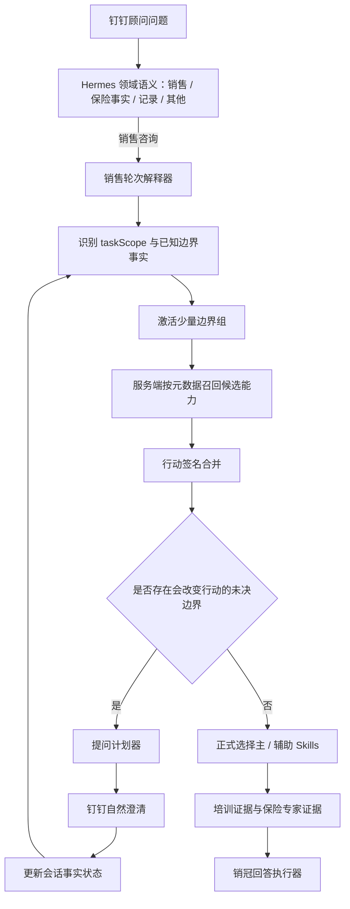

# 销冠 Skill 边界与渐进提问编排设计

日期：2026-07-19  
状态：建议方案，尚未实施  
范围：钉钉/Hermes 开放式销售咨询、销冠 Agent、程继业培训 Skills、保险专家事实分流

## 1. 背景

当前销冠链路已经具备：

```text
销售轮次解释
→ readiness 门控
→ 主 Skill / 最多六个辅助 Skills
→ 培训包与保险专家证据
→ 回答执行器
```

现有实现仍有四个缺口：

1. `missingInformation` 只有少量通用字段，无法表达客户来源、服务事项、购买意愿范围、沟通结束点等销售场景边界。
2. readiness 在 Skill 选择前直接把低置信度问题转成固定澄清，无法根据不同 Skill 的边界生成自然问题。
3. 场景型培训包依赖已经识别出的 `situations`。当顾问没有主动说“孤儿单”“转介绍”等场景名称时，系统没有机制发现隐藏场景。
4. 随着 Skills 增长，若每个 Skill 独立生成问题，问题数量、重复度和顾问负担会线性增长。

本设计把“边界、提问、事实状态、Skill 选择”拆开：

- Skill 声明边界；
- 边界组决定当前值得了解的维度；
- 提问计划器只选择会改变当前行动的问题；
- 会话事实状态记录回答、估计、未知和冲突；
- 正式 Skill 选择发生在必要的边界确认之后。

## 2. 假设

1. 顾问通过钉钉与销冠助手对话，系统不能假设存在可自动读取的 CRM 客户关系、服务转交或完整保单数据。
2. 系统可以使用服务端持有的安全近期历史和现有 SQLite 会话事实块；不信任客户端提交的历史或记忆。
3. 顾问可能只提供估计或个人感受，例如“收入大概七八千”“感觉他在意养老”。估计不能升级为客户事实。
4. 信息不足时允许先澄清，但顾问回答“不知道”、只回答一部分或跳过问题后，系统仍必须给出不依赖未知事实的安全方法。
5. 保险责任、现金价值、减保、理赔、核保、产品比较和保障缺口继续由 `insurance_expert` 基于证据处理。

## 3. 目标

1. 支持数百到上千个销售 Skills，而不让用户面对同等数量的问题。
2. 对“这个客户怎么跟进”等宽问题，能够发现顾问没有主动说出的高价值隐藏场景。
3. 对“客户觉得十年太长怎么回复”等窄问题，只询问当前异议相关信息。
4. 每个 Skill 有清晰的正式触发、允许探问、排除、未知兜底和保险事实边界。
5. 多个候选 Skill 当前行动相同时，先执行共同动作，不为区分内部 Skill 而打扰顾问。
6. 问题使用一线业务员复盘口吻，不把内部字段名、KYC 枚举或系统结构暴露给顾问。
7. 复用现有解释器、readiness、注册表、培训目录、保险专家和 SQLite 会话状态；不新建第二套路由器或独立记忆存储。

## 4. 非目标

- 不建立包含所有客户信息的通用 KYC 问卷。
- 不要求一次补齐家庭、收入、健康、资产和全部保单资料。
- 不根据年龄、职业、收入、婚姻或产品名称推断购买能力、共同决策、养老需求或保障缺口。
- 不让 DingTalk 网关、Hermes 或前端决定销售 Skill、保险事实或专业话术。
- 不把一千个 Skill key 全部放入模型提示词，让模型平面选择。
- 不为每一种关系、需求和异议组合创建一个新的复合 Skill。
- 首期不引入新的向量数据库、微服务或长期客户画像库。

## 5. 核心原则

### 5.1 边界不是问卷

每个 Skill 必须有边界，但边界不会自动变成用户问题。只有满足以下条件的未决边界才进入提问计划：

1. 属于当前激活的边界组；
2. 能确认或排除当前少量候选能力；
3. 答案会改变本轮或紧接着的销售行动；
4. 当前消息和已确认历史中没有答案；
5. 顾问没有明确回答“不知道”。

### 5.2 用维度组合代替类型爆炸

“孤儿单 + 只要服务 + 潜在养老关注 + 第一次见面”不是一个新的复合 Skill，而是：

```text
关系维度：orphan_policy
本轮来意：service_only
需求状态：retirement_needs_confirmation
阶段：contact
```

由一个主 Skill 和必要的辅助 Skills 组合处理。

### 5.3 只确认行动差异

如果多个候选 Skills 当前第一步都是“先问清服务事项并交付结果”，系统可以先给这个共同动作。只有后续动作确实不同，才确认客户来源或其他边界。

### 5.4 提问逐步展开

系统可以一次提出多个低负担、同主题的问题，但不使用固定问题数量。新增问题必须比其回答负担更有价值：

- 低负担：二选一、顾问凭记忆可答的客观事实；
- 中负担：客户原话、资金用途、沟通经过；
- 高负担：查保单、整理财务、健康或理赔材料。

高负担问题不得与一组无关问题同时抛出。

### 5.5 事实、估计和感觉分开

顾问提供的信息保留认识状态和来源：

```text
reported_fact       顾问明确报告的业务事实
customer_statement  顾问复述的客户原话
advisor_estimate    顾问估计
advisor_impression  顾问感觉
unknown             顾问明确不知道
conflicted          当前信息与已确认历史冲突
document_verified   正式材料或专家证据已核验
```

`advisor_estimate` 和 `advisor_impression` 可以允许一个低压力确认问题，但不能正式触发产品适配、购买能力、家庭决策或保障结论。

## 6. 分层路由



### 6.1 第一层：领域

Hermes 继续只负责识别用户在问：

- 销售经营与客户沟通；
- 产品、条款、保障、核保或理赔事实；
- 保单记录与系统操作；
- 其他问题。

销售专业工作必须进入 `sales_champion`。保险事实进入 `insurance_expert`。渠道层不能因缺失销售信息而自行生成问题或话术。

### 6.2 第二层：任务范围 `taskScope`

首期枚举：

```text
broad_client_followup   完整客户经营、整体跟进、客户复盘
narrow_objection        一个明确异议怎么处理
service_followup        一个明确服务事项怎么承接
meeting_progression     约见、二次会面或沟通收尾
needs_discovery         已明确要发现需求
mixed_sales_insurance   销售行动中同时需要保单、产品或保障事实
unknown                 尚无法确定
```

`taskScope` 决定哪些边界组有资格被检查：

- `broad_client_followup` 可以检查客户关系、本轮来意、沟通进度；
- `narrow_objection` 只检查异议原因、目标与必要约束；
- `mixed_sales_insurance` 保留当前销售行动，只把其中的保险事实交给保险专家核验，不启动完整销售 KYC；纯保险事实问题在领域层直接进入 `insurance_expert`，不进入该销售任务范围。

### 6.3 第三层：边界组

首期只建立少量稳定分组：

| 边界组 | 公共槽位 | 可发现的能力方向 |
| --- | --- | --- |
| 客户关系 | `customer_relationship_origin` | 孤儿单、转介绍、陌生开发、长期客户 |
| 本轮来意 | `explicit_customer_request`, `meeting_trigger` | 服务、保单检视、主动咨询、普通经营 |
| 沟通进度 | `conversation_end_state` | 二次会面、资料跟进、服务交付、停止联系 |
| 客户目标 | `customer_goal`, `goal_source` | 养老、教育、健康、财富、企业需求 |
| 明确异议 | `objection_reason` | 期限、流动性、支付压力、信任、家庭决策 |
| 决策与许可 | `decision_participants`, `contact_preference` | 共同决策、跟进同意、停止联系 |
| 保险证据 | 复用 `insuranceNeeds` 与已解析产品 | 产品事实、保障缺口、核保、理赔 |

边界组是问题规模控制点。即使目录有一千个 Skills，一轮通常只激活两到三个边界组。

### 6.4 第四层：候选 Skills

模型不接收一千个 Skill key。解释器只提出小规模、稳定的能力家族和结构化语义。服务端通过以下元数据确定性召回：

```text
domain
taskScopes
allowedStages
concerns
situations
boundaryGroups
actionSignature
antiTriggers
priority
```

运行时能力键继续保持小而稳定。大量课程蒸馏结果作为带边界元数据的培训包或原子方法，由服务端目录按阶段、场景、顾虑和能力匹配，不进入解释器的完整枚举提示词。

## 7. Skill 边界契约

现有 Skill 定义扩展为：

```js
{
  key: 'serve_orphan_policy_before_selling',
  version: 2,
  family: 'customer_relationship',
  taskScopes: ['broad_client_followup', 'service_followup'],
  allowedStages: ['contact', 'appointment', 'post_sale'],
  concerns: ['follow_up', 'unknown'],
  situations: ['orphan_policy'],
  actionSignature: 'service_first_then_permission',

  boundary: {
    confirmedWhen: [
      { slot: 'customer_relationship_origin', equals: 'company_transferred' }
    ],
    probeWhen: [
      { taskScope: 'broad_client_followup', slotStatus: 'missing' }
    ],
    excludedWhen: [
      { slot: 'customer_relationship_origin', in: ['self_developed', 'long_term_adviser'] },
      { signal: 'stop_contact', equals: true }
    ],
    requiredSlots: ['customer_relationship_origin'],
    helpfulSlots: ['explicit_customer_request', 'conversation_end_state'],
    unknownFallback: 'generic_service_first'
  },

  evidencePolicy: {
    officialFacts: 'not_required_unless_product_specific'
  }
}
```

边界状态固定为：

```text
irrelevant  当前任务未激活该边界组
unresolved  相关但尚无信号
candidate   有弱信号，只允许探问
confirmed   正式触发条件已确认
excluded    有明确反证或反触发条件
unknown     已询问但顾问不知道
```

只有 `confirmed` 的具体场景 Skill 可以成为场景主 Skill；通用销售能力仍可依据已校验的阶段和顾虑选择。`candidate` 可以提交一个公共槽位需求，但不能输出该场景专属结论。`unknown` 执行 `unknownFallback`，本任务内不重复提问。

## 8. 公共边界槽位

首期销售槽位：

```js
{
  customer_relationship_origin: {
    values: ['self_developed', 'referral', 'company_transferred', 'long_term_adviser', 'unknown'],
    burden: 'low',
    advisorQuestion: '这客户是怎么到你手上的？是你自己开发的、别人介绍的、公司转给你的，还是你原来一直服务的？'
  },
  explicit_customer_request: {
    values: ['service', 'policy_review', 'insurance_consultation', 'relationship_only', 'unknown'],
    burden: 'low',
    advisorQuestion: '他这次找你，明确想让你帮他做什么？'
  },
  meeting_trigger: {
    values: ['advisor_initiated', 'customer_initiated', 'unknown'],
    burden: 'low',
    advisorQuestion: '这次是你主动约他的，还是他有事情找你？'
  },
  conversation_end_state: {
    values: ['service_promised', 'meeting_agreed', 'materials_promised', 'customer_considering', 'no_next_step', 'stop_contact', 'unknown'],
    burden: 'low',
    advisorQuestion: '你们最后说好下一步做什么了吗？'
  },
  goal_source: {
    values: ['customer_explicit', 'advisor_impression', 'unknown'],
    burden: 'medium',
    advisorQuestion: '这个目标是客户自己明确说的，还是你聊下来感觉他比较在意？'
  },
  objection_reason: {
    values: ['duration', 'liquidity', 'affordability', 'trust', 'family_decision', 'other', 'unknown'],
    burden: 'medium',
    advisorQuestion: '他具体担心的是哪一点？当时大概怎么说的？'
  }
}
```

内部槽位名不出现在钉钉消息中。用户问题文案由中心注册表管理，Skill 只能引用槽位，不能各自新增一套近义问题。

新增公共槽位必须满足：

1. 至少服务两个 Skill 或一个高风险事实边界；
2. 答案会改变允许动作、主 Skill 或保险专家任务；
3. 已有槽位不能表达；
4. 有明确的 `unknown` 行为；
5. 有正例和近邻反例测试。

## 9. 销售事实状态

`SalesTurnProposal` 后续版本增加：

```json
{
  "taskScope": "broad_client_followup",
  "boundaryFacts": [
    {
      "slot": "customer_relationship_origin",
      "value": "company_transferred",
      "epistemicStatus": "reported_fact",
      "evidenceText": "公司转给我的孤儿单",
      "source": "current_message",
      "confidence": 0.98
    }
  ]
}
```

约束：

- `evidenceText` 必须能在当前消息或受控历史中逐字定位；
- 槽位和值必须来自中心注册表；
- 估计与感觉必须保留 `epistemicStatus`；
- 未确认产品类型、收入、家庭决策和客户目标不得升级为正式触发；
- 冲突信息分别保留来源，不能静默覆盖。

待澄清状态复用现有 SQLite 会话任务事实块：

```json
{
  "pendingSalesBoundaryClarification": {
    "taskScope": "broad_client_followup",
    "askedSlots": ["customer_relationship_origin", "explicit_customer_request"],
    "unknownSlots": [],
    "createdAt": 0,
    "expiresAt": 0
  }
}
```

不得新建临时 JSON、客户端记忆或第二套会话存储。新问题明显替换当前任务时，旧澄清状态结束；自然补充、部分回答和“不知道”继续当前任务。

## 10. 提问计划器

新增领域服务：

```text
server/sales-champion-question-planner.service.mjs
```

输入：

```js
{
  taskScope,
  boundaryFacts,
  activeBoundaryGroups,
  candidateSkillMetadata,
  actionGroups,
  pendingClarification,
  insuranceNeeds
}
```

输出：

```js
{
  decision: 'clarify' | 'execute',
  questions: [
    {
      slot: 'customer_relationship_origin',
      burden: 'low',
      reason: 'separates_relationship_actions'
    }
  ],
  commonActionSignature: '',
  unknownFallback: 'generic_service_first'
}
```

### 10.1 选择顺序

1. 明确拒绝或停止联系先于所有问题。
2. 删除已确认、已排除、已询问等待中和已标记 `unknown` 的槽位。
3. 若所有高分候选具有相同 `actionSignature`，直接执行共同动作。
4. 优先选择会改变安全边界或保险事实权限的问题。
5. 其次选择能确定主 Skill 或区分不同行动签名的问题。
6. 再选择明显改善本轮话术的问题。
7. 只让分析更完整、但不改变行动的问题延后。
8. 同价值时优先低负担、同主题、顾问凭记忆可回答的问题。

首期不实现复杂信息熵算法。使用可审计的等级和稳定排序；只有评估数据证明需要时再增加学习排序。

### 10.2 问题组合

- 可以组合两个或三个低负担、同主题的问题；
- 一个高负担问题单独提出；
- 不把保单材料、健康信息和普通关系问题混在同一轮；
- 问题已经足够确认行动后立即停止；
- 文案可以说明“不知道也没关系”，但不在每轮机械重复；
- 顾问只回答部分时，使用已知部分继续；不要求补齐整组。

### 10.3 自然表达

问题面向保险顾问，不面向终端客户。文案应像同事复盘：

```text
推荐：这客户是怎么到你手上的？
不推荐：请确认 customer_relationship_origin。

推荐：他这次明确想让你帮他做什么？
不推荐：请补充客户购买意愿范围与服务事项。
```

当需要顾问向客户继续了解时，由销冠回答另行生成客户可说的话；不能把系统对顾问的澄清问题直接当作客户话术。

## 11. readiness 与路由顺序

当前流程在正式 Skill 选择前由 readiness 直接返回固定澄清。调整为：

```text
严格校验语义提议
→ 拒绝/停止联系硬门
→ taskScope 与边界组
→ 候选元数据召回
→ 行动签名合并
→ 提问计划
→ clarify 或正式 Skill 选择
→ 证据计划
→ 执行
```

readiness 仍保留：

```text
execute
clarify
stop_contact
retry_later
```

但 `clarify` 必须携带 `questionPlan`，执行器不再使用一段固定“客户最想解决什么”的通用话术覆盖所有场景。

## 12. 保险专家边界

保险专家不决定销售阶段、客户关系、异议或客户话术。销售 Skills 也不能因想了解客户更多而主动收集所有保险信息。

仅在任务明确要求以下内容时启用保险证据需求：

- 产品责任、等待期、续保、领取、现金价值；
- 退保、减保、保单贷款；
- 产品比较、保障重复或缺口；
- 核保、理赔和正式保单解释。

钉钉环境不能假设已有保单。只有当前会话已有已上传、已解析且授权使用的材料时，才后台调用保险专家；否则由同一提问计划器在必要时请求准确产品或正式材料。

保险专家只提交证据需求，不直接向顾问增加销售 KYC 问题。提问计划器统一控制最终展示的问题。

## 13. 典型流程

### 13.1 隐藏孤儿单场景

顾问：

> 我昨天见了一个客户……怎么去跟进？

解释结果：

```text
taskScope = broad_client_followup
activeBoundaryGroups = customer_relationship, meeting_intent, conversation_progress
```

系统先问：

> 这客户是怎么到你手上的？他这次明确想让你帮他做什么？

顾问：

> 公司转给我的孤儿单，他只要服务。

更新：

```text
customer_relationship_origin = company_transferred
explicit_customer_request = service
serve_orphan_policy_before_selling = confirmed
product_recommendation = excluded for current turn
```

主 Skill 为孤儿单服务优先。养老兴趣若只有顾问感觉，只保留为以后允许确认的候选，不进入当前促成。

### 13.2 窄期限异议

顾问：

> 客户觉得十年太长，怎么回复？

解释结果：

```text
taskScope = narrow_objection
activeBoundaryGroups = objection
orphan_policy = irrelevant
```

系统只确认期限背后的具体担心；不询问客户来源、完整家庭信息或所有保单。

若顾问不知道原因，执行期限异议的 `unknownFallback`：先接住“时间长”，建议顾问向客户自然区分持续缴费、退休时间与资金使用顾虑，同时给出可直接使用的话术。

### 13.3 多候选但行动相同

候选包括孤儿单服务、普通售后服务和转介绍首次服务；当前共同动作都是 `service_first`。系统先给服务承接动作，不为内部分类立即追问。只有需要设计后续关系经营时，再确认客户来源。

### 13.4 顾问回答不知道

顾问：

> 我也不知道他是怎么来的，你先告诉我怎么跟。

系统把槽位标记为 `unknown`，本任务内不重复询问；执行当前边界组的通用安全动作，并明确不使用孤儿单专属推断。

## 14. 模块映射

| 现有模块 | 设计改动 |
| --- | --- |
| `sales-champion-turn.contract.mjs` | 增加 `taskScope`、受控 `boundaryFacts` 与严格来源校验 |
| `sales-champion-turn-interpreter.service.mjs` | 提取任务范围和事实认识状态，不生成问题或答案 |
| `sales-champion-skill-registry.mjs` | 增加 family、boundary groups、action signature、边界与未知兜底元数据 |
| `sales-champion-training-catalog.mjs` | 培训包引用公共槽位；禁止各自新增用户问卷；校验边界元数据 |
| `sales-champion-readiness.service.mjs` | 拒绝硬门后消费 `questionPlan`，不再只按阶段/顾虑置信度固定澄清 |
| `sales-champion-router.service.mjs` | 调整为边界组、候选、提问计划、正式选择的单一路径 |
| `sales-champion-question-planner.service.mjs` | 新增；合并槽位、行动等价、负担排序、未知与重复控制 |
| `sales-champion-skill-executor.service.mjs` | 渲染自然提问、部分回答后的兜底和选中 Skill 的原子回答 |
| `sales-champion-tool.service.mjs` | 传入服务端会话澄清状态；保持保险专家调用边界 |
| 现有 SQLite 会话事实块 | 保存有期限的 `pendingSalesBoundaryClarification`，不建第二存储 |
| DingTalk/Hermes/前端 | 不增加专业判断，仅保留完整澄清或销冠答案 |

## 15. 首期实施范围

首期只验证架构，不批量迁移全部 Skills：

1. 增加 `taskScope` 与六个公共销售槽位；
2. 增加边界槽位注册表和提问计划器；
3. 接入三个高价值场景：
   - 孤儿单且服务优先；
   - 客户明确只要服务；
   - 缴费期限太长；
4. 保留一个通用安全兜底；
5. 保险事实继续复用现有 `insuranceNeeds` 和保险专家链路；
6. 验证后再按边界组逐批迁移课程 Skills。

不在首期实现向量化 Skill 检索。现有受控能力键与培训目录元数据足以验证边界和提问机制；当目录规模和延迟数据证明需要时，再增加索引层。

## 16. 验收标准

### 16.1 路由与边界

1. 明确“公司转交的孤儿单”时不再追问客户来源，直接确认孤儿单 Skill。
2. 完整客户跟进问题未提供客户来源时，允许一个自然的关系边界问题。
3. “客户只要服务”不能单独证明是孤儿单。
4. 明确本人长期服务的客户时排除孤儿单 Skill。
5. 年龄、收入、婚姻、房产和产品名称不能单独触发预算、共同决策、高价值、养老或保障缺口 Skill。

### 16.2 问题负担

6. 窄期限异议不得询问孤儿单、客户来源、全部家庭或保单信息。
7. 多个候选共享同一公共槽位时只出现一个问题。
8. 多个候选具有相同当前行动签名时可以直接执行共同动作。
9. 顾问回答“不知道”后，同一任务不重复询问该槽位。
10. 顾问只回答部分问题时，系统使用已知答案继续，不要求补齐整组。
11. 问题文本不包含内部字段、枚举、KYC表单标题或课件腔。

### 16.3 安全与专家边界

12. 明确拒绝或停止联系先于所有提问和促成 Skills。
13. 养老是顾问感觉而非客户明确表达时，只能标为待确认。
14. 产品责任、现金价值、减保、理赔和保障缺口只形成保险专家证据需求。
15. 缺少产品或正式材料时不生成保险事实，也不把缺少记录解释为保障缺口。
16. Hermes、DingTalk 和 UI 不生成、改写或截断专业提问与回答。

### 16.4 规模

17. 模型提示词不包含完整培训 Skill 目录；运行时能力键保持小而稳定。
18. 一千个训练方法通过元数据目录过滤到受控候选集合，再进入边界评估。
19. 新 Skill 默认只能引用已注册公共槽位；新增槽位必须通过目录校验和回归用例。
20. 无候选、候选未知或所有关键边界无法确认时，仍返回安全可执行方法。

## 17. 验证计划

首期实现时增加或更新：

```text
tests/sales-champion-turn-interpreter.test.mjs
tests/sales-champion-atomic-orchestration.test.mjs
tests/sales-champion-skill-executor.test.mjs
tests/sales-champion-tool.test.mjs
```

新增提问计划器定向测试：

```text
tests/sales-champion-question-planner.test.mjs
```

覆盖：

- 宽问题发现隐藏孤儿单；
- 窄期限问题不询问客户关系；
- 公共槽位去重；
- 行动签名合并；
- 部分回答；
- `unknown` 不重复；
- 明确拒绝硬门；
- 保险专家事实分流；
- 新任务中断旧澄清；
- 解释器非法结构、超时和不可用不走关键词回退。

代码变更属于 `server/` 销售领域行为，按项目要求运行：

```bash
npm run check
npm test
```

并通过运行中的开发栈完成一条真实钉钉链路验收：

```text
DingTalk
→ Hermes
→ sales_champion
→ boundary question plan
→ 顾问自然回答
→ selected atomic Skills
→ preserved sales reply
→ DingTalk delivery
```

## 18. 推进顺序

```text
阶段一：契约、公共槽位、边界状态、提问计划器
阶段二：孤儿单 / 只要服务 / 期限太长三个场景
阶段三：钉钉会话澄清状态与部分回答
阶段四：按边界组逐批迁移其他销售 Skills
阶段五：基于命中率、重复提问率和人工评审决定是否增加检索索引
```

每个阶段独立验收。首期不为未来一千个 Skills 预先增加复杂基础设施；先证明共享边界和行动差异能够减少漏命中与无效提问。
